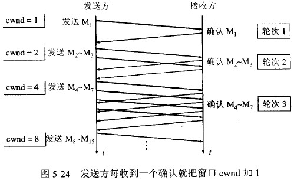

# 计算机网络

<!-- GFM-TOC -->

* 传输层：TCP和UDP
    * [什么是三次握手？](#什么是三次握手-three-way-handshake)
      * [TCP建立连接可以两次握手吗？为什么?](#TCP建立连接可以两次握手吗？为什么?)
      * [可以采用四次握手吗？为什么？](#可以采用四次握手吗？为什么？)
      * [第一次握手中，如果客户端发过来的SYN丢失，会怎么样？](#什么是三次握手 (three-way handshake)？)
      * [第二次握手中，如果服务端发给客户端的ACK+SYN丢失，会怎么样?](#什么是三次握手 (three-way handshake)？)
      * [第三次握手中，如果客户端的ACK未送达服务器，会怎样？](#第三次握手中，如果客户端的ACK未送达服务器，会怎样？)
        * [什么是SYN洪泛攻击?](#什么是SYN洪泛攻击?)
        * [什么是半连接队列，什么是全连接队列？](#什么是半连接队列，什么是全连接队列？)
        * [如何检测 SYN 攻击？](#什么是SYN洪泛攻击?)
        * [常见的防御SYN攻击的方法](#常见的防御SYN攻击的方法)
      * [如果已经建立了连接，但客户端出现了故障怎么办？](#如果已经建立了连接，但客户端出现了故障怎么办？)
      * [初始序列号是什么？作用？](#初始序列号是什么？)
    * [什么是四次挥手？](#什么是四次挥手)
      * [为什么不能把服务器发送的ACK和FIN合并起来，变成三次挥手（CLOSE_WAIT状态意义是什么）？](#为什么不能把服务器发送的ACK和FIN合并起来，变成三次挥手（CLOSE_WAIT状态意义是什么）？)
      * [如果第二次挥手时服务器的ACK没有送达客户端，会怎样？](#如果第二次挥手时服务器的ACK没有送达客户端，会怎样？)
      * [客户端TIME_WAIT状态的意义是什么？](#客户端TIME_WAIT状态的意义是什么？)
      * [MSL是什么？一个MSL大概是多少时间？](#MSL是什么？一个MSL大概是多少时间？)
    * [TCP如何实现流量控制？](#TCP如何实现流量控制)
      * [什么是流量控制？流量控制的目的？](#什么是流量控制？流量控制的目的？)
      * [如何实现流量控制？](#如何实现流量控制？)
      * [接收窗口太大或太小会怎么样？](#接收窗口太大或太小会怎么样？)
      * [流量控制引发的死锁？怎么避免死锁的发生？](#流量控制引发的死锁？怎么避免死锁的发生？)
      * [什么是零窗口（接收窗口为0时会怎样）？](#什么是零窗口（接收窗口为0时会怎样）？)
    * [流量控制和拥塞控制的区别](#流量控制和拥塞控制的区别)
    * [TCP的拥塞控制是怎么实现的？](#TCP的拥塞控制是怎么实现的)
    * [TCP与UDP的区别](#TCP与UDP的区别)
      * [什么时候选择TCP，什么时候选UDP？](#什么时候选择TCP，什么时候选UDP？)
      * [HTTP可以使用UDP吗？](#HTTP可以使用UDP吗？)
      * [面向连接和无连接的区别](#面向连接和无连接的区别)
    * [TCP如何保证传输的可靠性](#TCP如何保证传输的可靠性)
    * [什么是TCP粘包？如何解决？](#什么是TCP粘包)
* 应用层：HTTP和HTTPS
    * [简单说说HTTP（超文本传输协议）](#简单说说HTTP（超文本传输协议）)
    * [HTTP1.0 1.1 2.0 3.0的区别？](#HTTP1.0 1.1 2.0 3.0的区别？)
        * [HTTP1.1与1.0之间的区别](#HTTP1.1与1.0之间的区别:)
        * [HTTP2.0和HTTP1.X相比的新特性](#HTTP2.0和HTTP1.X相比的新特性)
        * [HTTP2.0的性能瓶颈](#HTTP2.0的性能瓶颈)
        * [HTTP3.0](#HTTP3.0)
        * [TODO: HTTP缓存](#HTTP缓存)
    * [Session与Cookie的区别？](#Session与Cookie的区别？)
        * 	[Cookie和session是如何互相配合的呢？](#Cookie和session是如何互相配合的呢？)
        * 	[如果浏览器里cookie被禁用了怎么办？](#如果浏览器里cookie被禁用了怎么办？)
    * [HTTP和HTTPS有什么区别？](#HTTP和HTTPS有什么区别)
        * [Https的连接过程？](#Https的连接过程？)
        * [什么是摘要？](#什么是摘要？)
        * [输入 www.baidu.com，怎么变成 https://www.baidu.com 的，怎么确定用HTTP还是HTTPS？](#输入 www.baidu.com，怎么变成 https://www.baidu.com 的，怎么确定用HTTP还是HTTPS？)
        * [TODO: HTTPS连接的时候，怎么确定收到的包是服务器发来的（中间人攻击）？](#HTTPS连接的时候，怎么确定收到的包是服务器发来的（中间人攻击）？)
        * [什么是对称加密、非对称加密？区别是什么？](#什么是对称加密、非对称加密？区别是什么？)
    * [HTTP的请求方法](#HTTP的请求方法)
        * [GET与POST的区别？](#GET与POST的区别)
        * [HTTP请求/响应报文](#HTTP请求/响应报文)
    * [TCP和HTTP的区别](#TCP和HTTP的区别)
    * [从输入网址到获得页面的过程 (越详细越好)？](#从输入网址到获得页面的过程-越详细越好)
        * [流程中各个协议都是运行在哪一层？](#流程中各个协议都是运行在哪一层？)
        * [DNS查找过程](#DNS查找)
    * [HTTP请求有哪些常见状态码？](#HTTP请求有哪些常见状态码)
        * [响应码500的时候怎么排查](#响应码500的时候怎么排查)
* [计算机网络体系结构，每个层的作用，分别有什么协议](#计算机网络体系结构: )
    * [路由器、交换机位于哪一层？](#路由器、交换机位于哪一层？)
* 网络层协议
    * [什么是RIP (距离矢量路由协议)?](#什么是RIP-Routing-Information-Protocol-距离矢量路由协议-算法是什么)
    * [IP地址的分类？](#IP地址的分类)
    * [什么叫划分子网？](#什么叫划分子网)
    * [什么是ARP协议？](#什么是ARP协议-Address-Resolution-Protocol)
    * [什么是NAT (网络地址转换)？](#什么是NAT-Network-Address-Translation-网络地址转换)
* [参考](#参考)
<!-- GFM-TOC -->

------

### 什么是三次握手 (three-way handshake)？

- 第一次握手：Client将SYN置1，随机产生一个初始序列号seq发送给Server，进入SYN_SENT状态；

- 第二次握手：Server收到Client的SYN=1之后，知道客户端请求建立连接，将自己的SYN置1，ACK置1，产生一个acknowledge number=sequence number+1，并随机产生一个自己的初始序列号，发送给客户端；进入SYN_RCVD状态；

- 第三次握手：客户端检查acknowledge number是否为序列号+1，ACK是否为1，检查正确之后将自己的ACK置为1，产生一个acknowledge number=服务器发的序列号+1，发送给服务器；进入ESTABLISHED状态；服务器检查ACK为1和acknowledge number为序列号+1之后，也进入ESTABLISHED状态；完成三次握手，连接建立。

- 

  

  

##### TCP建立连接可以两次握手吗？为什么?

展开

不可以。可能会出现以下情况：**已失效的连接请求报文段又传到了服务器端**。

> client 发出的第一个连接请求报文段并没有丢失，而是在某个网络结点长时间的滞留了，以致延误到连接释放以后的某个时间才到达 server。本来这是一个早已失效的报文段。但 server 收到此失效的连接请求报文段后，就误认为是 client 再次发出的一个新的连接请求。于是就向 client 发出确认报文段，同意建立连接。假设不采用 “三次握手”，那么只要 server 发出确认，新的连接就建立了。由于现在 client 并没有发出建立连接的请求，因此不会理睬 server 的确认，也不会向 server 发送数据。但 server 却以为新的运输连接已经建立，并一直等待 client 发来数据。这样，server 的很多资源就白白浪费掉了。采用 “三次握手” 的办法可以防止上述现象发生。例如刚才那种情况，client 不会向 server 的确认发出确认。server 由于收不到确认，就知道 client 并没有要求建立连接。

##### 可以采用四次握手吗？为什么？

展开

可以。但是会降低传输的效率。

四次握手是指：第二次握手：Server只发送ACK和acknowledge number；而Server的SYN和初始序列号在第三次握手时发送；原来协议中的第三次握手变为第四次握手。出于优化目的，四次握手中的二、三可以合并。

##### 第三次握手中，如果客户端的ACK未送达服务器，会怎样？

可能会：由于Server没有收到ACK确认，因此会重发之前的SYN+ACK（默认重发五次，之后自动关闭连接），Client收到后会重新传ACK给Server。

##### 什么是SYN洪泛攻击?

**服务器端的资源分配是在二次握手时分配的，而客户端的资源是在完成三次握手时分配的，所以服务器容易受到SYN洪泛攻击。**

SYN攻击就是Client在短时间内伪造大量不存在的IP地址，并向Server不断地发送SYN包，Server则回复确认包，并等待Client确认，由于源地址不存在，因此Server需要不断重发直至超时，这些伪造的SYN包将长时间占用半连接队列，导致正常的SYN请求因为队列满而被丢弃，从而引起网络拥塞甚至系统瘫痪。SYN 攻击是一种典型的 DoS/DDoS 攻击。

检测 SYN 攻击非常的方便，当你在服务器上看到大量的半连接状态时，特别是源IP地址是随机的，基本上可以断定这是一次SYN攻击。

##### 常见的防御SYN攻击的方法

- **缩短SYN Timeout时间**，由于SYN Flood攻击的效果取决于服务器上保持的SYN半连接数，这个值=SYN攻击的频度 x SYN Timeout，所以通过缩短从接收到SYN报文到确定这个报文无效并丢弃改连接的时间，例如设置为20秒以下（过低的SYN Timeout设置可能会影响客户的正常访问），可以成倍的降低服务器的负荷。

- **设置SYN Cookie**，就是给每一个请求连接的IP地址分配一个Cookie，如果短时间内连续受到某个IP的重复SYN报文，就认定是受到了攻击，以后从这个IP地址来的包会被一概丢弃。
- **将重传次数设置为0**。只要收不到客户端的响应，立即丢弃该连接，默认设置为5次

 

##### 如果已经建立了连接，但客户端出现了故障怎么办？

展开

服务器每收到一次客户端的请求后都会重新复位一个计时器，时间通常是设置为2小时，若两小时还没有收到客户端的任何数据，服务器就会发送一个探测报文段，以后每隔75秒钟发送一次。若一连发送10个探测报文仍然没反应，服务器就认为客户端出了故障，接着就关闭连接。

##### 初始序列号是什么？

    

展开

TCP连接的一方A，随机选择一个32位的序列号（Sequence Number）作为发送数据的初始序列号（Initial Sequence Number，ISN），比如为1000，以该序列号为原点，对要传送的数据进行编号：1001、1002...三次握手时，把这个初始序列号传送给另一方B，以便在传输数据时，**B可以确认什么样的数据编号是合法的**；同时在进行数据传输时，A还可以确认B收到的每一个字节，如果A收到了B的确认编号（acknowledge number）是2001，就**说明编号为1001-2000的数据已经被B成功接受**。

##### 什么是半连接队列，什么是全连接队列？

服务器第一次收到客户端的 SYN 之后，就会处于 SYN_RCVD 状态，此时双方还没有完全建立其连接，服务器会把此种状态下请求连接放在一个队列里，我们把这种队列称之为半连接队列。

当然还有一个全连接队列，就是已经完成三次握手，建立起连接的就会放在全连接队列中。如果队列满了就有可能会出现丢包现象。

### 什么是四次挥手？

- 第一次挥手：Client将FIN置为1，发送一个序列号seq给Server；进入FIN_WAIT_1状态；
- 第二次挥手：Server收到FIN之后，发送一个ACK=1，acknowledge number=收到的序列号+1；进入CLOSE_WAIT状态。此时客户端已经没有要发送的数据了，但仍可以接受服务器发来的数据。
- 第三次挥手：Server将FIN置1，发送一个序列号给Client；进入LAST_ACK状态；
- 第四次挥手：Client收到服务器的FIN后，进入TIME_WAIT状态；接着将ACK置1，发送一个acknowledge number=序列号+1给服务器；服务器收到后，确认acknowledge number后，变为CLOSED状态，不再向客户端发送数据。客户端等待2*MSL（报文段最长寿命, 1 MSL = 2 mins, maximum segment lifetime）时间后，也进入CLOSED状态。完成四次挥手。

##### 为什么不能把服务器发送的ACK和FIN合并起来，变成三次挥手（CLOSE_WAIT状态意义是什么）？

展开

因为服务器收到客户端断开连接的请求时，可能还有一些数据没有发完，这时先回复ACK，表示接收到了断开连接的请求。等到数据发完之后再发FIN，断开服务器到客户端的数据传送。

##### 如果第二次挥手时服务器的ACK没有送达客户端，会怎样？

展开

客户端没有收到ACK确认，会重新发送FIN请求。

##### 客户端TIME_WAIT状态的意义是什么？

展开

1. 第四次挥手时，客户端发送给服务器的ACK有可能丢失，TIME_WAIT状态就是用来重发可能丢失的ACK报文。如果Server没有收到ACK，就会重发FIN，如果Client在2*MSL的时间内收到了FIN，就会重新发送ACK并再次等待2MSL。如果没有这2msl的话，客户端发完最后一个ack报文后直接关闭连接，万一ack丢失了，那么这时候服务器端因为很久没有收到客户端的ack确认，会重新发FIN的信息报。这时候客户端因为是关闭的状态，自认为收到了一个非法的报文段，就返回一个RST数据报，表明拒绝此通信，那双方就产生异常了。服务器因为不能按正常步骤进入close状态，就会耗费服务器的资源。如果网络中存在大量的timewait状态，那么服务器的压力可想而知。
2. 在第四次挥手后，经过2msl的时间足以让本次连接产生的所有报文段都从网络中消失，这样下一次新的连接中就肯定不会出现旧连接的报文段了。也就是防止我们上一篇文章 [为什么tcp是三次握手而不是两次握手？](https://zhuanlan.zhihu.com/p/51448333) 中说的：已经失效的连接请求报文段出现在本次连接中。如果没有的话就可能这样：这次连接一挥手完马上就结束了，没有timewait。这次连接中有个迷失在网络中的syn包，然后下次连接又马上开始，下个连接发送syn包，迷失的syn包忽然又到达了对面，所以对面可能同时收到或者不同时间收到请求连接的syn包，然后就出现问题了。

##### MSL是什么？一个MSL大概是多少时间？

MSL(Maximum Segment Lifetime)，指一个片段在网络中最大的存活时间，2MSL就是一个发送和一个回复所需的最大时间。如果直到2MSL，Client都没有再次收到FIN，那么Client推断ACK已经被成功接收，则结束TCP连接。

一个MSL大概是2mins。

### SSL(HTTPS) 四次握手

https://blog.csdn.net/Handoking/article/details/93738231?utm_medium=distribute.pc_relevant_t0.none-task-blog-BlogCommendFromMachineLearnPai2-1.nonecase&depth_1-utm_source=distribute.pc_relevant_t0.none-task-blog-BlogCommendFromMachineLearnPai2-1.nonecase

第一次：客户端请求建立连接。向服务器发送随机码A，以及自己的支持的加密方式、压缩方式等。
第二次：服务器收到后，向客户端发送随机码B，以及确认客户端可用的加密方式、数字证书、非对称加密的公钥等信息。如果服务器与客户端加密方法不一致，那么关闭连接。
第三次：客户端收到以上信息，验证数字证书的正确性，并使用服务器返回的加密方式，使用公钥对生成对称密钥进行，发送到服务器。
第四次：服务端利用私钥进行解密，得到A，B以及对称加密的session key。服务器使用得到session key加密一段握手信息，发送给客户端。HTTP用此加密方式进行数据传输。

### TCP如何实现流量控制？

##### 什么是流量控制？流量控制的目的？

如果发送者发送数据过快，接收者来不及接收，那么就会有分组丢失（如果缓存区满了，那多接收过来的包可能就会被丢弃）。为了避免分组丢失，控制发送者的发送速度，使得接收者来得及接收，这就是流量控制。**流量控制是实现tcp可靠性的一个重要步骤。**

##### 如何实现流量控制？

**TCP有20字节的固定首部**

使用滑动窗口协议实现流量控制。防止发送方发送速率太快，接收方缓存区不够导致溢出。接收方会维护一个接收窗口 receiver window（窗口大小单位是字节），接受窗口的大小是根据自己的资源情况动态调整的，在返回ACK时将接受窗口大小放在TCP报文中的窗口字段告知发送方。发送窗口的大小不能超过接受窗口的大小，只有当发送方发送并收到确认之后，才能将发送窗口右移。

发送窗口的上限为**接受窗口和拥塞窗口**中的较小值。**接受窗口表明了接收方的接收能力，拥塞窗口表明了网络的传送能力。**

##### 接收窗口太大或太小会怎么样？

如果窗口太小（比如size=1），包一个一个发送，必须等到sender收到receiver的ack才能把window右移。这样的话这个过程就一直stop and wait。

如果窗口太大，包可能会被lost，那sender就会resend包

##### 流量控制引发的死锁？怎么避免死锁的发生？

当发送者收到了一个窗口为0的应答，发送者便停止发送，等待接收者的下一个应答。但是如果这个窗口不为0的应答在传输过程丢失，发送者一直等待下去，而接收者以为发送者已经收到该应答，等待接收新数据，这样双方就相互等待，从而产生死锁。

为了避免流量控制引发的死锁，TCP使用了**持续计时器**。每当发送者收到一个零窗口的应答后就启动该计时器。时间一到便主动发送大小为1字节的探测数据包询问接收者的窗口大小。若接收者仍然返回零窗口，则重置该计时器继续等待；若窗口不为0，则表示应答报文丢失了，此时重置发送窗口后开始发送，这样就避免了死锁的产生。

##### 什么是零窗口（接收窗口为0时会怎样）？

展开

如果接收方没有能力接收数据，就会将接收窗口设置为0，这时发送方必须暂停发送数据，但是会启动一个持续计时器(persistence timer)，到期后发送一个大小为1字节的探测数据包，以查看接收窗口状态。如果接收方能够接收数据，就会在返回的报文中更新接收窗口大小，恢复数据传送。

### 流量控制和拥塞控制的区别

- 拥塞控制：拥塞控制是作用于网络的，它是防止过多的数据注入到网络中，避免出现网络负载过大的情况；常用的方法就是：（ 1 ）慢启动、拥塞避免（ 2 ）快重传、快恢复。

- 流量控制：流量控制是作用于接收者的，它是控制发送者的发送速度从而使接收者来得及接收，防止分组丢失的。

### [TCP的拥塞控制是怎么实现的？](https://www.youtube.com/watch?v=cPLDaypKQkU&t=1s)

拥塞控制主要由四个算法组成：**慢启动（Slow Start）、拥塞避免（Congestion voidance）、快重传 （Fast Retransmit）、快恢复（Fast Recovery）**

1. 慢启动：刚开始发送数据时，先把拥塞窗口（congestion window）设置为一个最大报文段MSS(maximum segment size)的数值，每收到一个新的确认报文之后，就把拥塞窗口加1个MSS。这样每经过一个传输轮次（或者说是每经过一个往返时间RTT, round-trip time），拥塞窗口的大小就会加倍

2. 拥塞避免：当拥塞窗口的大小达到慢开始门限(slow start threshold)时，开始执行拥塞避免算法，拥塞窗口大小不再指数增加，而是线性增加，即每经过一个传输轮次只增加1MSS.  
> 无论在慢开始阶段还是在拥塞避免阶段，只要发送方判断网络出现拥塞（其根据就是没有收到确认，也就是重传计时器timeout），就要把慢开始门限ssthresh设置为出现拥塞时的发送方窗口值的一半（但不能小于2）。然后把拥塞窗口cwnd重新设置为1，执行慢开始算法。**（这是不使用快重传的情况）**

3. 快重传：快重传要求**接收方**在收到一个失序的报文段后就立即发出**重复确认**（为的是使发送方及早知道有报文段没有到达对方）而不要等到自己发送数据时捎带确认。快重传算法规定，发送方只要一连收到三个重复确认就应当立即重传对方尚未收到的报文段，而不必继续等待设置的**重传计时器**时间到期。（如果重传计时器到期了，就是timeout的处理方法了，把阻塞窗口size设为1）

4. 快恢复：当**发送方**连续收到三个重复确认时，就把慢开始门限减半，然后执行拥塞避免算法。不执行慢开始算法的原因：因为如果网络出现拥塞的话就不会收到好几个重复的确认，所以发送方认为现在网络可能没有出现拥塞。  
    也有的快重传是把开始时的拥塞窗口cwnd值再增大一点，即等于 s**sthresh + 3*MSS** 。这样做的理由是：既然发送方收到三个重复的确认，就表明有三个分组已经离开了网络。这三个分组不再消耗网络的资源而是停留在接收方的缓存中。可见现在网络中减少了三个分组。因此可以适当把拥塞窗口扩大些。

  

当有包丢失的两种情况：超时和3个重复的ack包

### TCP与UDP的区别

1. TCP是面向连接的，UDP是无连接的；

什么叫无连接？

UDP发送数据之前不需要建立连接 

> * 什么是面向连接，什么是面向无连接?
>
> 在互通之前，面向连接的协议会先建立连接，如 TCP 有三次握手，而 UDP 不会

2. TCP是可靠的，UDP不可靠；

什么叫不可靠？

  UDP接收方收到报文后，不需要给出任何确认

> TCP 为什么是可靠连接?
>
> TCP提供可靠的、面向连接的运输服务。在传输数据之前必须三次握手建立连接，数据传输结束之后，4次挥手释放连接，而且在数据传递时，又有**确认应答、超时重传、序列号、校验和、滑动窗口、拥塞控制**等机制保证传送数据的可靠性。

3. TCP只支持点对点通信，UDP支持一对一、一对多、多对一、多对多；
4. TCP是面向字节流的，UDP是面向报文的；

什么意思？

面向字节流是指发送数据时以字节为单位，一个数据包可以拆分成若干组进行发送，而UDP一个报文只能一次发完。

5. TCP首部开销（20字节）比UDP首部开销（8字节）要大

   ###### UDP首部

   

6. UDP 的主机不需要维持复杂的连接状态表，**支持同时向多个客户端传输相同的消息**

展开

 由于传输数据不建立连接，因此不需要维护连接状态，包括收发状态等；因此一台服务器可同时向多个客户机传输相同的消息。

##### 什么时候选择TCP，什么时候选UDP？

展开

对某些实时性要求比较高的情况，选择UDP，比如游戏，媒体通信，实时视频流（直播）(RIP, DNS也是），即使出现传输错误也可以容忍；其它大部分情况下，HTTP都是用TCP，因为要求传输的内容可靠，不出现丢失(SMTP, POP3, FTP, HTTP)

##### HTTP可以使用UDP吗？

展开

http3中使用了udp，但是不是很了解

##### 面向连接和无连接的区别

展开

无连接的网络服务（数据报服务 datagram）-- 面向连接的网络服务（虚电路服务 virtual circuit）

虚电路服务：首先建立连接，所有的数据包经过相同的路径(based on forwarding table)，服务质量有较好的保证；

数据报服务：每个数据报包含目的地址，数据路由相互独立（路径可能变化）；网络尽最大努力交付数据，但不保证不丢失、不保证先后顺序、不保证在时限内交付；网络发生拥塞时，可能会将一些分组丢弃；

### TCP如何保证传输的可靠性

详细版本

1. 数据包校验(checksum)
2. 对失序数据包重新排序（TCP报文具有序列号）
3. 丢弃重复数据
4. 应答机制：接收方收到数据之后，会发送一个确认（通常延迟几分之一秒）；
5. 超时重发：发送方发出数据之后，启动一个定时器，超时未收到接收方的确认，则重新发送这个数据；
6. 流量控制：确保接收端能够接收发送方的数据而不会缓冲区溢出

TCP提供可靠的、面向连接的运输服务。在传输数据之前必须三次握手建立连接，数据传输结束之后，4次挥手释放连接，而且在数据传递时，又有**确认应答、超时重传、checksum、序列号、滑动窗口、拥塞控制**等机制保证传送数据的可靠性。TCP经常用于对网络通信质量有很高要求的地方，如**文件传输，邮件发送，远程登录**等场景。SMTP、TELNET、HTTP、FTP

### 什么是TCP粘包？

TCP粘包就是指发送方发送的若干包数据到达接收方时粘成了一包，从接收端缓冲区来看，后一包数据的头紧接着前一包数据的尾。

如果发送方发送的多组数据本来就是同一块数据的不同部分，比如说一个文件被分成多个部分发送，这时当然不需要处理粘包现象；如果多个分组毫不相干，甚至是并列关系，那么这个时候就一定要处理粘包现象了

出现粘包的原因：

- 发送方：默认使用**Nagle算法**（主要作用：减少网络中报文段的数量，充分利用带宽），将多次间隔较小、数据量较小的数据，合并成一个数据量大的数据块，进行发送；
- 接收方：TCP将接收到的数据包保存在**接收缓存**里，然后应用程序主动从缓存读取收到的分组。如果TCP接收数据包到缓存的速度大于应用程序从缓存中读取数据包的速度，多个包就会被缓存，应用程序就有可能读取到多个首尾相接粘到一起的包。

##### 如何解决粘包问题？

>现象是这样个现象，但TCP本来就是基于字节流而不是消息包的协议，它自己说的清清楚楚：我会把你的数据变成字节流发到对面去，而且保证顺序不会乱，但是你要自己搞定字节流解析。
>
>所以这个问题其实就是“如何设计应用层协议的问题”。

- 发送方：关闭Nagle算法；
- 接收方：在应用层进行处理。将所有数据全部读完之后，再进行分组。分组的方法可以通过规定开始符和结束符(EOF, end of file)的方法；也可以在每组传输的数据前面加个长度头部。

### 简单说说HTTP（超文本传输协议）

1. client/server
2. stateless （但是可以用cookies和sessions来提供state）
3. Application layer protocal (99.9% HTTP uses TCP)
4. Client Action (GET, POST, DELETE)
5. Server Status Codes（200: ok, 404: not find, 500: internal error)
6. Headers: twick the operation (e.g. content type: I wanna text file, or xml file, or json file)

### HTTP1.0 1.1 2.0 3.0的区别？

#### HTTP1.1与1.0之间的区别:

- HTTP1.1默认开启长连接，在一个TCP连接上可以传送多个HTTP请求和响应 （Connection: Keep-Alive）。而1.0不支持长连接。客户端和服务器每进行一次HTTP操作，就建立一次连接。
- 缓存处理：在HTTP1.0中主要使用header里的If-Modified-Since,Expires来做为缓存判断的标准，HTTP1.1则引入了更多的缓存控制策略例如Entity tag，If-Unmodified-Since, If-Match, If-None-Match等更多可供选择的缓存头来控制缓存策略。
- Host头处理：1.0请求的url并没有传递主机名(服务器与IP地址绑定)，1.1请求和响应都支持Host头域(虚拟主机共享IP地址)
- 1.1新增24个错误状态响应码。409：请求的资源和资源的当前状态冲突，410：服务器资源永久性删除。
- 带宽优化以及网络连接的使用：1.1允许只请求资源的某个部分. (http1.0中会存在一些性能浪费,比如我们的只需要对象中的一部分,但是每次请求返回的却是整个对象,这无疑造成了性能的损害l; http1.1则不然,它可以通过在请求头处设置range头域,就可以返回请求资源的某一部分,也就是返回码为206(Partial Content)的时候,这对于性能优化很有必要.)
- 多了几个http请求方法（delete，put）

#### HTTP2.0和HTTP1.X相比的新特性

- 新的二进制格式：1.x的解析是基于文本的，而2.0的协议解析是采用二进制格式。
- 多路复用，即连接共享，即每一个request都是是用作连接共享机制的；多个http请求/应答使用一个链接。
- header压缩。http1.x中的header需要携带大量信息.而且每次都要重复发送.http2.0使用encode来减少传输的header大小.而且客户端和服务端可以各自缓存(cache)一份header filed表,避免了header的重复传输,还可以减少传输的大小.（如果首部发生了变化，则只需将变化的部分加入到header帧中，改变的部分会加入到头部字段表中，首部表在 http 2.0 的连接存续期内始终存在，由客户端和服务器共同渐进地更新。）
- 服务端推送。服务器可以对一个客户端请求发送多个响应，服务器向客户端推送资源无需客户端明确地请求。并且，服务端推送能把客户端所需要的资源伴随着index.html一起发送到客户端，省去了客户端重复请求的步骤。

#### HTTP2.0的性能瓶颈

启用http2.0后会给性能带来很大的提升，但同时也会带来新的性能瓶颈。因为现在所有的压力集中在底层一个TCP连接之上，TCP很可能就是下一个性能瓶颈，比如TCP分组的队首阻塞问题，单个TCP packet丢失导致整个连接阻塞，无法逃避，此时所有消息都会受到影响

#### HTTP3.0

- Replaced TCP with QUIC (UDP with congestion control)(Quick UDP including Congestion Control, lol)
- All HTTP2 features

### HTTP缓存

### Session与Cookie的区别？

[Detail](https://zhuanlan.zhihu.com/p/75536009)

- Session是服务器端保持状态的方案，Cookie是客户端保持状态的方案

- Cookie保存在客户端本地，客户端请求服务器时会将Cookie一起提交；Session保存在服务端，通过检索Sessionid查看状态。保存Sessionid的方式可以采用Cookie，如果禁用了Cookie，可以使用URL重写机制（把会话ID保存在URL中）。

  因为cookie保存在客户端，比较容易造成不法获取。而session存储在服务端，安全性相对于cookie要好一些。

- 单个cookie保存的数据不能超过4k，session可存储数据远高于cookie
- cookie一般可以长时间保持，比如我们经常使用的默认登陆功能。session一般失效时间较短，客户端关闭或者session超时都会失效。
- Cookie只能保存ASCII，Session可以存任意数据类型。一般我们在session中保持一些常用变量的信息，比如userid.

#### Cookie和session是如何互相配合的呢？
客户端请求服务端，服务端会为这次请求开辟一块`内存空间`，这个对象便是 Session 对象，存储结构为 `ConcurrentHashMap`。Session 弥补了 HTTP 无状态特性，服务器可以利用 Session 存储客户端在同一个会话期间的一些操作记录。
服务器第一次接收到请求时，开辟了一块 Session 空间（创建了Session对象），同时生成一个 sessionId ，并通过响应头的 **Set-Cookie：JSESSIONID=XXXXXXX **命令，向客户端发送要求设置 Cookie 的响应； 客户端收到响应后，在本机客户端设置了一个 **JSESSIONID=XXXXXXX **的 Cookie 信息，该 Cookie 的过期时间为浏览器会话结束；
当用户第二次访问服务器的时候，请求会自动判断此域名下是否存在 Cookie 信息，如果存在自动将 Cookie 信息也发送给服务端，服务端会从 Cookie 中获取 SessionID，再根据 SessionID 查找对应的 Session 信息，如果没有找到说明用户没有登录或者登录失效，如果找到 Session 证明用户已经登录可执行后面操作。

#### 如果浏览器里cookie被禁用了怎么办？
 1. **URL or POST**。每次请求中都携带一个 SessionID 的参数，也可以 Post 的方式提交，也可以在请求的地址后面拼接xxx?SessionID=123456...。

  2. [Token 机制](https://zhuanlan.zhihu.com/p/63061864)。Token 机制多用于 App 客户端和服务器交互的模式，也可以用于 Web 端做用户状态管理。当用户第一次登录后，服务器根据提交的用户信息生成一个 Token，响应时将 Token 返回给客户端，以后客户端只需带上这个 Token 前来请求数据即可，无需再次登录验证。

Token的好处就是不用像session一样将记录保存在服务端内。token保存在客户端上，用户每次请求服务器的时候带一个token，服务器验证token的正确性以后返回数据。

### HTTP和HTTPS有什么区别？

1. 端口不同：HTTP使用的是80端口，HTTPS使用443端口；
2. HTTP（超文本传输协议）信息是明文传输，HTTPS运行在SSL(Secure Socket Layer)之上，添加了加密和认证机制，更加安全；(还有一种叫TLS, Transport Layer Security)
3. HTTPS由于加密解密会带来更大的CPU和内存开销； 
4. HTTPS通信需要证书，一般需要向证书颁发机构（CA, certificate authority）购买

##### Https的连接过程？

展开

1. 客户端向服务器发送请求，同时发送客户端支持的一套加密规则和加密版本(SSL or TLS)；
2. 服务器从中选出一组合适的加密协议，并将自己的身份信息以证书的形式发回给浏览器。证书里面包含了网站地址，**加密公钥**（用于非对称加密），以及证书的颁发机构等信息（证书中的私钥只能用于服务器端进行解密）；
3. 客户端验证服务器的合法性，包括：证书是否过期，CA 是否可靠，发行者证书的公钥能否正确解开服务器证书的“发行者的数字签名”，服务器证书上的域名是否和服务器的实际域名相匹配；
4. 如果证书受信任，或者用户接收了不受信任的证书，浏览器会生成一个**随机密钥**（用于对称算法），并用服务器提供的公钥加密（采用非对称算法对密钥加密），发送给服务器端
5. 服务器使用自己的私钥解密，得到对称加密的密钥，然后开始使用对称密钥加密数据。
6. 客户端解密数据，SSL开始通信

总结：非对称加密算法用于加密在握手过程中加密生成的密码；对称加密算法用于对真正传输的数据进行加密

##### 什么是摘要？

一段信息，经过摘要算法得到一串哈希值，就是摘要(dijest)。信息是任意长度，而摘要是定长。

摘要算法有MD5、SHA1、SHA256、SHA512等，算法把无限的映射成有限，因此可能会有碰撞（两个不同的信息，算出的摘要相同）。摘要不同于加密算法，因为不存在解密，只不过从摘要反推原信息很难（可以认为能加密但无法解密还原，但可以用于比对）。

##### 输入 www.baidu.com，怎么变成 https://www.baidu.com 的，怎么确定用HTTP还是HTTPS？

展开

[你访问的网站是如何自动切换到 HTTPS 的？](https://www.sohu.com/a/136637876_487516)
https://zhuanlan.zhihu.com/p/25537440；HSTS详解 - ThoughtWorks中国的文章 - 知乎

一种是原始的302跳转，服务器把所有的HTTp流量跳转到HTTPS。但这样有一个漏洞，就是中间人可能在第一次访问站点的时候就劫持。 解决方法是引入[HSTS](https://zhuanlan.zhihu.com/p/25537440) (HTTP Strict-Transport-Security)机制，用户浏览器在访问站点的时候强制使用HTTPS。

##### HTTPS连接的时候，怎么确定收到的包是服务器发来的（中间人攻击）？

展开

##### 什么是对称加密、非对称加密？区别是什么？

展开

- 对称加密：加密和解密采用相同的密钥。如：DES、RC2、RC4
- 非对称加密：需要两个密钥：公钥和私钥。如果用公钥加密，需要用私钥才能解密。如：RSA
- 区别：对称加密速度更快，通常用于大量数据的加密；非对称加密安全性更高（不需要传送私钥）

##### 数字签名、报文摘要的原理

展开

- 发送者A用私钥进行签名，接收者B用公钥验证签名。因为除A外没有人有私钥，所以B相信签名是来自A。A不可抵赖，B也不能伪造报文。
- 摘要算法:MD5 (message digest 5, 32 bits)、SHA

### HTTP的请求方法

GET, POST, HEAD, (http1),

DELETE, PUT, (HTTP 1.1), 

OPTIONS, CONNECT, TRACE

#### PUT

PUT方法是从客户端向服务器传送的数据取代指定的文档的内容。PUT方法的本质是idempotent的方法，通过服务是否是idempotent来判断用PUT还是 POST更合理，通常情况下这两种方法没有刻意区分，根据语义使用即可

#### DELETE

请求服务器删除指定的页面，DELETE请求一般会返回3种状态码：200(OK), 2O2(Accepted, 删除请求已经被接受，但是没有被立刻执行), 204(No Content, 删除请求已经被执行，但是没有返回资源)

#### HEAD

类似于GET请求，只不过返回的响应中没有具体的内容，用于获取报头

### GET与POST的区别？

1. GET一般用于从服务器获取资源，而POST有可能改变服务器上的资源；
2. GET是幂等的，即读取同一个资源，总是得到相同的数据，POST不是幂等的；
3. 请求形式上：GET请求的数据附在URL之后（被maximum url length限制）；POST请求的数据在请求体request body中（相比之下length会大一点）；
4. 安全性：GET请求可被缓存、收藏、保留到历史记录，且其请求数据明文出现在URL中。POST的参数不会被保存，安全性相对较高；
5. GET只允许ASCII字符，POST对数据类型没有要求，也允许二进制数据；

### HTTP请求/响应报文

主要分三个部分：请求行 (Request line)，请求头(header)，请求体 (request body)

请求头里可能会有：

Accept： 支持的文件格式

Referer：从哪个页面跳转过来的

Host：想请求的主机

User-Agent：用户的操作系统，浏览器信息等

Accept-Language：用户系统支持的语言

Cookie：

Connection：想保持的连接方式，长连接 or 短连接

展开

①是请求方法，HTTP/1.1 定义的请求方法有8种：GET、POST、PUT、DELETE、PATCH、HEAD、OPTIONS、TRACE,最常的两种GET和POST，如果是RESTful接口的话一般会用到GET、POST、DELETE、PUT。
②为请求对应的URL地址，它和报文头的Host属性组成完整的请求URL
③是协议名称及版本号。
④是HTTP的报文头，报文头包含若干个属性，格式为“属性名:属性值”，服务端据此获取客户端的信息。
⑤是报文体，它将一个页面表单中的组件值通过param1=value1&param2=value2的键值对形式编码成一个格式化串，它承载多个请求参数的数据。不但报文体可以传递请求参数，请求URL也可以通过类似于“/chapter15/user.html? param1=value1&param2=value2”的方式传递请求参数。

Server: 服务端的Web服务端名

Content-Type:返回内容的类型

Content Length: 内容长度

Content-Language: zh-cn(服务端发送的语言类型)

Last-Modified: Tue, 18 Jul 2017 12:15:02 GMT(服务端对该资源最后修改的时间)

Date: 响应时间 

Set-Cookie:SS=Q0=5Lb_nQ; path=/search(服务端发送到客户端的暂存数据)

Cache-Control: no-cache(服务端禁止客户端缓存页面数据)

Connection: close(1.0)/(1.1)Keep-Alive(维护客户端和服务端的连接关系)

### TCP和HTTP的区别

TCP/IP协议是传输层协议，主要解决数据如何在网络中传输，而HTTP是应用层协议，主要解决如何包装数据。Http协议是建立在TCP协议基础之上的，当浏览器需要从服务器获取网页数据的时候，会发出一次Http请求。

### 从输入网址到获得页面的过程 (越详细越好)？

1. 浏览器查询 DNS，获取域名对应的IP地址:具体过程包括浏览器搜索自身的DNS缓存、搜索操作系统的DNS缓存、读取本地的Host文件和向本地DNS服务器进行查询等。对于向本地DNS服务器进行查询，如果要查询的域名包含在本地配置区域资源中，则返回解析结果给客户机，完成域名解析(此解析具有权威性)；如果要查询的域名不由本地DNS服务器区域解析，但该服务器已缓存了此网址映射关系，则调用这个IP地址映射，完成域名解析（此解析不具有权威性）。如果本地域名服务器并未缓存该网址映射关系，那么将根据其设置发起递归查询或者迭代查询；
2. 浏览器获得域名对应的IP地址以后，浏览器向服务器请求建立链接，发起三次握手；
3. TCP/IP链接建立起来后，浏览器向服务器发送HTTP请求；
4. 服务器接收到这个请求，并根据路径参数映射到特定的请求处理器进行处理，并将处理结果及相应的视图(html)返回给浏览器；
5. 浏览器解析并渲染视图，若遇到对js文件、css文件及图片等静态资源的引用，则重复上述步骤并向服务器请求这些资源；
6. 浏览器根据其请求到的资源、数据渲染页面，最终向用户呈现一个完整的页面。

#### 流程中各个协议都是运行在哪一层？

### DNS查找

https://stardustman.github.io/2020/04/23/network-dns/

- 分别check 浏览器自己的缓存，操作系统的缓存，路由器缓存
- 如果没有命中，就会发给本地域名服务器(local dns server，由isp提供)，开始递归咨询请求，本地域名服务器一定会返回一个结果。
- 本地域名服务器有所有root server的ip，先向一个root server咨询，该地址需要去哪个顶级域名服务器tld server找。
- local dns server根据root server返回的tld server地址，去找tld server发起迭代请求。
- tld server告诉local dns server这个域名归哪个权威服务器管，local dns server就去请求该权威服务器
- 权威服务器返回对应域名的ip地址，递归结束。

一共有八个udp请求。如图：

### HTTP请求有哪些常见状态码？

- 1**: 消息，告诉客户端，请求收到了，正在处理

- 2**: 处理成功。200: OK，202:Accepted （服务器接受了请求，但是还没处理）204: No Content （没有响应内容，只有响应头） 206: Partial Content (HTTP 1.1)

- 3**: 定向到其他地方，他让客户端再发一次请求以完成整个处理。301:永久重定向 302: 暂时性重定向

- 4**: 处理发生错误，责任在客户端，如客户端在请求一个不存在的资源，客户端未被授权，禁止访问等。400: Bad Request（请求报文中有语法错误） 401: Unauthorized（告诉客户端，想要获取资源的访问权，先对自己认证） 403: Forbidden （服务器拒绝了客户端的请求）404: not find （服务器无法找到请求的资源）409: Conflict 由于和被请求的资源的当前状态之间存在冲突，请求无法完成  410: Gone 服务器资源永久删除 （和404类似，代表服务器曾经拥有过某资源）

- 5**: 处理发生错误，责任在服务端，如服务端抛出异常，路由出错，HTTP版本不支持等； 500: Internal Server Error 服务器内部错误（可能服务器里有bug），501: Not Implemented 未实现（客户端发起的请求超除了服务器的能力范围，比如使用了服务器不支持的请求方法）, 502: Bad Gateway 网关错误，503 Service Unavailable，504: Gateway timeout

#### 响应码500的时候怎么排查

### 计算机网络体系结构: 

- 应用层：主要是为用户提供常用的应用程序，每个网络应用程序（文件传输、电子邮件、虚拟终端）都对应着的协议。**【FTP, SSH, TELNET, SMTP, POP3, HTTP/HTTP3, UDP】**

- 表现层：主要负责数据格式的转换，确保一个系统的应用层发送的信息被另一个系统的应用层读取。e.g.把数据变为二进制，数据压缩，加密(SSL)

- 会话层：在数据传输中维护网络中两台计算机直接的通信，建立或解除与别的节点的联系。

- 传输层：实现两个用户进程间端对端的可靠通信，处理数据包的错误等传输问题。**【TCP, UDP】**

- 网络层：为数据包的传输进行逻辑地址寻址，选择路由ip，实现不同网络之间的路径选择 【**IP, NAT, ICMP, RIP】**

- 数据链路层：建立逻辑链接，进行硬件地址寻址（MAC)，相邻的两个设备间互相通信。**【ARP, RARP】**

- 物理层：把二进制的数据在物理媒介上传输数据

###### 应用层 表示层 会话层都是在浏览器里完成的

- Application Layer:

- Presentation Layer: Translation (binary) -> Data Compression (lesser space) -> Encryption and decryption (SSL, secure sockets layer)

- Session Layer: Authentification, Authorization, Session Management（APIs, NETBIOS, Authentification; 为数据传输做准备的

- 传输层 (TCP and UDP)：Segmentation, Flow Control, Error Control, Connection and Connectionless transmission

- 网络层：logical addressing (Ipv4, Ipv6), path determination, routing

- 数据链路层：Access the media (framing), Controls how data is placed and received from the media (Media Access Control)(Error Detection). [physical addressing (add MAC addressing on the logical addressing)]

- 物理层 

    

    

    

- 应用层：常见协议：
    - FTP(21端口)：文件传输协议
    - SSH(22端口)：远程登陆
    - TELNET(23端口)：远程登录, virtual terminals
    - SMTP(25端口)：发送邮件
    - POP3(110端口)：接收邮件
    - HTTP(port 80)/HTTPs(port 443)：超文本传输协议
    - DNS(53端口)：运行在UDP上，域名解析服务
    
- 传输层：TCP/UDP

- 网络层：IP、ARP、NAT、RIP、ICMP(Ping命令）...

#### 路由器、交换机位于哪一层？

- 路由器网络层，根据IP地址进行寻址；
- 交换机数据链路层，根据MAC地址进行寻址

### 什么是RIP (Routing Information Protocol, 距离矢量路由协议)? 算法是什么？
每个路由器维护一张表，记录该路由器到其它网络的”跳数“，路由器到与其直接连接的网络的跳数是1，每多经过一个路由器跳数就加1；更新该表时和相邻路由器交换路由信息；路由器允许一个路径最多包含15个路由器，如果跳数为16，则不可达。**交付数据报时优先选取距离最短的路径。**

优缺点

- 实现简单，开销小
- 随着网络规模扩大开销也会增大；
- 最大距离为15，限制了网络的规模；
- 虽然距离短，但是不知道中间的路由器是不是congested的
- 当网络出现故障时，要经过较长的时间才能将此信息传递到所有路由器
- 

### IP地址的分类？

路由器仅根据网络号net-id来转发分组，当分组到达目的网络的路由器之后，再按照主机号host-id将分组交付给主机；同一网络上的所有主机的网络号相同。

### 什么叫划分子网？

从主机号host-id借用若干个比特作为子网号subnet-id；子网掩码：网络号和子网号都为1，主机号为0；数据报仍然先按照网络号找到目的网络，发送到路由器，路由器再按照网络号和子网号找到目的子网：将子网掩码与目标地址逐比特与操作，若结果为某个子网的网络地址，则送到该子网。

### 什么是ARP协议 (Address Resolution Protocol)？

**ARP协议完成了IP地址与物理地址(MAC)的映射**。每一个主机都设有一个 ARP 高速缓存(ARP cache)，里面有**所在的局域网**上的各主机和路由器的 IP 地址到硬件地址的映射表。当源主机要发送数据包到目的主机时，会先检查自己的ARP高速缓存中有没有目的主机的MAC地址，如果有，就直接将数据包发到这个MAC地址，如果没有，就向**所在的局域网**发起一个ARP请求的广播包（在发送自己的 ARP 请求时，同时会带上自己的 IP 地址到硬件地址的映射），收到请求的主机检查自己的IP地址和目的主机的IP地址是否一致，如果一致，则先保存源主机的映射到自己的ARP缓存，然后给源主机发送一个ARP响应数据包。源主机收到响应数据包之后，先添加目的主机的IP地址与MAC地址的映射，再进行数据传送。如果源主机一直没有收到响应，表示ARP查询失败。

如果所要找的主机和源主机不在同一个局域网上，那么就要通过 ARP 找到一个位于本局域网上的某个路由器的硬件地址，然后把分组发送给这个路由器，让这个路由器把分组转发给下一个网络。剩下的工作就由下一个网络来做。

### 什么是NAT (Network Address Translation, 网络地址转换)？	

用于解决内网中的主机要和因特网上的主机通信以及使用IPv4中ip地址不足的问题。由NAT路由器将主机的本地IP地址转换为全球IP地址，分为静态转换（转换得到的全球IP地址固定不变）和动态NAT转换。

### 参考
- [面试/笔试第一弹 —— 计算机网络面试问题集锦](https://blog.csdn.net/justloveyou_/article/details/78303617)
- [什么时候选TCP、UDP？](https://blog.csdn.net/yjxsdzx/article/details/71937886)
- [什么是TCP粘包？怎么解决这个问题](https://blog.csdn.net/weixin_41047704/article/details/85340311)

### 待完成
- [ ] 发送窗口的大小，如何最大利用带宽，假设延迟100ms，发送端10Mb/s，接收端100Mb/s. [reference](https://blog.csdn.net/bad_sheep/article/details/6158676)
