# Java


### HashMap

- HashMap初使的桶个数为16
- 

##### 为什么hashmap的数组大小一定要是2的幂？


##### Java 7 HashMap的问题（java8的改进）

- 并发环境中易发生死锁

  - 死锁问题分析

- 可以通过精心构造的恶意请求引发DoS
  - 链表性能退化分析

##### Java 8 HashMap的改进

- 数组+链表 -> 数组 + 红黑树
- 扩容时插入顺序的改进
- 函数方法
  - for each
  - compute系列
- map的新api
  - merge
  - replace


- Java基础
  - [Java面向对象特性介绍](#Java面向对象特性介绍)
  - [抽象类和接口](#抽象类和接口)
  - [static](#static)
  - [重载和重写](#重载和重写)
  - [缓存池](#缓存池)
  - [Object通用方法](#Object通用方法)
  
- JVM

  - [JVM和线程](#JVM和线程)
  
- [JVM内存](#JVM内存)
  
  - [JVM内存是怎么样分区的](#JVM内存)
  - [堆内存分配策略](#堆内存分配策略)
  
- [垃圾回收](#垃圾回收)
  
  - Young GC的触发情形
  - [Full GC的触发情形](#Full GC的触发情形)
  - [哪些对象需要被回收？|| 如何判断哪些对象不会再去使用?](#哪些对象需要被回收？)
    - [JVM中的四种引用](#JVM中的四种引用)
  - [回收对象的两次标记过程](#回收对象的两次标记过程)
    - 垃圾回收算法
  - 垃圾回收器
  - [创建一个对象的步骤](#创建一个对象的步骤)
  
- [创建对象的方法](创建对象的方法)
  
  - 对象的内存布局
  
- 对象访问形式
  
  - 详细介绍类加载过程
  
- 双亲委派机制，使用这个机制的好处?破坏双亲委派机制的场景?如何破坏?
  
- Java容器

  - 
  
    


## Java基础

### Java面向对象特性介绍    

**继承，多态，封装**

- **封装**：把对象的属性和方法封装成一个统一的整体，将二者存放在一个独立的模块中。将对象不需要让外界访问的成员变量和方法私有化(private)，只提供符合开发者意愿的公有方法(public)来访问这些数据和逻辑，保证了数据的安全和程序的稳定。
  - 好处：良好的封装能减少耦合【该模块只需要给外界暴露少量功能方法；模块之间相互依赖的程度不高】，对成员变量更精确的控制。
- **继承：**子类可以继承父类的非私有方法和属性(默认属性和方法也不行)，达到复用代码的效果。Java是单继承，一个类只能继承一个父类。
- **多态**: 不同类的对象对同一消息作出不同的响应叫做多态。同一消息可以根据发送对象的不同而采用多种不同的行为方式。可以用于消除类型之间的耦合关系
- 多态的分类：编译时多态，方法的重载，运行时多态，方法的覆盖。
  - **多态存在的条件：存在继承关系，子类重写父类的方法，向上转型（将子类的引用赋给父类对象）。**
- 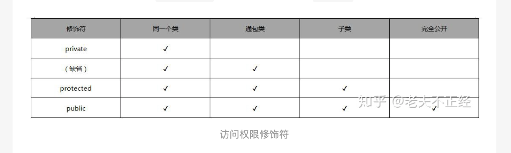

### 抽象类和接口

- 一个类只能继承(extends)一个抽象类，接口可以被多实现(implements)，即一个类只能继承一个类，可以实现多个接口
- 抽象类中可以有普通成员变量，接口中没有普通成员变量，只能有常量（always public static final)。
- 抽象类可以有构造函数，接口不可以有构造函数
- 抽象类中的方法可以被static修饰，接口中的方法不可以被static修饰 ---> jdk 1.8 可以接口可以有static修饰的方法
  - 为什么接口中的方法不可以被static修饰？
    - A条件：抽象类中的抽象方法，必须要在子类中覆盖(Overriding）。
    - B条件：static修饰的静态方法，不可以被覆盖。
    - A条件和B条件存在冲突无法同时满足，所以不可以在**抽象类中定义抽象的static方法**。
- 抽象类中可以有普通方法和抽象方法，接口中的方法全是抽象方法（且所有方法访问权限必须是public） ---> jdk 1.8接口中的方法还有default和static修饰的方法

##### 何时使用抽象类，何时使用接口？

- 接口主要用于模块与模块之间的调用。主要用接口来实现多继承，因为java不支持类的多继承，只能用接口
- 如果要实现的类和该抽象类是同一类事物，则用继承抽象类的方法；不是同一类事物，就用接口；
- 如果大部分方法都不确定，用接口抽象所有方法；如果只有少部分方法不确定，另有部分方法是确定的，用抽象类，实现部分确定的方法，抽象部分不确定的方法。


### static 

主要作用：创建独立于具体对象的域变量和方法。以致于即使没有创建对象，也能使用属性和调用方法！

- **static修饰方法**：静态方法。不依赖于对象就可以访问，可以直接通过类名.静态方法访问。静态方法只能访问对象的静态方法和静态变量。
- **static修饰变量**：静态变量被所有的对象所共享，在内存中只有一个副本，存在方法区中，当且仅当在类初次加载时会被初始化。
- **static修饰静态代码块**：在类被初次加载时执行，且执行一次，通常将只需要进行一次的初始化操作都放在static代码块中进行。
- **static静态内部类**：
  - 内部类对象无法在外边创建。
  - 内部类：定义在类内部的类叫做内部类，内部类持有外部类的引用，所以能使用外部类名.this.xxx访问来访问外部类的所有变量和方法，内部类一般只为外部类使用，且内部类能够独立的继承接口。
  - static修饰之后就叫做静态内部类，；
    -  优势：要创建静态内部类的对象，并不需要其外部类的对象；
    - 缺点：同时也失去了持有外部类的引用的权利。所以不能够从静态内部类的对象中访问外部类的非静态成员。
- **static静态导包**：`import static myClass.*;`导入类的所有静态方法或者调用特定静态方法。使用时直接使用方法名称就可以。


### 类 vs. 对象

类是一个模板，它描述一类对象的行为和状态。

对象是类的一个实例，有状态和行为。


### 重载和重写

重载(overload)：**发生在同一个类中**，方法名必须相同，参数类型不同、个数不同、顺序不同，方法返回值和访问修饰符可以不同，发生在编译时。

重写(override)：**发生在父子类中**，方法名、参数列表必须相同，返回值小于等于父类，抛出的异常小于等于父类（重写的方法一定不能抛出新的检查异常），访问修饰符大于等于父类（被子类重写的方法不能拥有比父类方法更加严格的访问权限）；如果父类方法访问修饰符为private则子类中就不是重写。


### 缓存池

Java 的数值类型的包装类型都有自己的缓存池，当用 valueOf 方法装箱数值的时候会优先返回缓存的值。

new Integer(123) 与 Integer.valueOf(123) 的区别在于:

- new Integer(123) 每次都会新建一个对象;
- Integer.valueOf(123) 会使用缓存池中的对象，多次调用会取得同一个对象的引用。

```java
Integer x = new Integer(123);
Integer y = new Integer(123); 
System.out.println(x == y); // false 
Integer z = Integer.valueOf(123); 
Integer k = Integer.valueOf(123); 
System.out.println(z == k); // true
```

valueOf() 方法的实现比较简单，就是先判断值是否在缓存池中，如果在的话就直接返回缓存池的内容。

```java
public static Integer valueOf(int i) {
  if (i >= IntegerCache.low && i <= IntegerCache.high)
		return IntegerCache.cache[i + (-IntegerCache.low)]; 
	return new Integer(i);
```

在 Java 8 中，Integer 缓存池的大小默认为 -128~127。

### Object通用方法

```java
public native int hashCode()
public boolean equals(Object obj)
protected native Object clone() throws CloneNotSupportedException
public String toString()
public final native Class<?> getClass()
protected void finalize() throws Throwable {}
public final native void notify()
public final native void notifyAll()
public final native void wait(long timeout) throws InterruptedException
public final void wait(long timeout, int nanos) throws InterruptedException
public final void wait() throws InterruptedException
```

##### **wait()/ wait(long)/ wait(long,int)**

这三个方法是用来**线程间通信用** 的，作用是 **阻塞当前线程** ，等待其他线程调用notify()/notifyAll()方法将其唤醒。**这些方法都是public final的，不可被重写。**

**wait()调用前必须获得该对象的对象级锁，只能在同步方法或者同步代码块中调用wait()**，否则会抛IllegalMonitorStateException。**当wait()执行后，当前线程释放锁。**

wait方法会一直阻塞，直到其他线程调用当前对象的notify()/notifyAll()方法将其唤醒；而wait(long)是等待给定超时时间内（单位毫秒），如果还没有调用notify()/nofiyAll()会自动唤醒；wait(long,int)如果第二个参数大于0并且小于999999，则第一个参数+1作为超时时间；

主要点在于知道 timeout的单位为毫秒, 参数nanos 的单位为纳秒, 1毫秒 = 1000 微秒 = 1000 000 纳秒
处理时，由于纳秒级时间太短(我猜测), 所以对参数nanos 其采取了近似处理,即nanos在半毫秒到一毫秒内，则让timeout++，不然的话，舍弃。

其主要作用应该在能更精确控制等待时间(尤其在高并发时，毫秒的时间节省也是很值得的)

##### notify()/notifyAll()

前面说了， 如果当前线程获得了当前对象锁，调用wait方法，将锁释放并阻塞；这时另一个线程获取到了此对象锁，并调用此对象的notify()/notifyAll()方法将之前的线程唤醒。 这些方法都是public final的，不可被重写。

**notify()调用前，必须获得该对象的对象级锁**，即**只能在同步方法或者同步代码块中**调用notify()方法，否则会抛出IllegalMonitorStateException。

<u>当notify()方法执行后，不会马上释放该对象的锁，呈wait状态的线程也并不能马上获得该对象锁，要等到执行notify()的线程将程序执行完，也就是退出synchronized代码块后，当前线程才会释放锁。</u>

1. public final native void notify(); **随机唤醒之前在当前对象上调用wait方法的一个线程**
2. public final native void notifyAll(); **唤醒所有之前在当前对象上调用wait方法的线程**

##### getClass()

final 方法、获取对象的运行时 class 对象，class 对象就是描述对象所属类的对象。这个方法通常是和 Java 反射机制搭配使用的。

- 获取对象的三种方法：	

  - 类名.class；
  - Class.forName("类名字符串")；
  - 对象.getClass()；

  ```java
  Class<?> clz1 = Person.class; 
  Class<?> clz2 = Class.forName("com.demo.reflect.Person");
  Class<?> clz3 = new Person().getClass();
  ```

##### equals()

等价与相等：

- 对于基本类型，== 判断两个值是否相等，基本类型没有 equals() 方法。
- 对于引用类型，== 判断两个变量是否引用同一个对象，而 equals() 判断引用的对象（值）是否等价。
- Object中的equals默认情况下，比较的是地址值。不过，我们可以根据情况自己重写该方法。**一般重写都是自动生成，比较对象的成员变量值是否相同**

```java
Integer x = new Integer(1);
Integer y = new Integer(1); 
System.out.println(x.equals(y)); // true 
System.out.println(x == y); // false
```

equals实现逻辑：

- 检查是否为同一个对象的引用，如果是直接返回 true; 

- 检查是否是同一个类型，如果不是，直接返回 false; 

- 将 Object 对象进行转型;
- 判断每个关键域是否相等。

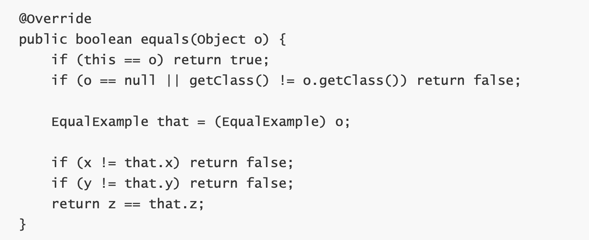


##### hashCode()

hashCode() 返回散列值（不重写的话，默认时对象的地址），而 equals() 是用来判断两个对象是否等价（默认是比较两个对象的地址）。等价的两个对象散列值一定相同，但是散列值相同的两个对象不一定等价。

在覆盖 equals() 方法时应当总是覆盖 hashCode() 方法，保证等价的两个对象散列值也相等。


###### equals()和hashCode()的关系？

hashCode()方法和equals()方法的作用其实一样，在Java里都是用来对比两个对象是否相等一致。

但是呢，因为重写的equas()里一般比较的比较全面比较复杂，大量并且快速的对比的话如果都用equal()去做显然效率太低。所以这时候，我们可以在需要对比的时候，首先用hashCode()去对比，如果hashCode()不一样，则表示这两个对象肯定不相等（也就是不必再用equal()去再对比了）,如果hashCode()相同，此时再对比他们的equal()，如果equal()也相同，则表示这两个对象是真的相同了，这样既能大大提高了效率也保证了对比的绝对正确性！


- 如果x.equals(y)为true,那么x与y的hashCode方法结果一定是相等的。
- 如果x.equals(y)为false,那么x与y的hashCode方法结果不一定是相等的。


###### 为什么在覆盖 equals() 方法时应当总是覆盖 hashCode() 方法？

其实简单的说就是为了保证同一个对象，**保证在equals相同的情况下hashcode值必定相同**。如果你重写了equals，比如说是基于对象的内容实现的，而保留hashCode的实现不变，那么很可能某两个对象明明是“相等”，而hashCode却不一样。


##### toString()

返回一个String类型的字符串，用于描述当前对象的信息，使用频率极高，一般都有子类都有覆盖，即可以重写返回对自己有用的信息，默认返回的是当前对象的类名+hashCode的16进制数字。

默认返回 ToStringExample@4554617c 这种形式，其中 @ 后面的数值为散列码的无符号十六进制表示。


##### clone()

该方法是保护方法，**实现对象的浅拷贝**，只有实现了 Cloneable 接口才可以调用该方法，否则抛出CloneNotSupportedException 异常。

**默认的 clone 方法是浅拷贝。**所谓浅拷贝，指的是对象内属性引用的对象只会拷贝引用地址，而不会将引用的对象重新分配内存。深拷贝则是会连引用的对象也重新创建。


##### finalize()

此方法是在垃圾回收之前，JVM会调用此方法来清理资源。此方法可能会将对象重新置为可达状态（有引用指向），导致JVM无法进行垃圾回收。

finalize()方法具有如下4个特点：

- **永远不要主动调用某个对象的finalize()方法，该方法由垃圾回收机制自己调用；**
- finalize()何时被调用，是否被调用具有不确定性；
- 当JVM执行可恢复对象的finalize()可能会将此对象重新变为可达状态；
- 当JVM执行finalize()方法时出现异常，垃圾回收机制不会报告异常，程序继续执行。

**finalize方法里面不能执行什么样的操作?**

耗时的操作，会影响GC的时间

## JVM

### JVM和线程

Java编写的程序都运行在在Java虚拟机（JVM）中，每用java命令启动一个java应用程序，就会启动一个JVM进程。在同一个JVM进程中，有且只有一个进程，就是它自己。在这个JVM环境中，所有程序代码的运行都是以线程来运行的。JVM找到程序程序的入口点main()，然后运行main()方法，这样就产生了一个线程，这个线程称之为主线程。当main方法结束后，主线程运行完成。JVM进程也随即退出。


### JVM内存

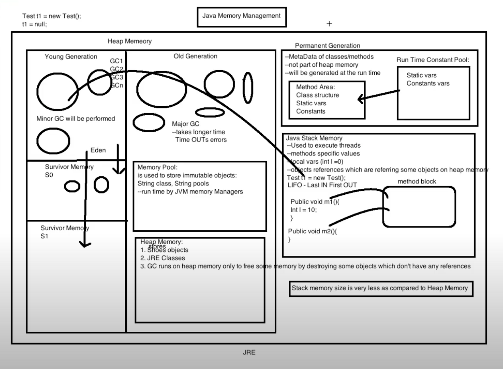


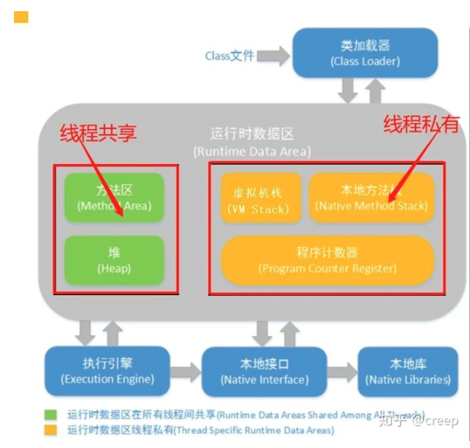


线程私有：PC程序计数器，虚拟机栈，本地方法栈    

线程共享：堆，方法区，直接内存


区域 | 是否隔离 | 异常
---|---|---
程序计数栈 | 私有 | 唯一不会抛出OutOfMemoryError异常
Java虚拟机栈 | 私有 | OutOfMemoryError（无法申请到足够内存）；StackOverFlowError（请求栈深度大于虚拟机允许深度）
本地方法栈 | 私有 | OutOfMemoryError（无法申请到足够内存）；StackOverFlowError（请求栈深度大于虚拟机允许深度）
Java堆 | 共享 | OutOfMemoryError（堆中没有完成内存分配且堆无法再扩展）
方法区 | 共享 | OutOfMemoryError（无法满足内存分配需求）


- **PC**：下一条执行字节码指令的地址，唯一不会发生OutOfMemory的地方；

- **虚拟机栈**：线程私有，生命周期和线程一致；每个方法执行时都会创建一个栈帧(stack frame)，用于存放【局部变量表（基本数据类型和引用类型变量），操作数栈，动态链接，方法返回地址】等。每一方法从调用到执行完成的过程，就对于着一个栈帧在虚拟机帧中入帧和出帧的过程。
  
  - 两种异常：当栈的深度超过最大申请申请深度时，StackOverFlowError; 内存不够Java虚拟机栈动态扩展时，OutOfMemory;
  - 栈中存放的是栈帧，一个函数=一个栈帧;
  - 什么是动态链接？
    - 在一个class文件中，一个方法要调用其他方法，需要将这些方法的符号引用转化为其在内存地址中的直接引用，而符号引用存在于方法区中的运行时常量池。
    - Java虚拟机栈中，每个栈帧都包含一个指向运行时常量池中该栈所属方法的符号引用，持有这个引用的目的是为了支持方法调用过程中的**动态连接(Dynamic Linking)**。
    - 这些符号引用一部分会在类加载阶段或者第一次使用时就直接转化为直接引用，这类转化称为**静态解析**。另一部分将在每次运行期间转化为直接引用，这类转化称为动态连接。
  
- **本地方法栈**：存放本地方法的栈，其他和虚拟机栈一样。

  - 虚拟机栈和本地方法栈的区别？

    虚拟机栈为虚拟机执行Java方法（也就是字节码）服务，而本地方法栈则为虚拟机使用到的Native方法服务。虚拟机规范中对本地方法栈中使用的语言、使用方式与数据结构并没有强制规定，因此具体的虚拟机可以自由实现它。

- **堆**：唯一作用：存储对象内存；几乎所有的对象和数组都在这分配内存；是垃圾回收的主要地方；为更好的回收内存和分配内存，将对堆进行分代，分为新生代和老年代，不同的代采用不同的垃圾回收算法；老年代基本采用标记整理，只有cms采用标记清除。

  - 新生代里面可以分为Eden空间，From Survivor空间，To Survivor空间。
  - 新生采用复制算法，为提高内存利用率，将新生代分为伊甸区，s0,[səˈvaɪvə(r)] s1，**比例为8:1:1**。每次留1块s区作为复制的备份内存，同时将老年代作为分配担保区。

- **方法区：**存储已被虚拟机加载的**类信息、常量、静态变量、即时编译器编译后的代码**等数据。线程共享。JDK1.8被元空间取代，元空间位于直接内存；
  
  - 替换的一个原因是，方法区有JVM设置固定大小上限，而元空间直接使用内存，只受限于直接内存，不会发生OutOfMemory;
  - **常量池** (Runtime Constant Pool)，**1.8之前，放在方法区**，大小受限于方法区。**而1.8存放堆中**。主要有字面量(字符串基本数据类型，final常量值)和符号引用.
  
- **直接内存**，不是运行时数据区的一部分，也不是虚拟机规范定义的内存，也可能OutOfMemory; 虽然本机直接内存的分配不会受到java堆大小的限制，但是还是会受到本机总内存大小以及处理器寻址空间的限制。


 ### 堆内存分配策略

- 对象优先在新生代伊甸区分配内存。
- 大对象直接进去老年代(长字符串和数组)
- 长期存活的对象进入老年代。一次Minor GC，年龄加一，默认年龄15进入老年代。
- 还有一个办法将对象进入老年代的就是**动态年龄判定**。当前survivor区空间相同年龄的所有对象的大小总和大于survivor空间的一半，则年龄大于或者等于该年龄的对象就直接进入老年代，无需等待Max Tenuring Threshold中的年龄要求。


### 垃圾回收

新生代 GC（Minor GC）,发生在新生代的垃圾回收动作，频繁且快。（根据新生代中对象是否有指向它的reference来判断）

老年代 GC（Major GC/Full GC，发生在老年代的垃圾回收，通常伴随着至少一次的minor gc。速度慢。


##### Young GC的触发情形


##### Full GC的触发情形

- 老年代空间不足
- 方法区空间不足。
- 调用System.gc(), 建议JVM进行full gc.（不能保证一定可以回收垃圾，只能说try best effort） 
- 没有足够的连续空间分配给大对象。
- 长期存活的对象转入老年代，空间不足。
- 新生代垃圾回收存活的对象太多，S1放不下，老年代担保空间不足。


#### 哪些对象需要被回收？

*不会再去用的对象呀...*

**如何判断哪些对象不会再去使用：**

- **引用计算法**：给对象添加一个引用计数器，每次被引用，计算器加一，引用失效，计算减一。当引用数为0时，表示对象不存活。

  但该方法无法解决循环引用问题。就是当两个对象相互引用时，这两个对象实际是不可获得的，但是由于引用计数不为零，所以均不会被回收。

- **可达性分析法**。以**GC Roots**对象为起点，向下搜索，节点所走的路径成为引用链。当一个对象和引用链没有相连时，表示这个对象不可达。**是采用的主要方法。**

  - 可以用作GC Roots的对象:
    -  虚拟机栈引用的对象
    - 本地方法栈引用的对象
    - 方法区静态属性引用的对象
    - 方法区常量引用的对象。
  - 为什么是这四个对象？
    - 因为gc roots一定要是一个活跃的引用。因为GC主要对堆回收，方法区回收可能性小，栈属于线程私有，不需要GC管理
    - tracing GC的本质是通过找出所有活对象来把其余空间认定为“无用”，而不是找出所有死掉的对象并回收它们占用的空间


#### JVM中的四种引用：

强引用 > 软引用 > 弱引用>虚引用

- **强引用**(Strong Reference)：new的对象。垃圾收集器永远不会回收被强引用的对象。

- **软引用**(Soft Reference)：如下所示，当我们存在有用但不是必需的对象时，例如**内存敏感的高速缓存**，就可以使用软引用。只要内存空间足够，软引用对象就不会被回收，将要发生内存溢出异常时，会将软引用的对象回收。

  - 软引用可以和一个引用队列（ReferenceQueue）联合使用，如果软引用所引用的对象被垃圾回收器回收，Java虚拟机就会把这个软引用加入到与之关联的引用队列中。

  ```java
  SoftReference<String> sr = new SoftReference<String>(new String("hello"));
  ```

- **弱引用**(Weak Reference)：弱引用也是用来描述非必需对象的，当JVM进行垃圾回收时，无论内存是否充足，都会回收被弱引用关联的对象。 

  - 弱引用可以和一个引用队列（ReferenceQueue）联合使用，如果弱引用所引用的对象被垃圾回收，Java虚拟机就会把这个弱引用加入到与之关联的引用队列中。

  ```java
  WeakReference<String> sr = new WeakReference<String>(new String("hello"));
  ```

- **虚引用**(Phantom Reference)：虚引用和前面的软引用、弱引用不同，它并不影响对象的生命周期。在java中用java.lang.ref.PhantomReference类表示。如果一个对象与虚引用关联，则跟没有引用与之关联一样，**在任何时候都可能被垃圾回收器回收**。

  - 虚引用必须和引用队列（ReferenceQueue）联合使用。当垃圾回收器准备回收一个对象时，如果发现它还有虚引用，就会在回收对象的内存之前，把这个虚引用加入到与之关联的引用队列中。

- 很少用虚和弱引用，软引用很多，可以加快jvm对垃圾内存的回收速度，防止内存溢出(OutOfMemory)等问题产生。


##### 虚引用与软引用和弱引用的一个区别：

虚引用必须和引用队列（ReferenceQueue）联合使用。当垃圾回收器准备回收一个对象时，如果发现它还有虚引用，就会在回收对象的内存之前，把这个虚引用加入到与之 关联的引用队列中。


#### 回收对象的两次标记过程：

即使在可达性分析算法中不可达的对象，也并非是“非死不可”，这时候它们暂时处于“缓刑”阶段，要真正宣告一个对象死亡，至少要经历两次标记过程。

**第一次标记：**如果对象在进行可达性分析后发现没有与GC Roots相连接的引用链，那它将会被第一次标记；

**第二次标记：**第一次标记后接着会进行一次筛选，筛选的条件是此对象是否有必要执行finalize()方法（当对象没有覆盖 finalize 方法，或 finalize 方法已经被虚拟机调用过时，虚拟机将这两种情况视为没有必要执行）。在finalize()方法中没有重新与引用链建立关联关系的，将被进行第二次标记。

在执行finalize方法时，该对象依然没有被引用，才会被真正回收掉。**对一个对象来说，finalize方法只能被调用一次。**


#### 垃圾回收算法

标记-清除算法，标记-整理算法，复制算法，分代回收算法

- **标记-清除算法**(Mark-Sweep)：标记-清除算法分为标记和清除两个阶段。该算法首先从根集合进行扫描，对存活的对象对象标记，标记完毕后，再扫描整个空间中未被标记的对象并进行回收。

  - 缺点：
    - 效率问题，标记和清除两个过程的效率都不高，需要遍历对象集合；
    - 空间问题，标记清除之后会产生大量不连续的内存碎片，空间碎片太多可能会导致以后在程序运行过程中需要分配较大的对象时，无法找到足够的连续内存而不得不提前触发另一次垃圾收集动作

  

- **标记-整理算法**(Mark-Compact)：标记整理算法会将所有的存活对象移动到一端，并对不存活对象进行处理，因此其不会产生内存碎片

  - 缺点与标记-清除算法一样，效率不高，要进行两次遍历
  - 优点：避免产生内存碎片，同时避免了复制算法的空间问题。

  

- **复制算法** (Copy)：复制算法将可用内存按容量划分为大小相等的两块，每次只使用其中的一块。当这一块的内存用完了，就将还存活着的对象复制到另外一块上面，然后再把已使用过的内存空间一次清理掉。**这种算法适用于对象存活率低的场景**，因为只需要付出少量存活对象的复制成本就可以完成搜集。

  - 缺点：
    - 牺牲了一半的内存换取内存布局整齐的代价
    - 当内存中一些对象存活时间比较长时，大量的拷贝工作会就会降低系统的运行效率

- **分代回收算法**：Java 堆分为新生代和老年代，这样就可以根据各个年代的特点采用最适当的收集算法。

  - 在**新生代**中，每次垃圾收集时都发现有大批对象死去，只有少量存活，那就选用**复制算法**，只需要付出少量存活对象的复制成本就可以完成收集。效率高
  - 而**老年代**中因为对象存活率高、没有额外空间对它进行分配担保，就使用“标记—清理”或者“标记—整理”算法来进行回收


#### 垃圾收集器

###### JDK8的默认垃圾收集器：默认使用 Parallel Scavenge（新生代）+ Serial Old（老年代）

一般Serial 和Serial Old 一起使用。

- **Serial串行收集器**
- 单线程，垃圾回收的时候，必须暂停其他工作。给新生代用的
  - **复制算法**

- **Serial Old 收集器**
    - Serial 收集器的老年代版本，老年**标记整理**


*+并行，多线程*

一般Parallel Scavenge和Parallel Old一起使用。

- **Parallel Scavenge收集器**
  - 复制算法的多线程收集器，新生代复制
  - **注重吞吐量**，cpu运行代码时间/cpu耗时总时间。[CMS 等垃圾收集器的关注点更多的是用户线程的停顿时间（提高用户体验)]

- **Parallel Old 收集器**
  - Parallel Scavenge老年代版本，**标记整理**。
  - 使用多线程和 “标记 - 整理” 算法。在注重吞吐量以及 CPU 资源的场合，都可以优先考虑 Parallel Scavenge 收集器和 Parallel Old 收集器。


一般parnew和cms一起使用

- **ParNew 收集器**
  - Serial的多线程版本，和Serial一样，复制算法。


*+并发*


- **CMS 收集器**
  - CMS（Concurrent Mark Sweep）收集器以注重**最短回收停顿时间**为目标的并发收集器
  - 由于整个过程中耗时最长的并发标记和并发清除过程收集器线程都可以与用户线程一起工作，所以我们可以说垃圾收集线程与用户线程（基本上）同时工作【并发】
  - 标记清除(Mark-Sweep)算法
  - 四个步骤收集垃圾：
    - **初始标记(stop the world):** 暂停所有的其他线程，并记录下与GC Roots直接关联的对象，速度很快 
    - **并发标记(不stop the world)：** 同时开启 GC 和用户线程，用一个闭包结构去记录可达对象(root tracing)。但在这个阶段结束，这个闭包结构并不能保证包含当前所有的可达对象。因为用户线程可能会不断的更新引用域，所以 GC 线程无法保证可达性分析的实时性。所以这个算法里会跟踪记录这些发生引用更新的地方。
    - **重新标记(stop the world)：** 重新标记阶段就是为了修正并发标记期间因为用户程序继续运行而导致标记产生变动的那一部分对象的标记记录，这个阶段的停顿时间一般会比初始标记阶段的时间稍长，远远比并发标记阶段时间短
    - **并发清除(不stop the world)：** 开启用户线程，同时 GC 线程开始对为标记的区域做清扫（标记清除算法，不用整理，是CMS能并发运行的主要原因）。
  - 优点：并发收集、低停顿(fast responsiveness)。
  - 缺点：
    - 无法处理浮动垃圾。
      - 由于CMS并发清理阶段用户线程还在运行着，伴随程序运行自然就还会有新的垃圾不断产生，这一部分的垃圾出现在标记过程之后，CMS无法在当次收集中处理掉它们，只好留待下一次GC在清理掉。这一部分垃圾就成为"浮动垃圾"。浮动垃圾的出现可能会导致Cucurrent Mode Failure，进而引发Full GC
    - 使用标记清除算法，导致大量不连续碎片产生。
    - 对CPU资源敏感，在并发阶段会占用一部分CPU资源导致应用程序变慢，总吞吐量变低。


*+缩短等待时间*


- **G1收集器 【低停顿， 高吞吐】**

  - **并行和并发**：G1 能充分利用 CPU、多核环境下的硬件优势，使用多个 CPU（CPU 或者 CPU 核心）来缩短 Stop-The-World 停顿时间。部分其他收集器原本需要停顿 Java 线程执行的 GC 动作，G1 收集器仍然可以通过并发的方式让 java 程序继续执行。
    - 并行：利用多CPU、多核环境下的硬件优势。
    - 并发：两个阶段的垃圾回收能和用户线程并发。
  - **分代收集**：与其他搜集器一样，分代概念在G1中依然得以保留。虽然 G1 可以不需要其他收集器配合就能独立管理整个 GC 堆，但它能采用不同的方式去处理新创建的对象和已经存活了一段时间、熬过多次gc的旧对象以获得更好的收集结果。
  - **空间整合**：与 CMS 的 “标记 – 清理” 算法不同，G1 从整体来看是基于 “标记-整理” 算法实现的收集器；从局部上来看是基于 “复制” 算法实现的。
  - **可预测的停顿**：（让使用者指定垃圾回收时间）
    - 这是 G1 相对于 CMS 的另一个大优势，降低停顿时间是 G1 和 CMS 共同的关注点，但 G1 除了追求低停顿外，还能建立可预测的停顿时间模型，能让使用者明确指定在一个长度为 M 毫秒的时间片段内。

  

  垃圾回收时，对新生代和老年代一视同仁。将整个堆划分成多个大小相等的Region。G1能跟踪每个Region的回收价值和停顿时间成本。

  **步骤：**

  - 初始标记(STW)：标记与GC roots**直接关联**的对象，以及gc对象所在的region（root region）
  - 并发标记（可以并发）：可达性分析过程（同CSM，但是遍历范围缩小）。
  - 最终标记(可以并行，STW)：对并发标记过程中，用户线程修改的对象再次标记一下。
  - 筛选回收（可以并发）：对各个Region的回收价值和成本进行排序，然后根据用户所期望的GC停顿时间制定回收计划并回收【复制清理】。


### 创建一个对象的步骤

1. 类加载检查，先检查对象所属类是否已被加载、解析、初始化过，如果没有，先进行类加载过程；
2. 分配内存，为对象分配内存(两种分配方式指针碰撞(标记整理)和空闲列表(标记清除))。
3. 初始化为0值，将内存空间除了对象头都初始化为0值。
4. 设置对象头，类的元数据信息，对象哈希码，对象年龄等
5. 执行init方法，对对象真正初始化。


### 创建一个对象的内存分配方式

1. **指针碰撞**：假设Java堆中内存是绝对规整的，所有用过的内存都放在一边，空闲的内存放在另一边，中间放着一个指针作为分界点的指示器。分配内存时就把指针向空闲空间那边挪动一段与对象大小相等的距离。一些新生代GC收集器使用的是复制算法，所以采用指针碰撞方式分配内存
2. **空闲列表**：如果Java堆中的内存并不是规整的，已使用的内存和空闲的内存相互交错，那就没有办法简单地进行指针碰撞了，虚拟机就必须维护一个列表，记录上哪些内存块是可用的，在分配的时候从列表中找到一块足够大的空间划分给对象实例， 并更新列表上的记录。老年代垃圾收集器使用了标记清理、整理算法，所以配合空闲列表方式分配内存


### 创建对象的方法

- 用new关键字创建

- 调用对象的clone方法
  
  - 注意：由于Object类中clone方法是protected 修饰的，所以我们必须在需要克隆的类中重写克隆方法
  
- 利用反射，调用Class类的或者是Constructor类的newInstance()方法

  ```java
  Class clazz = Dog.class; //通过反射创建对象第一步：需要获得class对象
  Dog dog = (Dog)clazz.newInstance(); //这样获取到类对s象之后就可以通过newInstance()这个方法来获取具体的对象了，需要注意的是这个方法的返回值是Object类型，我们需要进行转型操作
  ```
  
- 用反序列化，调用ObjectInputStream类的readObject()方法

  ```java
  Dog dog=new Dog();
  dog.name="xiaohei";
  dog.age=3;
  FileOutputStream fos = new FileOutputStream("dog.txt");
  ObjectOutputStream ops = new ObjectOutputStream(fos);
  ops.writeObject(dog);
  System.out.println("dog对象序列化完成");
  
  //通过ObjectOutputStream的writeObject方法，我们就将一个对象完成了序列化
  
  //现在我们再次将刚才序列化后的对象反序列化回来，这次用到的是ObjectInputStream的readObject方法：
  
  FileOutputStream fos=new FileOutputStream("dog.txt");
  ObjectInputStream ois=new ObjectInputStream(fos);
  Dog dog=(Dog) ois.readObject();
  System.out.println("我叫"+dog.name+"今年"+dog.age+"岁了");
  System.out.println("对象反序列化完成");
  ```


#### new 和newinstance的区别：

- newInstance: 弱类型。低效率。**只能调用无参构造**。
- new: 强类型。相对高效。能调用任何public构造。


#### 对象序列化的两种用途：

- 将对象的字节序列永久的保存到硬盘上：
  - 例如web服务器把某些对象保存到硬盘让他们离开内存空间，节约内存，当需要的时候再从硬盘上取回到内存中使用
- 在网络上传递字节序列：
  - 当两个进程进行远程通讯的时候，发送方将java对象转换成字节序列发送(序列化)，接受方再把这些字节序列转换成java对象(反序列化) 


#### 反射

[反射例子](https://zhuanlan.zhihu.com/p/32259566)

在运行状态中，对于任意一个类，都能够知道这个类的所有属性和方法；对于任意一个对象，都能够**调用**它所有属性和方法，这种动态获取信息以及动态调用对象方法的功能成为Java反射机制。

提供的功能：

- 创建实例
- 反射调用方法

```java
public interface IFood {
	public void cook();
}

public class Pork implements IFood{     //猪肉
   public void cook(){
      System.out.println("cook pork");
}
public class Beef implements IFood{     //牛肉
   public void cook(){
      System.out.println("cook beef");
}
public class Mutton implements IFood{    //羊肉
   public void cook(){
      System.out.println("cook mutton");
}


public class test{
      public static void main(String[] args){
         String food=null;                   //字符串food代表食物的类
         Class c=Class.forName(food);        //根据字符串food来载入类对象
         Object object=c.newInstance();      //生成对象
         IFood Ifood=(IFood)object;          //强制转型
         Ifood.cook();                       //调用方法
     }
}
```

###### 获取class对象的三种方法：Class.forName("全类名")；类名.class；对象.getClass()；


### 对象的内存布局

对象在内存中主要分为三部分：对象头，实例数据和对象对齐。

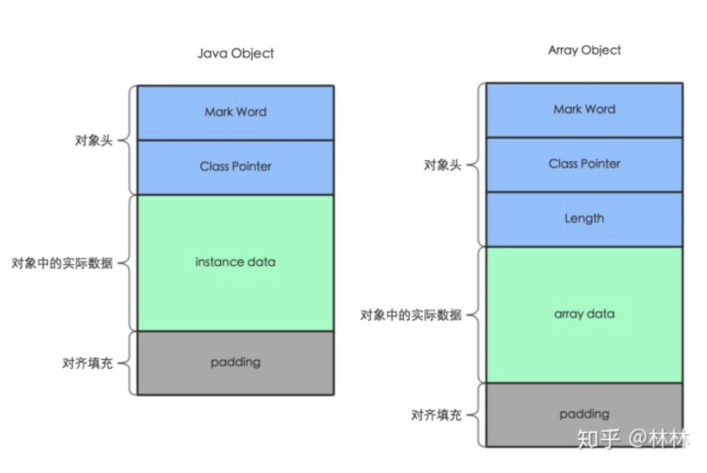

- **对象头**：其主要包括两部分数据：Mark Word、Class对象指针。特别地对于数组对象而言，其还包括了数组长度数据。
  
  - Mark Word（其记录了Hash Code，分代年龄，GC标记、锁状态等）
  
  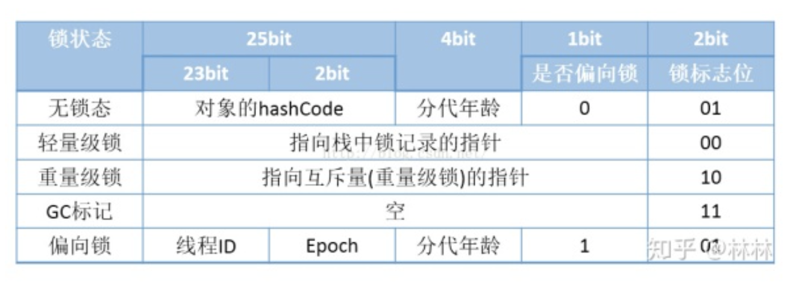
  
  - Class对象指针：指向它的类的元数据的指针，虚拟机通过这个指针来确定对象是哪个类的实例，
  
- **实例数据**：用于存放该对象的实例数据
- **内存填充**：64位的HotSpot要求Java对象地址按8字节对齐，即每个对象所占内存的字节数必须是8字节的整数倍。因此Java对象需要通过内存填充来满足对齐要求


### 对象访问形式

- 使用句柄：

  - 在堆中开辟句柄池，栈中的引用变量，指向句柄池中的句柄地址，该地址指向堆中的实例对象数据，和方法区的对象类型数据。(间接访问)

  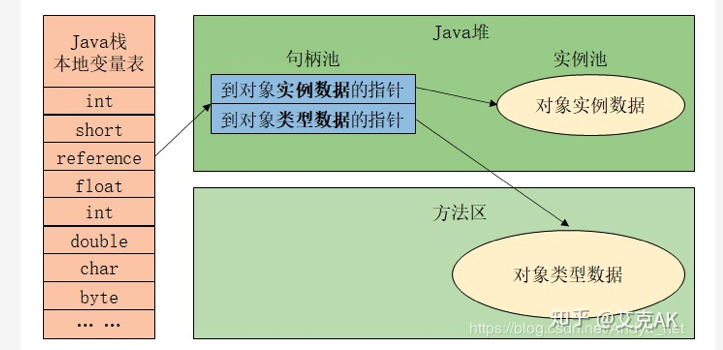

- 直接使用指针：

  - 直接指针，栈中的引用对象变量，直接指向堆中的对象，其中堆中的对象头又指向方法区中的对象类型数据。（直接访问）

  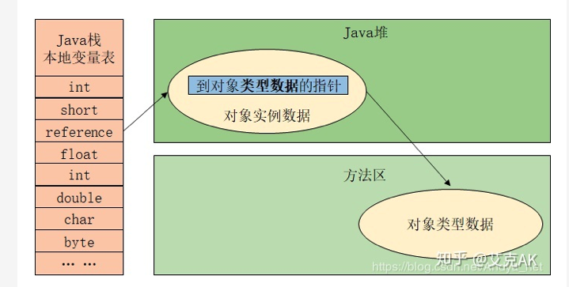

#### 使用句柄 vs 使用指针：

- 使用句柄访问优势是reference中存储的是稳定的句柄地址，对象被移动时，只会改变句柄中实例数据指针，reference本身不会变；
- 使用直接指针访问优势是速度快，节省一次指针定位时间开销。（**JVM默认使用**）


### 编译生成的class存在在哪里

类的加载的过程中，加载并通过通过文件格式验证后（验证的第一步），会将编译好的class类文件中的字节码读入到内存中，并将其放在**方法区**内。


### 详细介绍类加载过程

类的加载：将编译好的class类文件中的字节码读入到内存中，将其放在方法区内创建对应的class对象。

主要分成三步：加载，链接，初始化。链接又分验证，准备，解析。

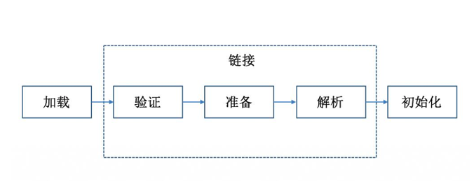

- **加载**：主要完成三件事：
  
  - 通过Class名称获取类的二进制字节流。
  - 将类的静态存储结构转化为方法区的运行时数据结构。
  
  - 在内存中生成代表这个类的java.lang.Class对象，作为方法区这个类的各种数据访问的入口。
  
- **验证**：确保Class文件的字节流中包含的信息符合当前虚拟机的要求，并且不会危害虚拟机自身的安全。对文件格式，元数据（检查类），字节码（检查方法体），符号引用等验证正确性。

- **准备**：在方法区内**为类变量（被static修饰的变量，不含final修饰的变量，final修饰的变量在编译的时候就赋值了）分配内存**并设置为0值（如果是object的话，就是null）。（实例变量会在对象实例时随着对象分配在java堆中）

  ```java
  //比如如下的代码，在准备阶段过后，变量value的初始值还是0，因为这时候还没有执行任何java方法。
  public static int value = 123
  ```

- **解析**：将符号引用转化为直接引用。比如一些常量，CONSTANT_FIELD_INFO这种，我们可能在代码里写的是int i = CONSTANT_FIELD_INFO; 那在解析过程中要把CONSTANT_FIELD_INFO符号改成实际保存该常量的地址。

- **初始化**：执行类构造器clinit方法（开始真正执行类中定义的java程序代码），真正初始化，即对静态变量赋予正确值。

    ```java
    //在初始化阶段，变量value的值才为0
    public static int value = 123
    ```

**类的生命周期：加载，验证，准备，解析，初始化，使用，卸载**


#### 类加载器

类加载过程的加载的第一步，将.class文件加载到内存是由类加载器完成的。

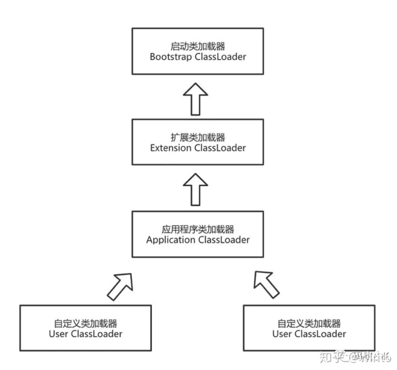

- BootstrapClassLoader启动类加载器（用c++语言写的，在java中不能被tostring方法打印）
  - 除了他其他类加载器都继承Java.lang.ClassLoader。   
  - 加载JDK/JRE/<u>lib</u>下的jar包和类 (以java.开头)。
- ExtensionClassLoader扩展类加载器
  - 加载 JDK/JRE/<u>lib/ext</u>目录下的jar包和类(以javax.开头)。
- AppClassLoader应用类加载器
  - 加载当前classPath下的jar包和类。
- 用户自己定义的加载器


**注意**：类加载器直接的的父子关系不会以继承（inheritance）的关系实现，而是都使用组合（composition）关系来复用父加载器


##### JDK vs. JRE vs. JVM

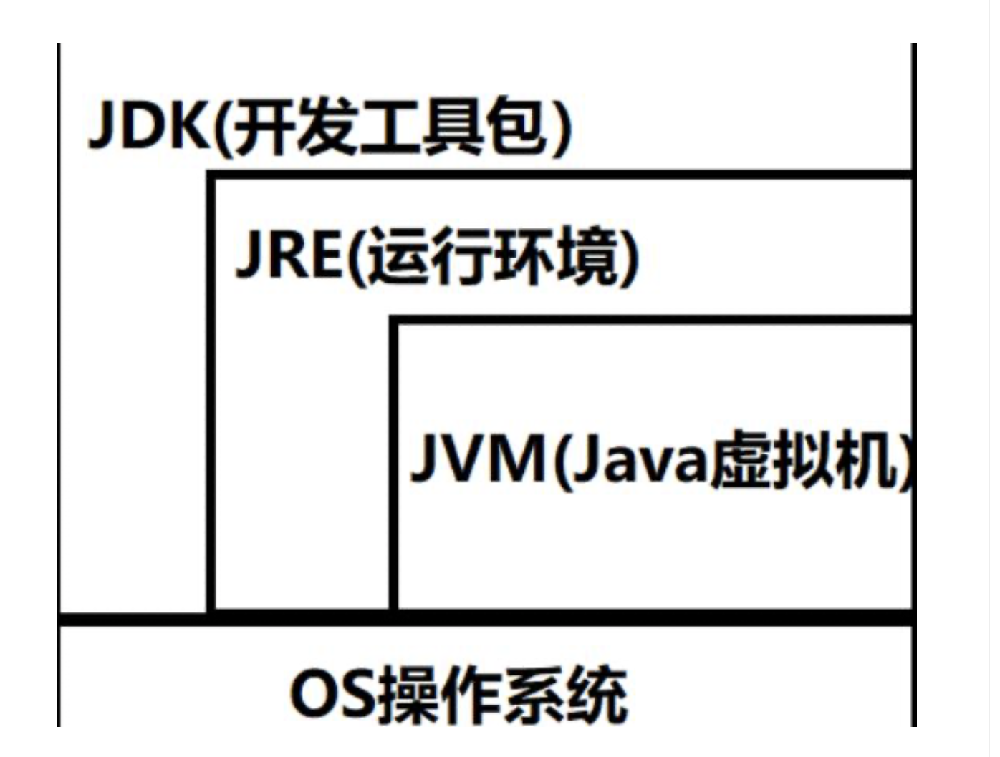

- JRE: java运行时环境，包含了java虚拟机，java基础类库。是使用java语言编写的程序运行所需要的软件环境，是提供给想运行java程序的用户使用的。

- JDK: java开发工具包，是程序员使用java语言编写java程序所需的开发工具包，是提供给程序员使用的。JDK包含了JRE，同时还包含了编译java源码的编译器javac，还包含了很多java程序调试和分析的工具：jconsole，jvisualvm等工具软件，还包含了java程序编写所需的文档和demo例子程序。
  

### 双亲委派机制，使用这个机制的好处?破坏双亲委派机制的场景?如何破坏?

一个类加载器收到类加载请求之后，首先判断当前类是否被加载过。已经被加载的类会直接返回，如果没有被加载，首先将类加载请求转发给父类加载器，一直转发到启动类加载器(Bootstrap Class Loader），只有当父类加载器无法完成时才尝试自己加载。

实现双亲委派的代码都集中在java.lang.CLassLoader中的loadClass()方法。实现逻辑清晰：

先检查是否已经被加载过，若没有加载则调用父加载器的loadClass()方法，若父加载器为空则默认使用启动类加载器作为父加载器。如果父类加载失败，抛出ClassNotFoundException异常后，再调用自己的findClass()方法进行加载。


**好处：**

- **可以避免类重复加载**(父类加载器已经加载过的类，不用再次加载)，保证了java程序的稳定运行
  - 如果没有双亲委派的话，相同的类被不同的类加载器加载产生的是不同的类，那就乱了
- **保证核心的API不被修改**
  - 假设通过网络传递一个名为java.lang.Integer的类，通过双亲委托模式传递到启动类加载器，而启动类加载器在核心Java API发现这个名字的类，发现该类已被加载，并不会重新加载网络传递的过来的java.lang.Integer，而直接返回已加载过的Integer.class，这样便可以防止核心API库被随意篡改。


##### 如何破坏双亲委派机制？

覆盖loadClass()方法


## Java容器

### 说说Java里的容器？

主要包括Collection和Map两种，Collection 存储着对象的集合，而 Map 存储着键值对(两个对象)的映射表。


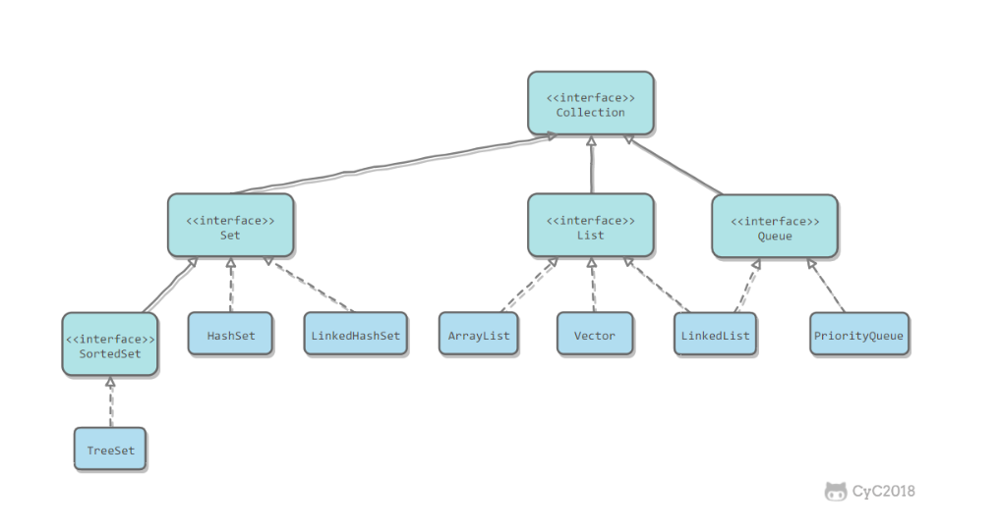

#### Collection 

- Set
  - TreeSet: 基于红黑树实现，支持有序性操作，例如根据一个范围查找元素的操作。但是查找效率不如 HashSet，HashSet 查找的时间复杂度为 O(1)，TreeSet 则为 O(logN)。
  -  HashSet:基于哈希表实现，支持快速查找，但不支持有序性操作。并且失去了元素的插入顺序信息，也就是说使用 Iterator 遍历 HashSet 得到的结果是不确定的。
  - LinkedHashSet:具有 HashSet 的查找效率，且内部使用双向链表维护元素的插入顺序。
- List
  - ArrayList:基于动态数组实现，支持随机访问。
  - Vector:和 ArrayList 类似，但它是线程安全的。 
  - LinkedList:基于双向链表实现，只能顺序访问，但是可以快速地在链表中间插入和删除元素。不仅如此， LinkedList 还可以用作栈、队列和双向队列。
- Queue
  - LinkedList:可以用它来实现双向队列。
  - PriorityQueue:基于堆结构实现，可以用它来实现优先队列。


集合 | 底层结构 | 存储类型 | 长度是否有上限 | 扩增/大小 | 线程安全 | 性能 | 备注
---|---|---|---|---|---|---|---
ArrayList | 数组 | 随机 | 有，`int hugeCapacity()` | 自动扩增/1.5倍 | 不安全 | 查询性能好 |
Vector | 数组 | 随机 | 有，`int hugeCapacity()` | 自动扩增/2倍 | 安全 | |
Stack | 数组 | 随机 | 有，`int hugeCapacity()` | 自动扩增/2倍 | 安全 | | 继承自Vector
LinkedList | 双向链表 | 顺序 | 无，直到内存满 | | 不安全 | 增加性能好 |
HashMap | | | 有，`MAXIMUM_CAPACITY = 1<<30` | 自动扩增/2倍 | 不安全 | |


#### Map

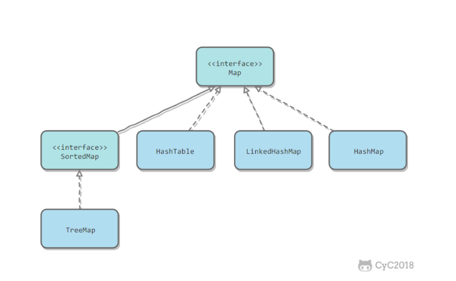

- TreeMap:基于红黑树实现。
- HashMap:基于哈希表实现。
- HashTable:和 HashMap 类似，但它是线程安全的，这意味着同一时刻多个线程可以同时写入 HashTable 并 且不会导致数据不一致。**它是遗留类，不应该去使用它**。现在可以使用 ConcurrentHashMap 来支持线程安 全，并且 ConcurrentHashMap 的效率会更高，因为 ConcurrentHashMap 引入了分段锁。
- LinkedHashMap:使用双向链表来维护元素的顺序，顺序为插入顺序或者最近最少使用(LRU)顺序。

### String

String 被声明为 final，因此它不可被继承。

在 Java 8 中，String 内部使用 char 数组存储数据。

```java
public final class String
	implements java.io.Serializable, Comparable<String>, CharSequence { /** The value is 		used for character storage. */
	
	private final char value[];
}
```

在 Java 9 之后，String 类的实现改用 byte 数组存储字符串，同时使用 coder 来标识使用了哪种编码。

```java
public final class String
    implements java.io.Serializable, Comparable<String>, CharSequence { /** The value is 		 used for character storage. */
		
		private final byte[] value;
		/** The identifier of the encoding used to encode the bytes in {@code value}. */
    private final byte coder;
}
```

value 数组被声明为 final，这意味着 value 数组初始化之后就不能再引用其它数组。并且 String 内部没有改变 value 数组的方法，因此可以保证 String 不可变。


##### String不可变的好处？/ String为什么是final的

1. **可以缓存 hash 值**

   因为 String 的 hash 值经常被使用，例如 String 用做 HashMap 的 key。不可变的特性可以使得 hash 值也不可变， 因此只需要进行一次计算。

2. **String Pool 的需要**

   如果一个 String 对象已经被创建过了，那么就会从 String Pool(String 常量池)中取得引用。只有 String 是不可变的，才可能使用 String Pool。

   

   

   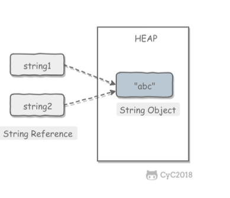

3. **安全性**

   String 经常作为参数，String 不可变性可以保证参数不可变。例如在作为网络连接参数的情况下如果 String 是可变 的，那么在网络连接过程中，String 被改变，改变 String 对象的那一方以为现在连接的是其它主机，而实际情况却不一定是。

4. **线程安全**

   String 不可变，天生具备线程安全，可以在多个线程中安全地使用。

### String Pool

字符串常量池(String Pool)保存着所有字符串字面量(literal strings)，**这些字面量在编译时期就确定**。不仅如

此，还可以使用 String 的 intern() 方法在运行过程中将字符串添加到 String Pool 中。

当一个字符串调用 intern() 方法时，如果 String Pool 中已经存在一个字符串和该字符串值相等(使用 equals() 方法 进行确定)，那么就会返回 String Pool 中字符串的引用;否则，就会在 String Pool 中添加一个新的字符串，并返回 这个新字符串的引用。

下面示例中，s1 和 s2 采用 new String() 的方式新建了两个不同字符串，而 s3 和 s4 是通过 s1.intern() 方法取得一 个字符串引用。intern() 首先把 s1 引用的字符串放到 String Pool 中，然后返回这个字符串引用。因此 s3 和 s4 引用 的是同一个字符串。

```java
String s1 = new String("aaa"); 
String s2 = new String("aaa"); 
System.out.println(s1 == s2); // false
String s3 = s1.intern(); 
String s4 = s1.intern(); 
System.out.println(s3 == s4); // true
```

如果是采用 "bbb" 这种字面量的形式创建字符串，会自动地将字符串放入 String Pool 中。

```java
String s5 = "bbb";
String s6 = "bbb"; 
System.out.println(s5 == s6); // true
```

在 Java 7 之前，String Pool 被放在运行时常量池中，常量池放在方法区。而在 Java 7，String Pool 被移到堆中。这是因为方法区的空间有限，在大量使用字符串的场景下会导致 OutOfMemoryError 错误。


### new String("abc")

使用这种方式一共会创建两个字符串对象(前提是 String Pool 中还没有 "abc" 字符串对象)。

- "abc" 属于字符串字面量(literal strings)，因此编译时期会在 String Pool 中创建一个字符串对象，指向这个 "abc" 字符串字面量;
- 而使用 new 的方式会在堆中创建一个字符串对象。

### String 和StringBuffer ,StringBuilder的区别

1. 可变性
   - String 不可变，StringBuffer和StringBuilder可变
2. 线程安全
   - String 不可变，因此线程是安全的
   - StringBuilder不是线程安全的
   - StringBuffer是线程安全的，内部使用synchronized进行同步


### ArrayList

- 底层实现是Object数组（transient Object[] elementData）;
- 默认长度是10, 扩容是变成1.5倍：int newCapacity = oldCapacity + (oldCapacity >> 1);
- 扩容是创建新的数组，elementData = Arrays.copyOf(elementData, newCapacity)
- 增减删除，会造成数组元素的移动，使用System.arraycopy();
- 支持随机访问;        

#### `ArrayList`的实现，为什么查找效率高

`ArrayList`采用数组实现。查找效率高，因为`ArrayList`是连续存放元素的，找到第一个元素的首地址，再加上每个元素的占据的字节大小就能定位到对应的元素


### LinkedList

- LinkedList 实际上是通过双向链表去实现的,内部类Node(val,next,pre)是链表的节点;
- 它也可以被当作堆栈、队列或双端队列进行操作。
- 不支持随机访问，但删除、插入元素时间不受元素位置影响，近似O(1),而ArryList是O(n);

### ArrayList和LinkedList的区别和底层实现?如何实现线程安全?


集合类 | `ArrayList` | `LinkedList`
---|---|---
继承关系 | `Collection<-List<-ArrayList` | `Collection<-List<-LinkedList`
底层数据结构 | 数组 | 双向链表
存取类型 | 随机存取 | 顺序存取
长度限制 | 有上限 `int hugeCapacity()` | 无上限 直到内存满
扩增/大小 | 自动扩增/1.5倍 | 
线程安全 | 不安全 | 不安全
性能 | 查询操作性能好 | 插入操作性能好


### 请你讲讲数组(Array)和列表(ArrayList)的区别?什么时候应该使用Array而不是ArrayList?

`ArrayList`可以算是`Array`（`[]`）的加强版，`ArrayList`想象成一种会自动扩增容量的`Array`
1. 存储内容
    1. `Array`数组可存放基本类型或对象类型；`Array`数组在存放的时候一定是同种类型的元素
    2. `ArrayList`只能包含对象类型；`ArrayList`可存放不同类型的元素，因为`ArrayList`可以存储`Object`
2. 空间大小
    1. `Array`最高效，但是其容量固定且无法动态改变
    2. `ArrayList`动态增长，但牺牲效率。若空间不够，会扩容1.5倍，然后将所有元素复制到新数组中并抛弃旧数组，每次添加新的元素的时候都会检查内部数组的空间是否足够
3. 相互转换
    ```java
    // ArrayList => Array
    ArrayList<Integer> arrayList = new ArrayList(10);
    Integer[] array = arrayList.toArray(new Integer[20]);
    
    // Array => ArrayList
    Integer[] array = new Integer[10];
    ArrayList<Integer> arrayList = new ArrayList(Arrays.asList(array));
    ```


使用arraylist的时候，对于基本类型数据，arraylist使用自动装箱把基本类型数据变成对象来减少编码工作量。但是，当处理固定大小的基本数据类型的时候，这种方式相对比较慢。

### HashMap的底层实现

[崩溃了,一个HashMap跟面试官扯了半个小时 - 遥遥无期的文章 - 知乎](https://zhuanlan.zhihu.com/p/133618417)

- 底层由链表+数组实现
- 可以存储null键和null值
- 线性不安全
- 初始容量为16，扩容每次都是2的n次幂(保证位运算) 加载因子为0.75，当Map中元素总数超过Entry数组的0.75，触发扩容操作。并发情况下，HashMap进行put操作可能会引起死循环，导致CPU利用率接近100%


HashMap底层是数组和链表的结合。HashMap通过key的HashCode（jdk1.8之后还会经过**扰动函数**处理，目的是减少哈希碰撞）得到Hash 值，然后通过位运算判断当前元素存放的位置，如果当前位置存在元素的话，就判断该元素与要存入的 元素的hash值以及key是否相同，如果相同的话，直接覆盖，不相同就通过拉链法解决冲突（1.7使用的是头插法，1.8使用的是尾插法，使用尾插法的原因就是为了让插入顺序保持一致，避免死循环）。当Map中 的元素总数超过Entry数组的0.75时，触发扩容操作，为了减少链表⻓度，元素分配更均匀。

HashMap基于哈希思想，实现对数据的读写。当我们将键值对传递给put()方法时，它调用 键对象的 hashCode()方法来计算hashcode，然后后找到bucket位置来储存值对象。当获取对象时，通过键对象的equals()方法找到正确的键值对，然后返回值对象。HashMap使用链表来解决碰撞问题，当发生碰撞了，对象将会储存在链表的下一个节点中。HashMap在每个 链表节点中储存键值对对象。当两个不同的键对象的hashcode相同时，它们会储存在同一个 bucket位置的链表中，可通过键对象的equals()方法用来找到键值对。如果链表大小超过阈值( 8)，链表就会被改造为树形结构（红黑树）。

为了配合使用分布良好的hashCode，树节点很少使用。并且在理想状态下，受随机分布的hashCode影响，链表中的节点遵循泊松分布，而且根据统计，链表中节点数是8的概率已经差不多千万分之一，而且此时链表的性能已经很差了。所以在这种比较罕⻅和极端的情况下，才会把链表转变为红黑树。因为链表转换为红黑树也是需要消耗性能的，特殊情况特殊处理，为了挽回性能，权衡之下，才使用红黑树，提高性能。也就是大部分情况下，hashmap还是使用的链表，如果是理想的均匀分布，节点数不到8， hashmap就自动扩容


##### 如何进行put 的

1. 判断数组是否为空，为空进行初始化;
2. 不为空，计算 k 的 hash 值，通过 `(n - 1) & hash`计算应当存放在数组中的下标 index ;
3. 查看 table[index] 是否存在数据，没有数据就构造一个Node节点存放在 table[index] 中；
4. 存在数据，说明发生了hash冲突, 继续判断key是否相等，相等，用新的value替换原数据(onlyIfAbsent为false)；
5. 如果不相等，判断当前节点类型是不是树型节点，如果是树型节点，创建树型节点插入红黑树中；
6. 如果不是树型节点，创建普通Node加入链表中；判断链表长度是否大于 8， 大于的话链表转换为红黑树；
7. 插入完成之后判断当前节点数是否大于阈值，如果大于开始扩容为原数组的二倍。

##### HashMap如何设定初始容量大小？

 一般如果`new HashMap()` 不传值，默认大小是16，负载因子是0.75， 如果自己传入初始大小k，初始化大小为 大于k的 2的整数次方，例如如果传10，大小为16。

##### 如何计算hash值的

##### 什么时候进行扩容的，怎么进行扩容的。

##### 扩容会出现什么问题（我问了一些是在多线程下的扩容吗？）

##### 那为什么选择链表大小超过8才会选择使用红黑树呢？


##### HashMap 1.8和1.7比 有什么优化？

- hashmap通过key得到hashcode后，加入了扰动函数来减少哈希碰撞。
- 数组+链表改成了数组+链表或红黑树；
- 链表的插入方式从头插法改成了尾插法，简单说就是插入时，如果数组位置上已经有元素，1.7将新元素放到数组中，原始节点作为新节点的后继节点，1.8遍历链表，将元素放置到链表的最后；
- 扩容的时候1.7需要对原数组中的元素进行重新hash定位在新数组的位置，1.8采用更简单的判断逻辑，位置不变或索引+旧容量大小；
- 在插入时，1.7先判断是否需要扩容，再插入，1.8先进行插入，插入完成再判断是否需要扩容；


##### 有什么办法可以解决哈希冲突？

- 开放定址法

  - 线性侦查法 (Linear Probing)：就是以当前冲突位置为起点，步长为1循环查找，直到找到一个空的位置，如果循环完了都占不到位置，就说明容器已经满了。
  - 平方侦测法 (Quadratic Probing)：相对于线性探查法，这就相当于的步长为di = i2来循环查找，直到找到空的位置。
  - 伪随机探测法：di=伪随机数序列，就是完全随机的布长来走

  缺点：   

  - 这种方法建立起来的哈希表，当冲突多的时候数据容易堆集在一起，这时候对查找不友好
  - 删除结点的时候不能简单将结点的空间置空，否则将截断在它填入散列表之后的同义词结点查找路径。因此如果要删除结点，只能在被删结点上添加删除标记，而不能真正删除结点；
  - 如果哈希表的空间已经满了，还需要建立一个溢出表，来存入多出来的元素。

- 再哈希法

- ```text
  Hi = (H(key) + di) MOD m，其中i=1,2,…,k(k<=m-1) //H(key)为元素本来应该放的位置
  Hi = RHi(key), 其中i=1,2,…,k
  ```

  RHi()函数是不同于H()的哈希函数，用于同义词发生地址冲突时，计算出另一个哈希函数地址，直到不发生冲突位置。这种方法不容易产生堆集，但是会增加计算时间。

- 拉链法

  - 将冲突位置的元素构造成链表。

    优点：

    - 处理冲突的方式简单，且无堆集现象，非同义词绝不会发生冲突，因此平均查找长度较短
    - 由于拉链法中各链表上的结点空间是动态申请的，所以它更适合造表前无法确定表长的情况；
    - 删除结点操作易于实现，只要简单地删除链表上的相应的结点即可。

    缺点：

    - 额外存储空间

- 建立一个公共溢出区

  假设哈希函数的值域为[0, m-1]，设向量HashTable[0,…,m-1]为基本表，每个分量存放一个记录，另外还设置了向量OverTable[0,…,v]为溢出表。基本表中存储的是关键字的记录，一旦发生冲突，不管他们哈希函数得到的哈希地址是什么，都填入溢出表。

  缺点：查找冲突数据的时候，需要遍历溢出表才能得到数据。


### HashMap和ConcurrentHashMap的区别？底层的锁是怎么实现的？


[ConcurrentHashMap实现原理及源码分析](https://www.cnblogs.com/chengxiao/p/6842045.html)

JDK1.7中采用`Segment`+`HashEntry`实现，lock加在`Segment`上。`Segment`继承了`ReentrantLock`，所以它就是一种可重入锁。在`ConcurrentHashMap`，一个`Segment`就是一个子哈希表，`Segment`里维护了一个`HashEntry`数组，并发环境下，对于不同`Segment`的数据进行操作是不用考虑锁竞争的，对于同一个Segment的操作才需考虑线程同步
1. `get()`方法：先定位`Segment`，再定位`HashEntry`。`get()`方法无需加锁，由于其中涉及到的共享变量都使用`volatile`修饰，`volatile`可以保证内存可见性，所以不会读取到过期数据
2. `put()`方法
    1. 定位segment并确保定位的Segment已初始化
    2. 调用Segment的put方法：`tryLock()`不成功时会遍历定位到的`HashEnry`位置的链表（遍历主要是为了使CPU缓存链表），若找不到，则创建`HashEntry`。`tryLock()`一定次数后，则lock。若遍历过程中，由于其他线程的操作导致链表头结点变化，则需要重新遍历


### HashMap和HashTable的区别？

HashMap和Hashtable都实现了Map接口，因此很多特性非常相似。

但是，他们有以下不同点:

- **实现方式不同**：HashMap继承了AbstractMap，HashTable继承Dictionary抽象类，两者均实现Map接口

- **是否允许null**：HashMap允许键和值是null，而Hashtable不允许键或者值是null。 

- **线程安全性不同**：HashTable线程安全，方法都是sychronized修饰; hashMap线程不安全；

- **初始化容量、扩容机制不同**：HashTable初始容量11，扩展2*n+1,HashMap,初始16，扩容加倍；初始容量向上取到2的N次方;

- HashMap当链表长度大于阈值时，转化成红黑树，而HashTable没有。

  

### HashTable如何做到线程安全的？

在每个数据操作的时候都会上锁(synchronized)，所以是线程安全的。但是同时效率比较低下。


### 如何让`HashMap`线程安全 | `HashTable`、`ConcurrentHashmap`如何实现线程安全
1. `HashTable`的方式：将容器中数据进行操作的方法用`synchronized`关键字修饰
2. `ConcurrentHashMap`的方式：采用分段锁思路，`segment`+`HashEntry`（JDK1.7）；`Node`+`CAS`+`Synchronized`（JDK1.8）


#### `HashMap` `ConcurrentHashMap` `LinkedHashMap` `HashTable`的区别

接口`java.util.Map`，Map主要用于存储健值对，根据键得到值，因此不允许键重复（重复则覆盖），但允许值重复
1. `Hashmap`
   
    ```java
    public class HashMap<K,V> extends AbstractMap<K,V> implements Map<K,V>, Cloneable, Serializable {}
    ```
    
    最常用的Map，它根据键的HashCode值存储数据，根据键可以直接获取它的值，具有很快的访问速度，遍历时，取得数据的顺序是完全随机的。HashMap最多只允许一条记录的键为`Null`，允许多条记录的值为`Null`；`HashMap`不支持线程的同步，即任一时刻可以有多个线程同时写HashMap，可能会导致数据的不一致。如果需要同步，可以用`Collections`的`synchronizedMap`方法使`HashMap`具有同步的能力，或者使用`ConcurrentHashMap`
2. `HashTable`
   
    ```java
    public class Hashtable<K,V> extends Dictionary<K,V> implements Map<K,V>, Cloneable, java.io.Serializable {}
    ```
    
    与HashMap类似，它继承自`Dictionary`类，不同的是：它不允许记录的键或者值为`Null`，它支持线程的同步，即任一时刻只有一个线程能写`Hashtable`，因此也导致了`Hashtable`在写入时会比较慢
3. `LinkedHashMap`
   
    ```java
    public class LinkedHashMap<K,V> extends HashMap<K,V> implements Map<K,V> {}
    ```
    
    `HashMap`的一个子类，保存了记录的插入顺序，在用`Iterator`遍历`LinkedHashMap`时，先得到的记录肯定是先插入的．也可以在构造时用带参数，按照应用次数排序。在遍历的时候会比`HashMap`慢，不过有种情况例外，当`HashMap`容量很大，实际数据较少时，遍历起来可能会比`LinkedHashMap`慢，因为`LinkedHashMap`的遍历速度只和实际数据有关，和容量无关，而`HashMap`的遍历速度和容量有关
4. `ConcurrentHashMap`
   
    ```java
    public class ConcurrentHashMap<K,V> extends AbstractMap<K,V> implements ConcurrentMap<K,V>, Serializable {}
    public interface ConcurrentMap<K, V> extends Map<K, V> {}
    ```
    
    不允许key/value为空，`Concurrenthashmap`线程安全
    1. JDK1.7中采用`Segment`+`HashEntry`实现，lock加在`Segment`上
    2. JDK1.8中采用`Node`+`CAS`+`Synchronized`实现


### 请你说明一下TreeMap的底层实现?

TreeMap 的实现就是红黑树数据结构,一棵自平衡的排序二叉树，这样就可以保证当需要快速检索指定节点。 红黑树的插入、删除、遍历时间复杂度都为O(lgN)，所以性能上低于哈希表。但是哈希表无法提供键值对的有序输出，红黑树因为是排序插入的，可以按照键的值的大小有序输出。


### HashMap和TreeMap的区别？

HashMap:数组方式存储key/value，线程非安全，允许null作为key和value，key不可以重复，value 允许重复，不保证元素迭代顺序是按照插入时的顺序，key的hash值是先计算key的hashcode值，然后 再进行计算，每次扩容会重新计算key的hash值，会消耗资源，要求key必须重写equals和hashcode方 法。它默认初始容量为16，加载因子0.75，扩容为旧容量的2倍，查找元素快，如果key一样则比较 value，如果value不一样，则按照链表结构存储value，就是一个key后面有多个value 

TreeMap:基于红黑树的NavigableMap实现，线程非安全，不允许null，key不可以重复，value允许重复，存入TreeMap的元素应当实现Comparable接口或者实现Comparator接口，会按照排序后的顺序 迭代元素，两个相比较key不得抛出classCastException。主要用于存入元素的时候对元素进行自动排 序，迭代输出的时候就按照排序顺序输出。


### HashSet?


### 红黑树性质

- 节点是红色或黑色。
- 根节点是黑色。
- 每个叶子节点都是黑色的空节点(NIL节点)。
- 每个红色节点的两个子节点都是黑色。(从每个叶子到根的所有路径上不能有两个连续的红色节点) 
- 从任一节点到其每个叶子的所有路径都包含相同数目的黑色节点


### 平衡二叉树的性质

它是一棵空树或它的左右两个子树的高度差的绝对值不超过1，并且左右两个子树都是一棵平衡二叉 树。这个方案很好的解决了二叉查找树退化成链表的问题，把插入，查找，删除的时间复杂度最好情况 和最坏情况都维持在O(logN)。但是频繁旋转会使插入和删除牺牲掉O(logN)左右的时间，不过相对二叉查找树来说，时间上稳定了很多。


### 平衡二叉树vs红黑树？

- 红黑树放弃了追求完全平衡，追求大致平衡，在与平衡二叉树的时间复杂度相差不大的情况下，保证每次插入最多只需要**三次旋转**就能达到平衡，实现起来也更为简单。
- 平衡二叉树追求绝对平衡，条件苛刻，实现起来比较麻烦，每次插入新节点之后需要旋转的次数不能预知。


### B树

m阶B树：

- 每个节点最多有m-1个**关键字**（可以存有的键值对）
- 根节点最少可以只有1个**关键字**。 
- 非根节点至少有m/2个**关键字**。 
- 每个节点中的关键字都按照从小到大的顺序排列，每个关键字的左子树中的所有关键字都小于它，而右子树中的所有关键字都大于它。 
- 所有叶子节点都位于同一层，或者说根节点到每个叶子节点的长度都相同。 
- 每个节点都存有索引和数据，也就是对应的key和value。 

所以，根节点的**关键字**数量范围：`1 <= k <= m-1`，非根节点的**关键字**数量范围：`m/2 <= k <= m-1`。

### B+树和B树的区别

**相同点**：

- 根节点至少一个元素 

**不同点：**

- **非根节点元素范围：m/2 <= k <= m**

- B+树有两种类型的节点：内部结点（也称索引结点）和叶子结点。内部节点就是非叶子节点，内部节点不存储数据，只存储索引，数据都存储在叶子节点。 
- 内部结点中的key都按照从小到大的顺序排列，对于内部结点中的一个key，左树中的所有key都小于等于它，右子树中的key都大于它（左闭右开）。叶子结点中的记录也按照key的大小排列。 
- 每个叶子结点都存有相邻叶子结点的指针，叶子结点本身依关键字的大小自小而大顺序链接。 
- 父节点存有右孩子的第一个元素的索引。 


### B+树的优势：

1.单一节点存储更多的元素，使得查询的IO次数更少。

2.所有查询都要查找到叶子节点，查询性能稳定。

3.所有叶子节点形成有序环形链表，便于范围查询。


## Java多线程

### 创建线程的方法

- 继承thread类

  - 定义Thread类的子类，并**重写**该类的run方法，该run方法的方法体就代表了线程要完成的任务。因此把run()方法称为执行体。
  - 创建Thread子类的实例，即创建了线程对象。
  - 调用线程对象的start()方法来启动该线程。

  ```java
  public class testThread extends Thread{
  
      public void run() {
          System.out.println("My thread is running! ");
      }
      public static void main(String[] args) {
  
          testThread myThread1 = new testThread();
          testThread myThread2 = new testThread();
  
          myThread1.start();
          myThread2.start();
      }
  }
  ```

- 实现runnable接口

  - 定义runnable接口的实现类，并**重写**该接口的run()方法，该run()方法的方法体同样是该线程的线程执行体。
  - 创建 Runnable实现类的实例，并依此实例作为Thread的target来创建Thread对象，该Thread对象才是真正的线程对象。
  - 调用线程对象的start()方法来启动该线程。

  ```java
  public class testThread implements Runnable{
  
      public void run() {
          System.out.println("My thread is running! ");
      }
      public static void main(String[] args) {
  
          testThread myThread1 = new testThread();
          testThread myThread2 = new testThread();
  
          Thread thread1 = new Thread(myThread1);
          Thread thread2 = new Thread(myThread2);
  
          thread1.start();
          thread2.start();
  
      }
  }
  ```

- 通过Callable和Future创建线程 （可以有返回值）

  - 创建`Callable`接口的实现类，并实现`call()`方法，该`call()`方法将作为线程执行体，并且有返回值

    ```java
    //Callable接口（也只有一个方法）定义如下：
    public interface Callable<V> { 
      V call（） throws Exception;
    }
    ```

    ```java
    public class SomeCallable<V> extends OtherClass implements Callable<V> {
        @Override
        public V call() throws Exception {
            // TODO Auto-generated method stub
            return null;
        }
    }
    ```

  - 创建`Callable`实现类的实例，使用`FutureTask`类来包装`Callable`对象，该`FutureTask`对象封装了该`Callable`对象的`call()`方法的返回值（`FutureTask`是一个包装器，它通过接受`Callable`来创建，它同时实现了`Future`和`Runnable`接口）

  - 使用`FutureTask`对象作为`Thread`对象的`target`创建并启动新线程

  - 调用`FutureTask`对象的`get()`方法来获得子线程执行结束后的返回值
  
       ```java
    Callable<V> oneCallable = new SomeCallable<V>();   
    //由Callable<Integer>创建一个FutureTask<Integer>对象：   
    FutureTask<V> oneTask = new FutureTask<V>(oneCallable);   
    //注释：FutureTask<Integer>是一个包装器，它通过接受Callable<Integer>来创建，它同时实现了Future和Runnable接口
    //由FutureTask<Integer>创建一个Thread对象：
    Thread oneThread = new Thread(oneTask);   
    oneThread.start();   
    //至此，一个线程就创建完成了
    ```


### 守护线程

守护线程（即daemon thread），是个服务线程，它的作用准确地来说就是**服务其他的线程，也就是用户线程**。守护线程就是主线程运行完，如果进程中剩下的线程都是守护线程的时候，那么程序就将自动运行结束。

守护线程对于后台支持任务非常有用。大多数jvm线程都是守护线程。

```java
thread.setDaemon(true)
```


###### Java里线程分2种：守护线程和用户线程

**gc是一种守护线程**：当你所有的程序都执行完毕了，留着这个GC线程就没有任何意义了。反过来可以设想，如果把GC线程设计成非守护线程，当你明确你的程序都执行完毕了，但是就是不自动退出岂不是很奇怪？

​	


#### 乐观锁和悲观锁
1. 悲观锁
    1. 总是假设最坏的情况，每次去拿数据的时候都认为别人会修改，所以每次在拿数据的时候都会上锁，这样别人想拿这个数据就会阻塞直到它拿到锁（共享资源每次只给一个线程使用，其它线程阻塞，用完后再把资源转让给其它线程）
    2. 传统的关系型数据库里边就用到了很多这种锁机制，比如行锁，表锁等，读锁，写锁等，都是在做操作之前先上锁。Java中`synchronized`和`ReentrantLock`等独占锁就是悲观锁思想的实现
2. 乐观锁
    1. 总是假设最好的情况，每次去拿数据的时候都认为别人不会修改，所以不会上锁，但是在更新的时候会判断一下在此期间别人有没有去更新这个数据，可以使用版本号机制和CAS算法实现
    2. 乐观锁适用于多读的应用类型，这样可以提高吞吐量，像数据库提供的类似于`write_condition`机制，其实都是提供的乐观锁。Java中`java.util.concurrent.atomic`包下面的原子变量类就是使用了乐观锁的一种实现方式CAS实现的


### Synchronized

Synchronized关键字三种使用方式：

- 对象锁：

  - **修饰实例方法**，对当前实例对象加锁，进入同步代码前要获取对象实例的锁。

    ```java
    /**
     * 用在普通方法
     */
    private synchronized void synchronizedMethod() {
        System.out.println("synchronizedMethod");
        try {
            Thread.sleep(2000);
        } catch (InterruptedException e) {
            e.printStackTrace();
        }
    }
    ```

    - 此时，同一个实例只有一个线程能获取锁进入这个方法。

  - **修饰代码块**，指定加锁对象，给对象加锁。

    ```java
    @Override
        public void run() {
            synchronized (object) {
                try {
                    System.out.println(Thread.currentThread().getName() 
                            + "线程执行了run方法");
                    Thread.sleep(2000);
                    System.out.println(Thread.currentThread().getName() 
                            + "执行2秒钟之后完毕");
                } catch (InterruptedException e) {
                    e.printStackTrace();
                }
            }
        }
    ```

    - 表示同一时刻只有一个线程能够进入代码块。

- 类锁：

  - **修饰静态方法**，对当前类对象加锁

    ```java
    /**
     * 用在静态方法
     */
    private synchronized static void synchronizedStaticMethod() {
        System.out.println("synchronizedStaticMethod");
        try {
            Thread.sleep(2000);
        } catch (InterruptedException e) {
            e.printStackTrace();
        }
    }
    ```

    - **同步静态方法是类级别的锁，一旦任何一个线程进入这个方法，其他所有线程将无法访问这个类的任何同步类锁的方法。**


具体实例，双重校验锁实现单例模式


#### Synchronized底层实现

是基于进入退出监视器Monitor对象实现的，无论是同步代码块还是同步方法，都是如此；同步代码块，是根据底层**monitorenter** 和 **monitorexit** 指令实现的，同步方法，是通过设置方法的 **ACC_SYNCHRONIZED** 访问标志(flag); 

监视器Monitor对象存在于每个对象的对象头中（mark word中的重量级锁所在的指针，因为重量级锁也就是通常说synchronized的对象锁）。


注意：在JVM中monitorenter和monitorexit字节码依赖于底层的操作系统的Mutex Lock来实现的，但是由于使用Mutex Lock**需要将当前线程挂起并从用户态切换到内核态来执行，这种切换的代价是非常昂贵的**。


#### Synchronized和ReentrantLock的区别

1. 相似点：

    1. **都是加锁方式同步，而且都是阻塞式的同步**，也就是说当如果一个线程获得了对象锁，进入了同步块，其他访问该同步块的线程都必须阻塞在同步块外面等待，而进行线程阻塞和唤醒的代价是比较高的；
    2. 两者都是**可重入锁**(自己可以再次获取自己的内部锁)，锁计数器加1;

2. 功能区别
    1. `Synchronized`是java语言的关键字，是原生语法层面的互斥，**依赖于JVM实现**
    2. `ReentrantLock`它是JDK1.5之后提供的API层面的互斥锁，需要`lock()`和`unlock()`方法配合`try/finally`语句块来完成，**依赖于JDK实现**

3. 便利性
    1. `Synchronized`的使用比较方便简洁，并且由编译器去保证锁的加锁和释放
    2. `ReentrantLock`需要手工声明来加锁和释放锁，为了避免忘记手工释放锁造成死锁，所以最好在`finally`中声明释放锁

4. 锁的细粒度和灵活度：(很明显`ReenTrantLock`优于`Synchronized`)

    1. ReentrantLock功能加多：
        1. **等待可中断**；synchronized是不可中断类型的锁，除非加锁的代码中出现异常或正常执行完成； ReentrantLock则可以中断，可通过`trylock(long timeout,TimeUnit unit)`设置超时方法
        2. **支持公平锁**；synchronized只能是是非公平锁，而ReenTrantLock默认实现非公平锁，也支持公平锁(先等先得)
        3. **基于condition实现选择性唤醒，用来实现唤醒特定的线程**（synchronized要么随机唤醒一个线程要么唤醒全部线程。）

5. 性能的区别：在`Synchronized`优化以前，`synchronized`的性能是比`ReenTrantLock`差很多，但是自从`Synchronized`引入了偏向锁、轻量级锁（自旋锁）后，两者的性能就差不多了。（在两种方法都可用的情况下，官方甚至建议使用`synchronized`）

    > 其实synchronized的优化感觉就借鉴了ReenTrantLock中的CAS技术。都是试图在用户态就把加锁问题解决，避免进入内核态的线程阻塞。

ReentrantLock,可重入互斥锁，独占锁。

**互斥锁**：同一时间只能被一个线程持有。

**可重入锁**：可以被单个线程多次获取。


#### 公平锁 vs 非公平锁，为什么非公平锁效率高？

**公平锁**：线程依次排队获取锁。

**非公平锁**：不管是不是队头都能获取。

公平锁和非公平锁，它们尝试获取锁的方式不同：公平锁在尝试获取锁时，即使“锁”没有被任何线程锁持有，它也会判断自己是不是CLH等待队列的表头；是的话，才获取锁。而非公平锁在尝试获取锁时，如果“锁”没有被任何线程持有，则不管它在CLH队列的何处，它都直接获取锁。

公平锁要维护一个队列，后来的线程要加锁，即使锁空闲，也要先检查有没有其他线程在 wait，如果有自己要挂起，加到队列后面，然后唤醒队列最前面的线程。**这种情况下相比较非公平锁多了一次挂起和唤醒。**

线程切换的开销，其实就是非公平锁效率高于公平锁的原因，因为非公平锁减少了线程挂起的几率，后来的线程有一定几率逃离被挂起的开销。


#### synchronized锁优化/锁升级

[Reference](https://blog.csdn.net/tongdanping/article/details/79647337)

synchronized锁升级实际上是把本来的悲观锁变成了 在一定条件下 使用无锁(同样线程获取相同资源的偏向锁)，以及使用乐观(自旋锁 cas)和一定条件下悲观(重量级锁)的形式。


锁优化：偏向锁、轻量级锁、自旋锁、适应性自旋锁、锁消除、锁粗化等技术减少开销。

锁主要存在4种状态：无琐状态，偏向锁状态，轻量级锁状态，重量级锁状态。


偏向锁: 适用于单线程适用锁的情况

轻量级锁：适用于竞争较不激烈的情况(这和乐观锁的使用范围类似)

重量级锁：适用于竞争激烈的情况


##### 锁消除

对于被检测出不可能存在竞争的共享数据的锁进行消除。(逃逸分析)


##### 锁粗化

虚拟机探测到一系列连续操作都对同一个对象加锁解锁，就将加锁的范围粗化到整个操作系列的外部。


##### 偏向锁

当锁对象第一次被线程获取的时候，进入偏向状态，标记为101，同时CAS将线程ID记录到对象头的Mark Word中，如果成功，这个线程以后每次获取锁就不再需要进行同步操作，甚至CAS不都需要。当另一个线程尝试获取这个锁，偏向状态结束，恢复到未锁定状态或者轻量级状态。


**偏向锁记录过程：**

- 线程抢到了对象的同步锁(锁标志为01参考上图即无其他线程占用)
- 对象Mark World 将是否偏向标志位设置为1
- 记录抢到锁的线程ID
- 进入偏向状态

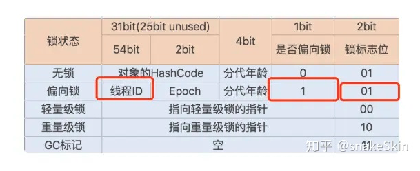


**偏向锁的优势：**

通过加偏向锁的方式可以看到，对象中记录了获取到对象锁的线程ID，这就意味如果短时间同一个线程再次访问这个加锁的同步代码或方法时，该线程只需要对对象头Mark Word中去判断一下是否有偏向锁指向它的ID，不需要在进入Monitor去竞争对象了（减少上下文切换）。


##### 什么时候升级成轻量级锁？

一旦出现其他线程竞争资源时，偏向锁就会被撤销。

偏向锁的插销需要等待全局安全点，暂停持有该锁的线程，同时检查该线程是否还在执行该方法，如果是，则升级锁。反之则其他线程抢占。即如果线程在全局安全点检查时，还需要使用该锁，则进行锁升级，如果线程已经不需要使用锁，并有其他线程需要使用时，将偏向锁的拥有者切换为另外线程。

详细步骤：

当线程1访问代码块并获取锁对象时，会在java对象头和栈帧中记录偏向的锁的threadID，因为**偏向锁不会主动释放锁**，因此以后线程1再次获取锁的时候，需要**比较当前线程的threadID和Java对象头中的threadID是否一致**，如果一致（还是线程1获取锁对象），则无需使用CAS来加锁、解锁；如果不一致（其他线程，如线程2要竞争锁对象，而偏向锁不会主动释放因此还是存储的线程1的threadID），那么需要**查看Java对象头中记录的线程1是否存活**，如果没有存活，那么锁对象被重置为无锁状态，其它线程（线程2）可以竞争将其设置为偏向锁；如果存活，那么立刻**查找该线程（线程1）的栈帧信息，如果还是需要继续持有这个锁对象**，那么暂停当前线程1，撤销偏向锁，升级为轻量级锁，如果线程1 不再使用该锁对象，那么将锁对象状态设为无锁状态，重新偏向新的线程。


##### 轻量级锁

轻量级锁考虑的是竞争锁对象的线程不多，而且线程持有锁的时间也不长的情景。因为阻塞线程需要CPU从用户态转到内核态，代价较大，如果刚刚阻塞不久这个锁就被释放了，那这个代价就有点得不偿失了，因此这个时候就干脆不阻塞这个线程，让它自旋这等待锁释放。

**注意：**为了避免无用的自旋，轻量级锁一旦膨胀为重量级锁就不会再降级为轻量级锁了；偏向锁升级为轻量级锁也不能再降级为偏向锁。一句话就是锁可以升级不可以降级，但是偏向锁状态可以被重置为无锁状态。


##### 自旋策略

JVM 提供了一种自旋锁，可以通过自旋方式不断尝试获取锁，从而避免线程被挂起阻塞 (进程进入阻塞的开销很大)。这是基于大多数情况下，线程持有锁的时间都不会太长，毕竟线程被挂起阻塞可能会得不偿失。

线程1获取轻量级锁时会先把锁对象的**对象头MarkWord复制一份到线程1的栈帧中创建的用于存储锁记录的空间**（称为DisplacedMarkWord），然后**使用CAS把对象头中的内容替换为线程1存储的锁记录（**DisplacedMarkWord**）的地址**；

如果在线程1复制对象头的同时（在线程1CAS之前），线程2也准备获取锁，复制了对象头到线程2的锁记录空间中，但是在线程2CAS的时候，发现线程1已经把对象头换了，**线程2的CAS失败，那么线程2就尝试使用自旋锁来等待线程1释放锁**。

从 JDK1.7 开始，自旋锁默认启用，自旋次数由 JVM 设置决定，不建议设置的重试次数过多，因为 CAS 重试操作意味着长时间地占用 CPU。自旋锁重试之后如果抢锁依然失败，同步锁就会升级至重量级锁，锁标志位改为 10。在这个状态下，未抢到锁的线程都会进入 Monitor，之后会被阻塞在 _WaitSet 队列中。


##### 重量级锁

自旋失败次数到一定程度，很大概率再一次自旋也是失败，或者有其他新的线程参与竞争。因此直接升级成重量级锁，进行线程阻塞，减少cpu消耗（自旋是消耗cpu的）。

当锁升级为重量级锁后，未抢到锁的线程都会被阻塞，进入阻塞队列。


#### 乐观锁悲观锁

- **乐观锁**：每次访问数据的时候都认为其他线程不会修改数据，所以直接访问数据，更新的时候再判断在此期间其他线程是否修改数据。**CAS和版本号机制**（版本号机制:数据有个version字段，表示被修改的次数）是乐观锁的实现。
  - 乐观锁就是，每次不加锁而是假设没有冲突而去完成某项操作，如果因为冲突失败就重试，直到成功为止。乐观锁用到的机制就是CAS，Compare and Swap。CAS 操作包含三个操作数 —— 内存位置（V）、预期原值（A）和新值(B)。 如果内存位置的值与预期原值相匹配，那么处理器会自动将该位置值更新为新值 。否则，处理器不做任何操作。CAS是通过硬件命令保证了原子性。
  - **CAS**: 无琐算法，非阻塞同步，需要读写的内存值V和旧的期望值A相同时，更新为B.一般都是自旋CAS,不断的重试。
  - 乐观锁缺点：
    - ABA问题（加入版本号机制，一个数据一个版本，版本变化，即使值相同，也不应该修改成功。）。
      - 考虑如下操作：
        - 并发1（上）：获取出数据的初始值是A，后续计划实施CAS乐观锁，期望数据仍是A的时候，修改才能成功
        - 并发2：将数据修改成B
        - 并发3：将数据修改回A
        - 并发1（下）：CAS乐观锁，检测发现初始值还是A，进行数据修改
        - 上述并发环境下，并发1在修改数据时，虽然还是A，但已经不是初始条件的A了，中间发生了A变B，B又变A的变化，此A已经非彼A，数据却成功修改，可能导致错误，这就是CAS引发的所谓的ABA问题。
    - 自旋CAS如果一直不成功，开销大。
    - 只对单变量有效，当涉及多个共享变量时，无效。
- **悲观锁**：每次访问数据的时候都会认为其他线程会修改数据，所以先获取锁，再访问数据。synchronized和ReentrantLock都是悲观锁思想的实现。
- 乐观锁适合多读场景，悲观锁适合多写情况。


#### Java内存模型(JMM)

数据主要存放在主内存中，为了加快对内存的数据处理，在cpu和内存中间，加入了寄存器，存储器，高速缓存等处理器缓存;

从多线程角度，可以把内存模型简化成: **主内存和线程本地内存**。

线程可以把变量从主内存读取到本地缓存中，然后再本地缓存中进行读写，然后将改变结果写入到内存中。这就导致线程本地内存和主内存数据不一致的情况。即可见性。

跑在CPU上的一个线程将这个共享对象读到CPU缓存中，然后修改了这个对象。只要CPU缓存没有被刷新回主存，对象修改后的版本对跑在其它CPU上的线程都是不可见的。这种方式可能导致每个线程拥有这个共享对象的私有拷贝，每个拷贝停留在不同的CPU缓存中。

**volatile可解决这个问题。**

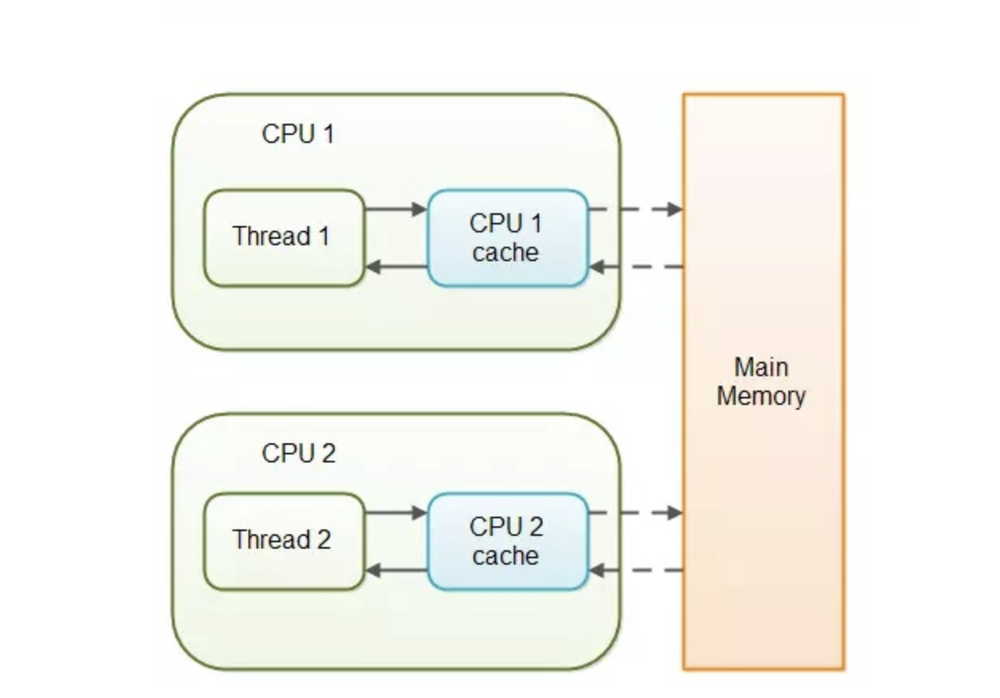

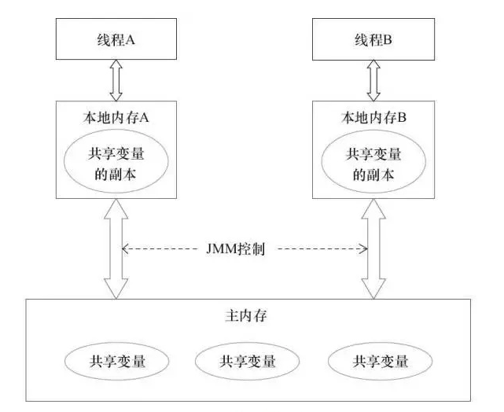


#### volatile

- 保证可见性 （从JMM的角度说）

- 保证有序性（禁止指令重排）

- 不保证原子性

  - 为什么不能保证原子性？

    - 还是以最常用的i++来说吧，包含3个步骤

      - 从内存读取i当前的值
      - 加1
      - 把修改后的值刷新到内存

      对于普通变量来说多线程下1，2之间被中断，其它线程修改了i的值，那原来已经在1，2之间被中断的线程的i的值就已经无效了，所以多线程是不安全的。

      另外对于普通变量来说，步骤1并不是每次都会从内存中读取，步骤3也并不会每次都保证会立即刷新到内存。所以这里有两个问题，可见性和原子性。volatile只能保证可见性，即步骤1每次都重新读，步骤3每次都立即刷新主内存。但是1和2之间仍然会被中断，多个线程交叉修改，所以不安全。

      

Volatile变量在汇编阶段，会多出一条lock前缀指令，这会导致volatile关键字可以保证直接从主存中读取一个变量，如果这个变量被修改后，总是会被写回到主存中去，且让其他改数据的处理器缓存失效。这就保障了可见性

**Volatile的修饰的变量，虚拟机会使用内存屏障禁止指令重排序保障其有序性。**但volatile变量不能保证其原子性。所以volatile是线程同步的轻量级实现，性能好，多线程访问volatile变量不会发生阻塞，volatile变量主要用于变量在多线程之间的可见性。

**但并不能保障原子性，不可替代synchronized. synchronized解决的是多线程之间访问共享资源的同步性。**


#### JMM定义了线程的三个规范

- 可见性（volatile可以保证）
  - 各个线程对主内存中共享变量的操作都是各个线程各自拷贝到自己的工作内存操作后再写回主内存中的
  - 这就可能存在一个线程AAA修改了共享变量X的值还未写回主内存中时 ,另外一个线程BBB又对内存中的一个共享变量X进行操作,但此时A线程工作内存中的共享比那里X对线程B来说并不不可见.
  - 这种工作内存与主内存同步延迟现象就造成了可见性问题.
- 原子性（锁可以保证）
  - 不可分割，完整性，也即是某个线程正在做某个具体业务时，中间不可以被加塞或者被分割。需要整体完整，要么同时成功，要么同时失败。类似于事务。
  - 如何保证原子性？
    - synchronized!
- 有序性（volatile可以保证）
  - 计算机在执行程序时,为了提高性能,编译器和处理器常常会做指令重排
  - 单线程环境里面确保程序最终执行结果和代码顺序执行的结果一致
  - 多线程环境中线程交替执行,由于编译器优化重排的存在,两个线程使用的变量能否保持一致性是无法确定的,结果无法预测

###### synchronized其实能同时保证可见性，原子性，有序性


#### 线程池

线程池是为了**帮助我们管理线程，减少线程建立和销毁带来的性能消耗**。线程池的使用可以帮助我们**更合理的使用系统资源**。因为线程其实也是一个对象，创建一个对象，需要经过类加载过程，销毁一个对象，需要走GC垃圾回收流程，都是需要资源开销的。


- **降低资源消耗。**通过重复利用已创建的线程降低线程创建和销毁造成的消耗。

- **提高响应速度。**当任务到达时，任务可以不需要等到线程创建就能执行。

- 提高线程的可管理性，线程是稀缺资源，如果无限制地创建，不仅会消耗系统资源，还会降低系统的稳定性，使用线程池可以进行统一分配、调优和监控。

  

#### ThreadPoolExecutor

**ThreadPoolExecutor**是线程池类。对于线程池，可以通俗的将它理解为"存放一定数量线程的一个线程集合。线程池允许若个线程同时运行;

当添加的到线程池中的线程超过它的容量时，会有一部分线程阻塞等待。线程池会通过相应的调度策略和拒绝策略，对添加到线程池中的线程进行管理。


#### 【自行整理】线程池`ThreadPoolExecutor`
1. **`ThreadPoolExecutor`执行`execute()`方法分4步：**
   
    1. 如果当前运行的线程少于`corePoolSize`，则创建新线程来执行任务（需要获取全局锁）
    2. 如果运行的线程等于或多于`corePoolSize`，则将任务加入`BlockingQueue`
    3. 如果无法将任务加入`BlockingQueue`（队列已满），则创建新的线程来处理任务（**需要获取全局锁**）
    4. 如果创建新线程将使当前运行的线程超出`maximumPoolSize`，任务将被拒绝，并调用`RejectedExecutionHandler.rejectedExecution()`方法
    
    `ThreadPoolExecutor`采取上述步骤的总体设计思路，是为了在执行`execute()`方法时，尽可能地避免获取全局锁（那将会是一个严重的可伸缩瓶颈）。在`ThreadPoolExecutor`完成预热之后（当前运行的线程数大于等于`corePoolSize`），几乎所有的`execute()`方法调用都是执行步骤2，而步骤2不需要获取全局锁
    
    线程池处理流程图：
    
    
2. 线程池中的线程执行任务分2步：
    1. 在`execute()`方法中创建一个线程时，会让这个线程执行当前任务
    2. **这个线程执行完任务后，会反复从`BlockingQueue`获取任务来执行**
    


##### ThreadPoolExecutor线程池的7大参数：

- corePoolSize：核心池的大小
  - 创建线程池之后，线程池中的线程数为0，当有任务来之后，就会创建一个线程去执行任务，当线程池中的线程数目达到corePoolSize后，就会把到达的任务放到缓存队列当中；调用了prestartAllCoreThreads()或者prestartCoreThread()方法，可以在任务来之前预创建线程。
  - 核心线程会一直存活，即使没有任务需要执行；
  - 设置allowCoreThreadTimeout=true（默认false）时，核心线程会超时关闭；
- maximumPoolSize：线程池最大线程数
  - 这个参数也是一个非常重要的参数，它表示在线程池中最多能创建多少个线程；
- keepAliveTime：非核心线程的最大空闲时间。
- TimeUnit：空闲时间的单位。
- BlockingQueue\<Runnable\> workQueue ：等待执行的任务队列，队列分为有界队列和无界队列。
  - 有界队列：队列的长度有上限，当核心线程满载的时候，新任务进来进入队列，当达到上限，又没有核心线程去即时取走处理，这个时候，就会创建临时线程。（警惕临时线程无限增加的风险）
  - 无界队列：队列没有上限的，当没有核心线程空闲的时候，新来的任务可以无止境的向队列中添加，而永远也不会创建临时线程。（警惕任务队列无限堆积的风险）
- ThreadFactory：线程工厂，用来创建线程
- RejectedExecutionHandler：队列已满，而且任务量大于最大线程的异常处理策略


##### 4种线程池

- newFixedThreadPool：建立一个线程数量固定的线程池，规定的最大线程数量，超过这个数量之后进来的任务，会放到等待队列中，如果有空闲线程，则在等待队列中获取，遵循先进先出原则。
  - **corePoolSize 和maximumPoolSize 要一致**，Executors 默认使用的是 LinkedBlockingQueue 作为等待队列，这是一个无界队列。**等待队列无限长的问题，容易造成 OOM。**

- newSingleThreadExecutor：建立一个只有一个线程的线程池，如果有超过一个任务进来，只有一个可以执行，其余的都会放到等待队列中，如果有空闲线程，则在等待队列中获取，遵循先进先出原则。
  - 使用LinkedBlockingQueue 作为等待队列。**等待队列无限长的问题，容易造成 OOM。**

- newCachedThreadPool：缓存型线程池，在核心线程达到最大值之前，有任务进来就会创建新的核心线程，并加入核心线程池，即时有空闲的线程，也不会复用。达到最大核心线程数后，新任务进来，如果有空闲线程，则直接拿来使用，如果没有空闲线程，则新建临时线程。并且线程的允许空闲时间都很短，如果超过空闲时间没有活动，则销毁临时线程。
  - 关键点就在于它使用 SynchronousQueue 作为等待队列，它不会保留任务，新任务进来后，直接创建临时线程处理。**容易造成无限制的创建线程，造成 OOM。**

- newScheduledThreadPool：计划型线程池，可以设置固定时间的延时或者定期执行任务，同样是看线程池中有没有空闲线程，如果有，直接拿来使用，如果没有，则新建线程加入池。
  - 使用的是 DelayedWorkQueue 作为等待队列，这中类型的队列会保证只有到了指定的延时时间，才会执行任务。**容易造成无限制的创建线程，造成OOM。**


#### AQS (AbstractQueuedSynchronizer)组件 【线程同步类】

AQS类别：独占锁和共享锁。

共享锁有ReentrantReadWriteLock、CountDownLatch、CyclicBarrier、Semaphore。

- ReadWriteLock，读写锁。维护了一对相关联的读取锁和写入锁。

  - 读取锁用于只读操作，共享。
  - 写入锁用于写入操作， 是独占锁。
  - 不能同时存在读取锁和写入锁。
- CountDownLatch是通过共享锁实现的

  - `CountDownLatch doneSignal = new CountDownLatch(LATCH_SIZE);`

  - CountDownLatch对象维护一个count,执行一次doneSignal.countDown()时，count减一直到count为0时，doneSignal.await()的等待线程才能运行。

  - 所以countDownLatch可以让一个线程等待一组线程完成之后才执行。
- CyclicBarrier锁

  - `CyclicBarrier cb = new CyclicBarrier(SIZE);`

  - 调用线程创建N个齐头并进的CyclicBarrier对象。每个线程执行cb.await()时，参与者数量加一，当参与者数量达到SIZE，阻塞的参与线程继续运行。
- Semaphore
  - `Semaphore sem = new Semaphore(SEM_MAX);` 建立N个信号量
  - sem.acquire(count); 获取count个信号量。如果有就给予，没有就阻塞。
  - sem.release(count);释放信号量。


##### CountDownLatch和CyclicBarrier的区别


- CountDownLatch的作用是允许1或N个线程等待其他线程完成执行；而CyclicBarrier则是允许N个线程相互等待, 直到到达某个公共屏障点.

  - CyclicBarrier：十名运动员各自准备比赛,需要等待所有运动员都准备好以后,裁判才能说开始然后所有运动员一起跑。
  - CountdownLatch可以当做一个计数器来使用,比如某线程需要等待其他几个线程都执行过某个时间节点后才能继续执行，裁判必须等十名运动员都跑到终点了，才能休息。
- CountDownLatch的计数器无法被重置；CyclicBarrier的计数器可以被重置后使用，因此它被称为是循环的barrier。


#### JUC原子类  

- 基本类型：
  - AtomicInteger：整形原子类
  - AtomicLong：长整型原子类
  - AtomicBoolean ：布尔型原子类
- 数组类型：
  - AtomicIntegerArray：整形数组原子类
  - AtomicLongArray：长整形数组原子类
  - AtomicReferenceArray ：引用类型数组原子类
- 引用类型
  - AtomicReference：引用类型原子类
  - AtomicStampedRerence：原子更新引用类型里的字段原子类
  - AtomicMarkableReference ：原子更新带有标记位的引用类型
- 对象属性修改类型。
  - AtomicIntegerFieldUpdater:原子更新整形字段的更新器
  - AtomicLongFieldUpdater：原子更新长整形字段的更新器
  - AtomicStampedReference ：原子更新带有版本号的引用类型。该类将整数值与引用关联起来，可用于解决原子的更新数据和数据的版本号，可以解决使用 CAS 进行原子更新时可能出现的 ABA 问题。

在32位操作系统中，64位的long 和 double 变量由于会被JVM当作两个分离的32位来进行操作，所以不具有原子性；


原子类基本通过自旋CAS+volatile+native(unsafe)的方法来实现，期望的值和现在的值是否一致，如果一致就更新。

```java
public final boolean compareAndSet(long expect, long update) {

	 return unsafe.compareAndSwapLong(this, valueOffset, expect, update);

}
```


主要利用CAS + volatile + native方法来保证操作的原子性，从而避免同步方法的高开销。CAS原理是拿期望的值和现在的值进行比较，如果相同则更新成新的值。Unsafe类（单例模式）允许我们直接访问本地的C++实现库(native)从而使java具有了直接操作内存空间的能力。volatile保证底层变量的可见性。

**原子类在CAS的过程中，调用unsafe类的compareAndSwap的方法，直接去看变量在内存中的值，如果自旋过程中变量没有被改动，那就更新成新的值。**


### wait(), join(), start(), run(), sleep(), notify(), yield(), <u>stop()</u>, await()


### wait() vs. sleep()

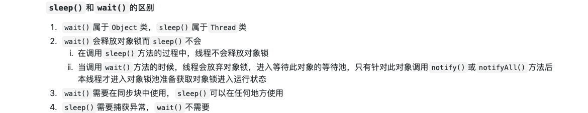

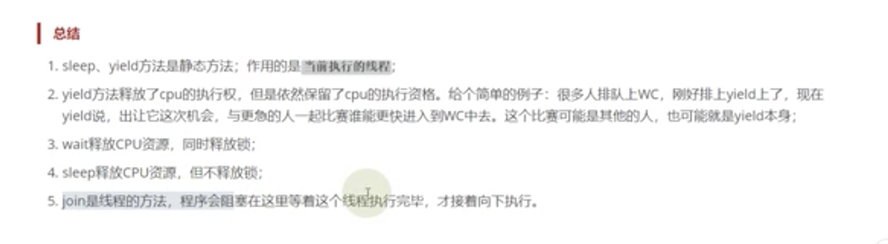


### 请简要说明一下IOC和AOP是什么？

IOC（Inversion Of Controll，控制反转）是一种设计思想，将原本在程序中手动创建对象的控制权，交由给Spring框架来管理。IOC容器是Spring用来实现IOC的载体，IOC容器实际上就是一个Map(key, value)，Map中存放的是各种对象。这样可以很大程度上简化应用的开发，把应用从复杂的依赖关系中解放出来。IOC容器就像是一个工厂，当需要创建一个对象，只需要配置好配置文件/注解即可，不用考虑对象是如何被创建出来的，大大增加了项目的可维护性且降低了开发难度。

IOC就是控制反转，指创建对象控制权的转移，原本创建对象的主动权和时机由自己把控，而现在这种权利转移到Spring容器中。Spring根据配置文件或注解创建实例和管理实例之间的依赖关系，在程序运行时动态的创建对象以及管理对象之间的依赖应用。Spring的IOC有三种注入方式：构造器注入、setter方法注入、接口注入。


AOP，即面向切面编程，它利用一种称为"横切"的技术，剖解开封装的对象内部，并将那些影响了多个类的公共行为封装到一个可重用模块，并将其命名为"Aspect"，所谓"切面"是那些**与业务无关，却为业务模块所共同调用的逻辑或责任封装起来**，便于减少系统的重复代码，降低模块之间的耦合度，并有利于未来的可操作性和可维护性。AOP是OOP的一个补充。

使用"横切"技术，AOP把软件系统分为两个部分：核心关注点和横切关注点。业务处理的主要流程是核心关注点，与之关系不大的部分是横切关注点。横切关注点的一个特点是，他们经常发生在核心关注点的多处，而各处基本相似，比如权限认证、日志、事务(Transaction)。AOP的作用在于分离系统中的各种关注点，将核心关注点和横切关注点分离开。


### 用java写个deadlock


#### 单例

懒汉式、饿汉式，双重锁（双重检查）模式，静态内部类单例模式

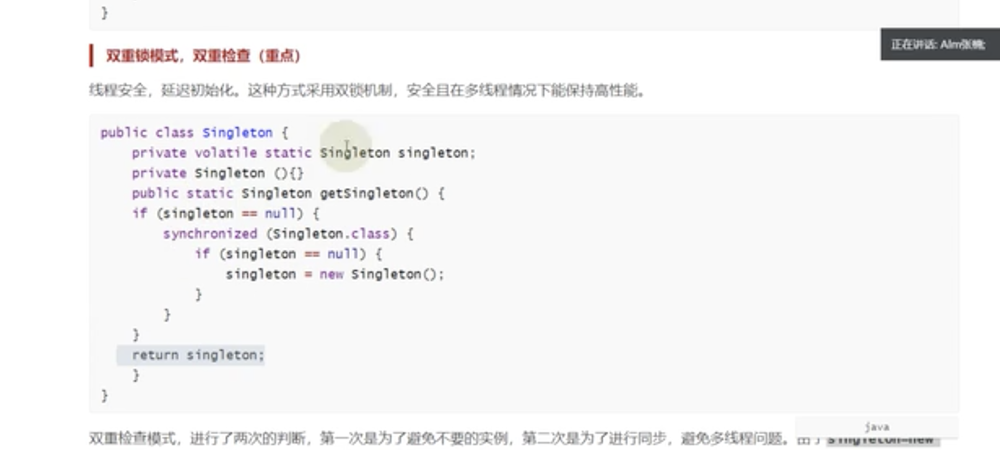


### **Mybatis中 #{}和${}的差别**