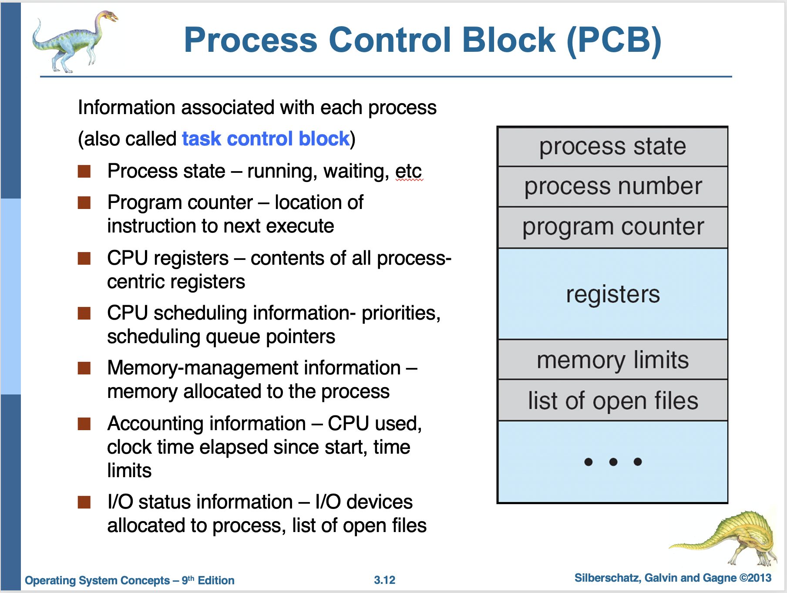
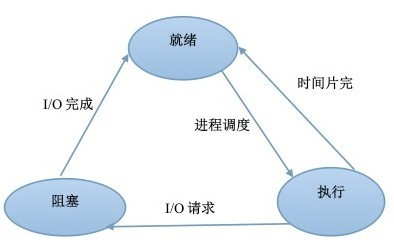
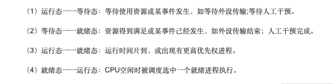
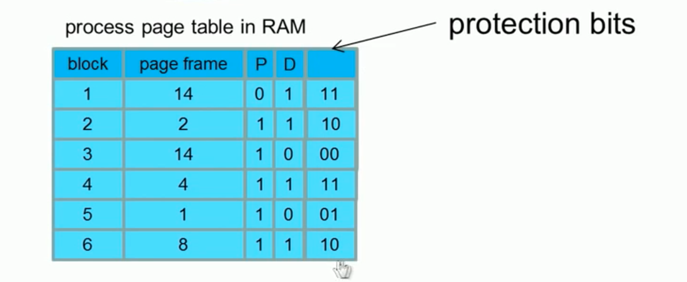
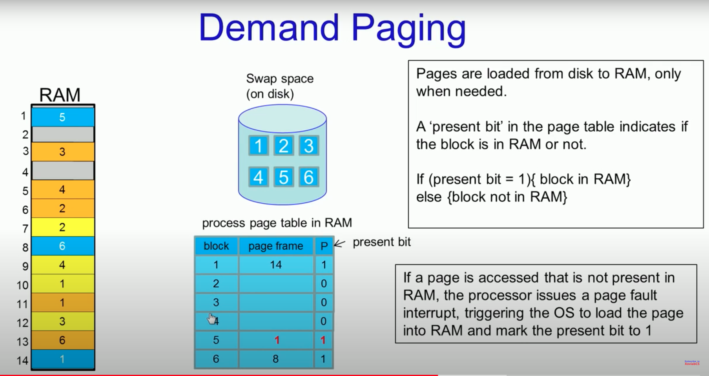

# 操作系统

* 进程和线程
    * [进程和线程有什么区别？](#进程和线程有什么区别)
      * [进程控制块(PCB)中有什么？](#进程控制块(PCB))
      * [同一进程中的线程可以共享哪些数据？](#同一进程中的线程可以共享哪些数据？)
      * [线程独占哪些资源？](#线程独占哪些资源？)
      * [为什么线程更方便？](#为什么线程更方便？)
      * [什么是协程？](#协程：)
        * [协程和线程的区别？](#协程和线程的区别？)
    * [进程间通信有哪些方式？](#进程间通信有哪些方式)
    * [进程间的协作](#进程间的协作)
    * [进程同步问题](#进程同步问题)
      * [生产者-消费者问题](#生产者-消费者问题)
      * [临界区(critical section)的概念？](#临界区(critical section)的概念？)
      * [如何solve critical section?](##临界区(critical section)的概念？)
      * [同步与互斥的概念？](#同步与互斥的概念？)
      * [多线程、并发、并行、串行、异步的区别？](#并发、并行、异步的区别？)
    * [进程有哪几种状态？](#进程有哪几种状态)
    * [进程调度策略有哪些？](#进程调度策略有哪些？CPU Scheduling)
    * [什么叫优先级反转？如何解决？](#什么叫优先级反转？如何解决？)
      * [优先级反转的两种方式对比](#什么叫优先级反转？如何解决？)
    * [什么是僵尸进程？](#什么是僵尸进程)
      * [如何把僵尸进程给移除？](#如何把僵尸进程给移除？)
    * [什么是孤儿进程？](#什么是孤儿进程？)
    * [线程同步有哪些方式？](#线程同步有哪些方式)
      * [互斥量和临界区有什么区别？](#互斥量和临界区有什么区别？)
      * [互斥锁和信号量的区别？](#互斥锁和信号量的区别？)
    * [什么是IO多路复用？怎么实现？](#什么是IO多路复用怎么实现)
      * [select/poll/epoll三者的区别？](#什么是IO多路复用怎么实现)
      * [什么时候使用select/poll，什么时候使用epoll？](#什么是IO多路复用怎么实现)
      * [什么是文件描述符？](#什么是IO多路复用怎么实现)
      * [epoll里什么是水平触发？什么是边缘触发？分别应用于哪些场景？](#什么是IO多路复用怎么实现)
    * [有哪些常见的IO模型？](#有哪些常见的IO模型？)
    * [什么是用户态和内核态？](#什么是用户态和内核态)
      * [为什么要分用户态和内核态](#为什么要分用户态和内核态)
      * [如何从用户态切换到内核态？](#如何从用户态切换到内核态？)
      * [什么是中断?](#什么是中断)
* 死锁
    * [什么是死锁？](#什么是死锁)
    * [死锁产生的必要条件？](#死锁产生的必要条件)
    * [死锁有哪些处理方法？](#死锁有哪些处理方法)
    * [死锁预防和死锁避免的区别？](#死锁预防和死锁避免的区别？)
* 内存管理
    * [分页和分段有什么区别？](#分页和分段有什么区别)
    * [什么是虚拟内存？](#什么是虚拟内存)
      * [程序运行时，虚拟内存是怎么分配的？/ 缺页后的处理流程](#程序运行时，虚拟内存是怎么分配的？/ 缺页后的处理流程)
      * [如何进行逻辑地址空间到物理内存的映射？](#如何进行地址空间到物理内存的映射？)
    * [有哪些页面置换算法？](#有哪些页面置换算法)
      * [局部性原理](#局部性原理)
      * [什么是颠簸现象](#什么是颠簸现象)
* [磁盘调度](#磁盘调度)
* [参考](#参考)

------

### 进程和线程有什么区别？
- 进程（Process）是系统进行资源分配和调度的基本单位【应用程序的执行实例】，线程（Thread）是程序执行的最小单位。
- 进程有自己的**独立地址空间**，每启动一个进程，系统都会为其分配地址空间。线程则是进程的一个实体，共享所属进程的地址空间，只拥有一点在运行中必不可少的资源(如程序计数器,一组寄存器和栈）；
- 线程依赖于进程而存在，一个进程至少有一个线程；
- 在**进程切换**时，涉及到整个当前进程CPU环境的保存环境的设置以及新被调度运行的CPU环境的设置，而线程切换只需保存和设置少量的寄存器的内容，并不涉及存储器管理方面的操作，可见，进程切换的开销远大于线程切换的开销；
- **线程之间的通信**更方便，同一进程下的线程共享全局变量等数据，而进程之间的通信需要以进程间通信(IPC)的方式进行；
- 多线程程序只要有一个线程崩溃，整个程序就崩溃了，但多进程程序中一个进程崩溃并不会对其它进程造成影响，因为进程有自己的独立地址空间，因此**多进程更加健壮**

进程操作代码实现，可以参考：[多进程 - 廖雪峰的官方网站](https://www.liaoxuefeng.com/wiki/1016959663602400/1017628290184064)


##### 进程控制块(PCB)



	- 当前进程的id、父进程的id
	- 进行的状态（running, waiting, etc)
	- 程序计数器（该线程下一条要运行的指令所在的地方）

- 寄存器
  - 用户程序可以使用的数据，地址等寄存器
- 内存管理信息
  - 包含有指向本进程映像存储空间的数据结构
- 进程所用资源
  - 说明由进程打开，使用的系统资源: 使用了多少CPU，开始到现在过了多少个clock，等
- I/O信息
  - 该线程分配了多少I/O设备
  - 该线程所打开的文件


##### 同一进程中的线程可以共享哪些数据？
<details>
<summary>展开</summary>

- 进程ID与进程组ID
- 进程代码段
- 进程的公有数据（全局变量、静态变量...）
- 堆（保存java里面的object）
- 进程打开的文件描述符
- 进程的当前目录
- 信号处理器/信号处理函数：对收到的信号的处理方式
  </details>

##### 线程独占哪些资源？
<details>
<summary>展开</summary>

- 线程ID

  - 每个线程都有自己的线程ID，这个ID在本进程中是唯一的。进程用此来标识线程。
- 一组寄存器的值

  - 由于线程间是并发运行的，每个线程有自己不同的运行线索，当从一个线程切换到另一个线程上时，必须将原有的线程的寄存器集合的状态保存，以便将来该线程在被重新切换到时能得以恢复。
- 线程自身的栈（一个进程的堆是共享的）

  - 栈：由编译器自动分配释放 ，存放函数的参数值，局部变量的值等。其操作方式类似于数据结构中的栈，栈使用的是一级缓存， 他们通常都是被调用时处于存储空间中，调用完毕立即释放；
  - 堆：一般由程序员分配释放， 若程序员不释放，程序结束时可能由OS回收，分配方式倒是类似于链表。堆则是存放在二级缓存中，生命周期由虚拟机的垃圾回收算法来决定（并不是一旦成为孤儿对象就能被回收）。所以调用这些对象的速度要相对来得低一些
- 程序计数器：Program Counter
- 错误返回码：线程可能会产生不同的错误返回码，**一个线程的错误返回码不应该被其它线程修改；**
- 信号掩码/信号屏蔽字(Signal mask)：表示是否屏蔽/阻塞相应的信号（SIGKILL,SIGSTOP除外）
- </details>


### 为什么线程更方便？
1. 轻量级：lightweight
2. 线程间通信方便，因为有共享局部变量的数据：efficient communication between entities
3. 线程间的上下文切换更方便：efficient context switch 环境切换

### 协程：

协程是一种**用户态的轻量级线程**，它是异步的，不需要调度，那也就不需要多线程的锁机制，它的调度完全由用户控制。

**协程拥有自己的寄存器上下文(register context)和栈**。协程调度切换时，将寄存器上下文和栈保存到其他地方。在切回来的时候，恢复先前保存的寄存器上下文和栈，直接操作栈则基本没有内核切换的开销，可以不加锁的访问全局变量，所以上下文的切换非常快。


### 协程和线程的区别？

- 一个线程可以多个协程，一个进程也可以单独拥有多个协程。
- 线程进程都是同步机制，而协程则是异步。
- 协程不需要调度。协程避免了无意义的调度，由此可以提高性能，但也因此，程序员必须自己承担调度的责任，同时，协程也失去了标准线程使用多CPU的能力。


### 进程间通信有哪些方式？

[进程之间究竟有哪些通信方式，如何通信？告别死记硬背](https://zhuanlan.zhihu.com/p/104713463)

[Reference](https://www.youtube.com/watch?v=ZQb3DRy0g8U&list=PLEJxKK7AcSEGPOCFtQTJhOElU44J_JAun&index=23)

1. 管道(Pipe)
<details>
<summary>展开</summary>

- 管道是半双工的，数据只能向一个方向流动；**需要双方通信时，需要建立起两个管道**；

  

- 一个进程向管道中写的内容（由fd[1]写入) 被管道另一端（由fd[0]读出)的进程读出。写入的内容每次都添加在管道缓冲区的末尾，并且每次都是从缓冲区的头部读出数据；

- 只能用于父子进程或者兄弟进程之间(具有亲缘关系的进程) 
  
  
  

调用pipe函数时在**内核**中开辟一块缓冲区用于通信,它有一个读端，一个写端：pipefd[0]指向管道的读端，pipefd[1]指向管道的写端。所以管道在用户程序看起来就像一个打开的文件,通过read(pipefd[0])或者write(pipefd[1])向这个文件读写数据，其实是在读写内核缓冲区。

返回值：成功返回0，失败返回-1；


**管道调用过程：**

1.父进程调用pipe开辟管道,得到两个文件描述符指向管道的两端。

2.父进程调用fork创建子进程,那么子进程也有两个文件描述符指向同一管道。

3.父进程关闭管道读端,子进程关闭管道写端。父进程可以往管道里写,子进程可以从管道里读,管道是用环形队列实现的,数据从写端流入从读端流出,这样就实现了进程间通信。


**四种特殊情况：**

- 写端关闭，读端不关闭；
  - 那么管道中剩余的数据都被读取后,再次read会返回0,就像读到文件末尾一样。
- 写端不关闭，但是也不写数据，读端不关闭；
  - 此时管道中剩余的数据都被读取之后再次read会被阻塞，直到管道中有数据可读了才重新读取数据并返回；
- 读端关闭，写端不关闭；
  - 此时该进程会收到信号SIGPIPE，通常会导致进程异常终止。
- 读端不关闭，但是也不读取数据，写端不关闭；
  - 此时当写端被写满之后再次write会阻塞，直到管道中有空位置了才会写入数据并重新返回。


  </details>

2. [命名管道FIFO](https://www.youtube.com/watch?v=hLGwgbrrlXM)
<details>
<summary>展开</summary>

有名管道也是半双工的，但是允许无亲缘关系进程间的通信；


**命名管道的创建与读写：**

1).是在程序中使用系统函数建立命名管道；

2).是在Shell下交互地建立一个命名管道，Shell方式下可使用mknod或mkfifo命令来创建管道，两个函数均定义在头文件sys/stat.h中；

返回值：都是成功返回0，失败返回-1；


**命名管道的特点：**

- **命名管道是一个存在于硬盘上的文件，而管道是存在于内核中的特殊文件。**所以当使用命名管道的时候必须先open将其打开。

- 命名管道可以用于任何两个进程之间的通信，不管这两个进程是不是父子进程，也不管这两个进程之间有没有关系。

</details>

3. 消息队列

   与管道、命名管道一样，从消息队列中读出消息，消息队列中对应的数据都会被删除。

   消息队列，是消息的链接表，存放在内核中。一个消息队列由一个标识符（即队列ID）来标识。消息队列独立于发送与接收进程。消息队列可以实现消息的随机查询,消息不一定要以先进先出的次序读取,也可以按消息的类型读取。

   

   

   <details>
     消息队列和管道的对比
     1.匿名管道是跟随进程的，消息队列是跟随内核的，也就是说进程结束之后，匿名管道就死了，但是消息队列还会存在（除非显示调用函数销毁）
     2.管道是文件，存放在磁盘上，访问速度慢，**消息队列是数据结构，存放在内存，访问速度快**
     3.管道是数据流式存取，消息队列是数据块式存取
   </details>

   

4. 信号(Signal)（e.g. control+c in shell)

   1. 

5. 共享内存  (Shared Memory)
   1. 优点：
      1. 最快的ipc
      2. Writing/Reading is like regular reading/writing
   2. 缺点：error prone。need synchronization between processes

   

   共享内存最大的问题是什么？没错，就是多进程竞争内存的问题，就像类似于我们平时说的线程安全问题。如何解决这个问题？这个时候我们的信号量就上场了。

   信号量的本质就是一个计数器，用来实现进程之间的互斥与同步。例如信号量的初始值是 1，然后 a 进程来访问内存1的时候，我们就把信号量的值设为 0，然后进程b 也要来访问内存1的时候，看到信号量的值为 0 就知道已经有进程在访问内存1了，这个时候进程 b 就会访问不了内存1。**所以说，信号量也是进程之间的一种通信方式**。

6. 信息传递 Message Passing 
   1. 在kernel建一个共享的shared memory
      1. more explicitly defined，safe，因为kernel负责sync
      2. slow

   

7. 信号量(Semaphore)：初始化操作、P操作、V操作；P操作：信号量-1，检测是否小于0，小于则进程进入阻塞状态；V操作：信号量+1，若小于等于0，则从队列中唤醒一个等待的进程进入就绪态


7. 套接字(Socket)：以上都是同个机器之间的ipc，但是socket可用于不同机器间的进程通讯（通过tcp或者udp）（当然也可同一个设备之间的ipc）

   <details>
    Socket通信的基本流程具体步骤如下所示：1. 开启一个连接之前，需要先完成Socket和Bind两个步骤。Socket是指创建一个新的套接字对象，Bind是指定套接字的IP和端口（客户端在调用Connect时会由系统分配端口，因此可以省去Bind）。2. 服务端通过Listen开启监听，等待客户端接入。3. 客户端通过Connect连接服务器，服务端通过Accept接收客户端连接。在connect-accept过程中，操作系统将会进行三次握手。4. 客户端和服务端通过Recv和Send发送和接收数据，操作系统将会完成数据的确认，重发等步骤。5. 通过Close关闭连接，操作系统会进行四次挥手操作。
   </details>


### 进程间的协作

同步、互斥、通信

### 进程同步问题

> 进程的同步是目的，而进程间通信是实现进程同步的手段

<details>
<summary>管程 Monitor</summary>

管程将共享变量以及对这些共享变量的操作封装起来，形成一个具有一定接口的功能模块，这样只能通过管程提供的某个过程才能访问管程中的资源。进程只能互斥地使用管程，使用完之后必须释放管程并唤醒入口等待队列中的进程。

当一个进程试图进入管程时，在**入口等待队列**等待。若P进程唤醒了Q进程，则Q进程先执行，P在**紧急等待队列**中等待。（**HOARE管程**）

wait操作：执行wait操作的进程进入条件变量链末尾，唤醒紧急等待队列或者入口队列中的进程；signal操作：唤醒条件变量链中的进程，自己进入紧急等待队列，若条件变量链为空，则继续执行。（**HOARE管程**）

**MESA管程**：将HOARE中的signal换成了notify（或者broadcast通知所有满足条件），进行通知而不是立马交换管程的使用权，在合适的时候，条件队列首位的进程可以进入，进入之前必须用while检查条件是否合适。优点：没有额外的进程切换
</details>

<details>
<summary>生产者-消费者问题</summary>

> 问题描述：使用一个缓冲区来存放数据，只有缓冲区没有满，生产者才可以写入数据；只有缓冲区不为空，消费者才可以读出数据
</details>

可以用3个mutex来解决！但是使用3个mutex，可能会造成infinite waiting！


所以，semaphore被引入了！(full = 0, empty = N, where N is the empty blocks in the buffer)


<details>
<summary>哲学家就餐问题</summary>

</details>

<details>
<summary>读者-写者问题</summary>


</details>

##### 临界区(critical section)的概念？
<details>
<summary>展开</summary>
  各个进程中对临界资源（互斥资源/共享变量，一次只能给一个进程使用）进行操作的程序片段
</details>

**如何solve critical section?**

1. mutural exclusion: 最多只能有一个process进入临界区

2. progress: 如果没有process在临界区，任何request进去临界区的线程都要无延迟的被允许进入

3. bounded wait: 每个进程进入临界区的次数要有个upper bound，避免正在等待的其他进程永远进不来

##### 同步与互斥的概念？
<details>
<summary>展开</summary>

- 同步：多个进程因为合作而使得进程的执行有一定的先后顺序。比如某个进程需要另一个进程提供的消息，获得消息之前进入阻塞态；
- 互斥：多个进程在同一时刻只有一个进程能进入临界区
</details>

##### 并发、并行、异步的区别？

<details>
<summary>展开</summary>

并发：在一个时间段中同时有多个程序在运行，但其实任一时刻，只有一个程序在CPU上运行，宏观上的并发是通过不断的切换实现的；

多线程：并发运行的一段代码。是实现异步的手段

并行（和串行相比）：在多CPU系统中，多个程序无论宏观还是微观上都是同时执行的

串行：多任务中某时刻只能有一个任务被运行(并没有指定任务间的先后顺序，跟口语中的串行不一样)；

异步（和同步相比）：同步是顺序执行，异步是在等待某个资源的时候继续做自己的事
</details>

### 进程有哪几种状态？







- 就绪状态：进程已获得除处理机以外的所需资源，等待分配处理机资源
- 运行状态：占用处理机资源运行，处于此状态的进程数小于等于CPU数
- 阻塞状态： 进程等待某种条件，在条件满足之前无法执行


以上是常见的三态模型，如果问五态模型，那就还有新建态(new)和终止态(exit)。

### 进程调度策略有哪些？CPU Scheduling

###### Purpose: Reduce context switching as much as possible, since the overhead of context switch is huge

Process分为I/O bound Process 和 CPU bound process。


选取策略的标准：


1. **批处理系统**：

<details>
<summary>先来先服务 first-come first-serverd（FCFS）</summary>

按照请求的顺序进行调度。非抢占式，开销小，无饥饿问题，响应时间不确定（可能很慢）；

对短进程不利，对IO密集型进程(I/O bound process)不利。


</details>

<details>
<summary>最短作业优先 shortest job first（SJF）</summary>

按估计运行时间最短的顺序进行调度。非抢占式，吞吐量高，开销可能较大，可能导致饥饿问题；

对短进程提供好的响应时间，对长进程不利。**很难预测进程需要运行的时间**


</details>

<details>
<summary>最短剩余时间优先 shortest remaining time first（SRTF）</summary>

按剩余运行时间的顺序进行调度。(最短作业优先的抢占式版本)。吞吐量高，开销可能较大，提供好的响应时间；

可能导致饥饿问题，对长进程不利。很难预测进程需要运行的时间
</details>

<details>
<summary>最高响应比优先 Highest Response Ratio First（HRRF）</summary>
响应比 = 1+ 等待时间/处理时间。同时考虑了等待时间的长短和估计需要的执行时间长短，很好的平衡了长短进程。非抢占，吞吐量高，开销可能较大，提供好的响应时间，无饥饿问题。
</details>

2. **交互式系统** 
交互式系统有大量的用户交互操作，在该系统中调度算法的目标是快速地进行响应。

<details>
<summary>时间片轮转 Round Robin</summary>

将所有就绪进程按 FCFS 的原则排成一个队列，用完时间片的进程排到队列最后。抢占式（时间片用完时），开销小，无饥饿问题，为短进程提供好的响应时间；

若时间片小，进程切换频繁，吞吐量低；若时间片太长，实时性得不到保证。


</details>

<details>
<summary>优先级调度算法</summary>


为每个进程分配一个优先级，按优先级进行调度。为了防止低优先级的进程永远等不到调度，可以随着时间的推移增加等待进程的优先级。


如果进程有很多的话，然后有一大部分的进程的优先级是一样的，那这个调度算法和round robin很像了。所以为了拒绝这样的情况发生，multilevel feedback queue这个算法就出来了。

</details>

<details>
<summary>多级反馈队列调度算法 Multilevel Feedback Queue</summary>
主要使用了2个算法，刚开始使用优先级条度算法来决定调度到哪个队列，然后该队列内部的多个线程再使用自己的一个调度算法，比如round robin或者FCFS。


设置多个就绪队列1、2、3...，优先级递减，时间片递增。只有等到优先级更高的队列为空时才会调度当前队列中的进程。如果进程用完了当前队列的时间片还未执行完，则会被移到下一队列。

抢占式（时间片用完时），开销可能较大，对IO型进程有利，可能会出现饥饿问题。

而且有可能有些线程会故意trick系统，在time slice结束前，就sleep，让系统误认为它是io bound的，以此拿到更高的priority


</details>

##### 什么叫优先级反转？如何解决？
<details>
<summary>展开</summary>

高优先级的进程等待被一个低优先级进程占用的资源时，就会出现优先级反转，即优先级较低的进程比优先级较高的进程先执行。

解决方法：
- 优先级天花板(priority ceiling)：当任务申请某资源时，把该任务的优先级提升到可访问这个资源的所有任务中的最高优先级，这个优先级称为该资源的优先级天花板。简单易行。
  
  - 优先级天花板的主要思想是认为系统中的资源都很宝贵，为了让占有临界资源的进程尽快释放资源，系统将进程优先级提升到优先级天花板，让进程不会被其他可能使用该临界资源的进程抢占。
  
- 优先级继承(priority inheritance)：当任务A申请共享资源S时，如果S正在被任务C使用，通过比较任务C与自身的优先级，如发现任务C的优先级小于自身的优先级，则将任务C的优先级提升到自身的优先级，任务C释放资源S后，再恢复任务C的原优先级。

- 两者的区别： 优先级继承：只有一个任务访问资源时一切照旧，没有区别，只有当高优先级任务因为资源被低优先级占有而被阻塞时,才会提高占有资源任务的优先级；而优先级天花板,不论是否发生阻塞,都提升,即谁先拿到资源，就将这个任务提升到该资源的天花板优先级。

  </details>

### 什么是僵尸进程？


PCB: process control block

所有进程在运行exit()后都会进入zombie state 

Zombie Process: a process which has completed its execution but still has an entry in the process table (mapping pid to PCB)


**一个子进程结束后，它的父进程并没有等待它（调用wait或者waitpid），那么这个子进程将成为一个僵尸进程。**僵尸进程是一个已经死亡的进程，但是并没有真正被销毁。它已经放弃了几乎所有内存空间，没有任何可执行代码，也不能被调度，仅仅在进程表中保留一个位置，记载该进程的进程ID、终止状态以及资源利用信息(CPU时间，内存使用量等等)供父进程收集，除此之外，僵尸进程不再占有任何内存空间。这个僵尸进程可能会一直留在系统中直到系统重启。

危害：占用进程号，而系统所能使用的进程号是有限的（32768）；

以下情况不会产生僵尸进程：
- 该进程的父进程先结束了。每个进程结束的时候，系统都会扫描是否存在子进程，如果有则用Init进程接管，成为该进程的父进程，并且会调用wait等待其结束。
- 父进程调用wait或者waitpid等待子进程结束（需要每隔一段时间查询子进程是否结束）。wait系统调用会使父进程暂停执行，直到它的一个子进程结束为止。waitpid则可以加入```WNOHANG```(wait-no-hang)选项，如果没有发现结束的子进程，就会立即返回，不会将调用waitpid的进程阻塞。同时，waitpid还可以选择是等待任一子进程（同wait），还是等待指定pid的子进程，还是等待同一进程组下的任一子进程，还是等待组ID等于pid的任一子进程；
- 子进程结束时，系统会产生```SIGCHLD```(signal-child)信号，可以注册一个信号处理函数(signal handler)，在该函数中调用waitpid，等待所有结束的子进程（注意：一般都需要循环调用waitpid，因为在信号处理函数开始执行之前，可能已经有多个子进程结束了，而信号处理函数只执行一次，所以要循环调用将所有结束的子进程回收）；
- 也可以用```signal(SIGCLD, SIG_IGN)```(signal-ignore)通知内核，表示忽略```SIGCHLD```信号，在这种方式下，**子进程状态信息会被丢弃，也就是自动回收了，所以不会产生僵尸进程**，那么子进程结束后，内核会进行回收。


##### 如何把僵尸进程给移除？

- 把它父进程kill了。然后该僵尸进程就会变成孤儿进程，孤儿进程随后会被其他的进程接管理。

- 改写父进程，在子进程死后要为它收尸。

  具体做法是接管SIGCHLD信号。子进程死后，会发送SIGCHLD信号给父进程，父进程收到此信号后，执行 waitpid()函数为子进程收尸。这是基于这样的原理：就算父进程没有调用wait，内核也会向它发送SIGCHLD消息，尽管对的默认处理是忽略，如果想响应这个消息，可以设置一个处理函数。

##### 什么是孤儿进程？
<details>
<summary>展开</summary>
**一个父进程已经结束了（突然被kill了，可能还在wait子进程的途中），但是它的子进程还在运行，那么这些子进程将成为孤儿进程**（因为没有父进程等它，孤儿进程就会一直处于zombie state）。所以孤儿进程会被Init（进程ID为1）接管，当这些孤儿进程结束时由Init完成状态收集工作。


</details>

### 线程同步有哪些方式？

> 为什么需要线程同步：线程有时候会和其他线程共享一些资源，比如内存、数据库等。当多个线程同时读写同一份共享资源的时候，可能会发生冲突。因此需要线程的同步，多个线程按顺序访问资源。

- **互斥量** Mutex：互斥量是内核对象，只有拥有互斥对象的线程才有访问互斥资源的权限。因为互斥对象只有一个，所以可以保证互斥资源不会被多个线程同时访问；当前拥有互斥对象的线程处理完任务后必须将互斥对象交出，以便其他线程访问该资源；

  

  ​	

  **如果有很多现场都同时被唤醒，那这样的情况会引起惊群效应thundering herd problem：**

  - 所有等待的线程都被唤醒
  - 会有很多环境切换context switch
  - 然后除了拿到锁的那个线程，其他所有线程都要回去继续sleep

  会导致由于环境切换引起的overhead很大，而且可能会造成starvation（有些运气不好的线程永远拿不到锁）


​		**那如何解决thundering herd problem？**

​		在process去sleep的时候，把当前的process放到一个queue里面。当当下的process退出临界区以后，只把		queue里面第一个的process唤醒，并且把该process在queue中移除。

​		

- **信号量** Semaphore：信号量是内核对象，它允许同一时刻多个线程访问同一资源，但是需要控制同一时刻访问此资源的最大线程数量。信号量对象保存了**最大资源计数**和**当前可用资源计数**，每增加一个线程对共享资源的访问，当前可用资源计数就减1，只要当前可用资源计数大于0，就可以发出信号量信号，如果为0，则将线程放入一个队列中等待。线程处理完共享资源后，应在离开的同时通过```ReleaseSemaphore```函数将当前可用资源数加1。如果信号量的取值只能为0或1，那么信号量就成为了互斥量；

- **事件**对象 Event：允许一个线程在处理完一个任务后，主动唤醒另外一个线程执行任务。事件分为手动重置事件和自动重置事件。事件Event内部它包含一个使用计数，两个布尔值，一个表示手动重置事件还是自动重置事件，另一个布尔值用来表示事件有无触发。

  > 手动重置事件被设置为激发状态后，会唤醒所有等待的线程，而且一直保持为激发状态，直到程序重新把它设置为未激发状态。自动重置事件被设置为激发状态后，会唤醒**一个**等待中的线程，然后自动恢复为未激发状态。       

  区别：当一个手动重置事件被触发的时候, 正在等待该事件的所有线程都变为可调度状态; 当一个自动重置事件被触发的时候, 只有一个正在等待该事件的线程会变为可调度状态. 系统并不会保证会调度其中的哪个线程, 剩下的线程将继续等待.

- **临界区** Critical Section：任意时刻只允许**一个线程**对临界资源进行访问。拥有临界区对象的线程可以访问该临界资源，其它试图访问该资源的线程将被挂起，直到临界区对象被释放。

##### 互斥量和临界区有什么区别？
<details>
<summary>展开</summary>
- 互斥量是内核对象，可以用于进程和线程的同步。而临界区是一块代码块，只能用于同一进程中线程的同步。
- 创建互斥量需要的资源更多，因此临界区的优势是速度快，节省资源。

</details>

##### 互斥锁和信号量的区别？

- 互斥量用于线程的互斥，信号量用于线程的同步。
  - 这是互斥量和信号量的根本区别，也就是互斥和同步之间的区别。
  - 互斥：是指某一资源同时只允许一个访问者对其进行访问，具有唯一性和排它性。但互斥无法限制访问者对资源的访问顺序，即访问是无序的。
  - 同步：是指在互斥的基础上（大多数情况），通过其它机制实现访问者对资源的有序访问。在大多数情况下，同步已经实现了互斥，特别是所有写入资源的情况必定是互斥的。少数情况是指可以允许多个访问者同时访问资源
- 互斥量值只能为0/1，信号量值可以为非负整数。
  - 也就是说，一个互斥量只能用于一个资源的互斥访问，它不能实现多个资源的多线程互斥问题。信号量可以实现多个同类资源的多线程互斥和同步。当信号量为单值信号量是，也可以完成一个资源的互斥访问。
- 互斥量的加锁和解锁必须由同一线程分别对应使用，信号量可以由一个线程释放，另一个线程得到。

### 什么是IO多路复用？怎么实现？

[IO多路复用](https://zhuanlan.zhihu.com/p/150972878)（IO Multiplexing）是指单个进程/线程就可以同时处理多个IO请求。

[100%让你弄明白5种IO模型 - 勤劳的小手的文章 - 知乎](https://zhuanlan.zhihu.com/p/115912936)

实现原理：用户将想要监视的文件描述符（File Descriptor）添加到select/poll/epoll函数中，由内核监视，函数阻塞。一旦有文件描述符就绪（读就绪或写就绪），或者超时（设置timeout），函数就会返回，然后该进程可以进行相应的读/写操作。

<details>
<summary>select/poll/epoll三者的区别？</summary>


- ```select```：将文件描述符放入一个集合中，调用select时，将这个集合从用户空间拷贝到内核空间（缺点1：每次都要复制，**开销大**），由内核根据就绪状态修改该集合的内容。（缺点2）**集合大小有限制**，32位机默认是1024（64位：2048）；采用水平触发机制。select函数返回后，需要通过遍历这个集合，找到就绪的文件描述符（缺点3：**轮询的方式效率较低**），当文件描述符的数量增加时，效率会线性下降；
- ```poll```：和select几乎没有区别，区别在于文件描述符的存储方式不同，poll采用链表的方式存储，没有最大存储数量的限制；
- ```epoll```：通过内核和用户空间共享内存，**避免了不断复制的问题**；支持的同时连接数上限很高（1G左右的内存支持10W左右的连接数）；文件描述符就绪时，采用回调机制，避免了轮询（回调函数将就绪的描述符添加到一个链表中，执行epoll_wait时，返回这个链表）；支持水平触发和边缘触发，采用边缘触发机制时，只有活跃的描述符才会触发回调函数。（缺点：只能工作在linux下，select任何系统下都可以）

总结，区别主要在于：
- 一个线程/进程所能打开的最大连接数
- 文件描述符传递方式（是否复制）
- 水平触发 or 边缘触发
- 查询就绪的描述符时的效率（是否轮询）
</details>

<details>
<summary>什么时候使用select/poll，什么时候使用epoll？</summary>
当连接数较多并且有很多的不活跃连接时，epoll的效率比其它两者高很多；但是当连接数较少并且都十分活跃的情况下，由于epoll需要很多回调，因此性能可能低于其它两者。
</details>


<details>
<summary>什么是文件描述符？</summary>

文件描述符在形式上是一个非负整数。**实际上，它是一个索引值，指向内核为每一个进程所维护的该进程打开文件的记录表。**当程序打开一个现有文件或者创建一个新文件时，内核向进程返回一个文件描述符。

内核通过文件描述符来访问文件。文件描述符指向一个文件。
</details>

epoll里什么是水平触发？什么是边缘触发？

<details>
<summary>展开</summary>

- 水平触发（LT，Level Trigger）模式下，只要一个文件描述符就绪，就会触发通知，如果用户程序没有一次性把数据读写完，下次还会通知；

- 边缘触发（ET，Edge Trigger）模式下，当描述符从未就绪变为就绪时通知一次，之后不会再通知，直到再次从未就绪变为就绪（缓冲区从不可读/写变为可读/写）。

- 区别：边缘触发效率更高，减少了被重复触发的次数，函数不会返回大量用户程序可能不需要的文件描述符。

- **LT, ET分别用于什么场景？**


  - 使用 LT 模式，我们可以自由决定每次收取多少字节（对于普通 socket）或何时接收连接（对于侦听 socket），但是可能会导致多次触发；
  - 使用 ET 模式，我们必须每次都要将数据收完（对于普通 socket）或必须理解调用 accept 接收连接（对于侦听socket），其优点是触发次数少。但是如果我们没有把数据读完，下一次就不一定有机会再收取数据了，即使有机会，也可能存在上次没读完的数据没有及时处理，造成客户端响应延迟。

- 为什么使用边缘触发时，网络一定要用非阻塞（non-block）IO：避免由于一个描述符的阻塞读/阻塞写操作让处理其它描述符的任务出现饥饿状态。

  [使用epoll时需要将socket设为非阻塞吗？ - 知乎](https://www.zhihu.com/question/23614342/answer/172352358)

  </details>

##### 有哪些常见的IO模型？
<details>
<summary>展开</summary>

- 同步阻塞IO（Blocking IO）：用户线程向内核发起IO读/写操作请求，线程阻塞，直到可以开始处理数据；对CPU资源的利用率不够；
- 同步非阻塞IO（Non-blocking IO）：发起IO请求之后可以立即返回，如果没有就绪的数据，需要不断地发起IO请求直到数据就绪；不断重复请求消耗了大量的CPU资源；
- IO多路复用（同步的）
- 异步IO（Asynchronous IO）：用户线程发出IO请求之后，继续执行，由内核进行数据的读取并放在用户指定的缓冲区内，在IO完成之后通知用户线程直接使用。
</details>

### 什么是用户态和内核态？

为了限制不同程序的访问能力，防止一些程序访问其它程序的内存数据，CPU划分了用户态和内核态两个权限等级。

- 用户态只能受限地访问内存，且不允许访问外围设备，没有占用CPU的能力，CPU资源可以被其它程序获取；
- 内核态可以访问内存所有数据以及外围设备，也可以进行程序的切换。

所有用户程序都运行在用户态，但有时需要进行一些内核态的操作，比如从硬盘或者键盘读数据，这时就需要进行系统调用(system call)，使用**陷阱指令**，CPU切换到内核态，执行相应的服务，再切换为用户态并返回系统调用的结果。

##### 为什么要分用户态和内核态？
<details>
<summary>展开</summary>

（我自己的见解：）

- 安全性：防止用户程序恶意或者不小心破坏系统/内存/硬件资源；
- 封装性：用户程序不需要实现更加底层的代码；
- 利于调度：如果多个用户程序都在等待键盘输入，这时就需要进行调度；统一交给操作系统调度更加方便。
</details>

##### 如何从用户态切换到内核态？
<details>
<summary>展开</summary>

- 系统调用(System call)：比如读取命令行输入。本质上还是通过中断实现
- 异常：当CPU在执行运行在用户态下的程序时，发生了某些事先不可知的异常，这时会触发由当前运行进程切换到处理此异常的内核相关程序中，也就转到了内核态，比如缺页异常。
- 外围设备的中断：当外围设备完成用户请求的操作后，会向CPU发出相应的中断信号，这时CPU会暂停执行下一条即将要执行的指令转而去执行与中断信号对应的处理程序，如果先前执行的指令是用户态下的程序，那么这个转换的过程自然也就发生了由用户态到内核态的切换。比如硬盘读写操作完成，系统会切换到硬盘读写的中断处理程序中执行后续操作等。
</details>

##### 什么是中断

中断（广义）：会改变处理器执行指令的顺序，因为处理器默认都是顺序执行的，当需要改变处理顺序的时候，需要引入中断。

- 来自CPU外部的中断称为**外部中断**，比如键盘事件、鼠标事件等。按照是否导致宕机来划分可细分为可屏蔽中断和不可屏蔽中断。
- 来自CPU内部的中断称为**内部中断**，比如除以0错误等。按照是否正常来划分，可分为软中断和异常。

### 什么是死锁？

在两个或者多个并发进程中，每个进程都持有某种资源而又正在等待其它进程释放它们现在保持着的资源，在未改变这种状态之前都不能向前推进，称这一组进程产生了死锁(deadlock)。


### Deadlock Detaction


### 死锁产生的必要条件？

###### 这四个条件同时存在不代表一定会有deadlock，只能说可能会有deadlock

- **互斥**：一个资源一次只能被一个进程使用；
- **占有并等待**：一个进程至少占有一个资源，并在等待另一个被其它进程占用的资源；
- **非抢占**：已经分配给一个进程的资源不能被强制性抢占，只能由进程完成任务之后自愿释放；
- **循环等待**：若干进程之间形成一种头尾相接的环形等待资源关系，该环路中的每个进程都在等待下一个进程所占有的资源。


### 死锁有哪些处理方法？

**鸵鸟策略、死锁预防、死锁避免、死锁解除；**

<details>
<summary>鸵鸟策略</summary>
直接忽略死锁。因为解决死锁问题的代价很高，因此鸵鸟策略这种不采取任务措施的方案会获得更高的性能。当发生死锁时不会对用户造成多大影响，或发生死锁的概率很低，可以采用鸵鸟策略。
</details>

<details>
<summary>死锁预防(Deadlock Prevention)</summary>
死锁的预防是至少破坏死锁产生的四个必要条件之一来预防死锁的发生。通常通过调整对锁（资源）的请求和处理代码来实现。

基本思想是破坏形成死锁的四个必要条件：

- 破坏互斥条件：允许某些资源同时被多个进程访问（比如只读文件）。但是有些资源本身并不具有这种属性（可写文件，键盘等本来就互斥的），因此这种方案实用性有限；

- 破坏占有并等待条件：
    - 实行资源预先分配策略（当一个进程开始运行之前，必须一次性向系统申请它所需要的全部资源，否则不运行）；
    - 或者只允许进程在没有占用资源的时候才能申请资源（申请资源前先释放占有的资源）；
    - 缺点：很多时候无法预知一个进程所需的全部资源；同时，会降低资源利用率，降低系统的并发性；
    
- 破坏非抢占条件：允许进程强行抢占被其它进程占有的资源。会降低系统性能；

- 破坏循环等待条件：对所有资源统一编号，所有进程对资源的请求必须按照序号递增的顺序提出，即只有占有了编号较小的资源才能申请编号较大的资源（a process may only request resources at higher levels than any resource it currently hold)。如果占有序号高的又想请求序号低的，必须**释放所有**序号**大于低序号的资源**。这样避免了占有大号资源的进程去申请小号资源。

  - One way, process holding a resource coannot hold a resource and request for another one.
  - Ordering requests in a sequential/hierarchical order

  </details>    

<details>
<summary>死锁避免(Deadlock Avoidance)</summary>
死锁的避免是在动态考虑每个进程或线程的资源请求。如果当前请求不会造成死锁就允许。如果会造成死锁就不允许。调度器需要事先了解线程或进程的资源需求。

不太实际，因为需要知道一个线程的最大request资源的数量。[Deadlock avoidance is not practical, need to know maximum requests of a process]

 

动态地检测资源分配状态，以确保系统处于安全状态，只有处于安全状态时才会进行资源的分配。所谓安全状态是指：即使所有进程突然请求需要的所有资源，也能存在某种对进程的资源分配顺序，使得每一个进程运行完毕。


> 银行家算法
>
> https://blog.csdn.net/s634772208/article/details/46324257
>
> </details>

<details>
<summary>死锁解除</summary>

> 如何检测死锁：检测有向图是否存在环；或者使用类似死锁避免的检测算法。

死锁解除的方法：

- 鸵鸟策略
- 利用抢占(preemption)：挂起某些进程，并抢占它的资源。但应防止某些进程被长时间挂起而处于饥饿状态；
- 利用回滚(rollback)：让某些进程回退到足以解除死锁的地步，进程回退时自愿释放资源。要求系统保持进程的历史信息，设置还原点；
- 利用杀死进程：强制杀死某些进程直到死锁解除为止，可以按照优先级进行。
</details>

##### 死锁预防和死锁避免的区别？

打个比方吧，要想马路不堵车，预防的方法是每辆车都遵守规则，避免的方法是让交警站在马路中间指挥每辆车，交警会根据路况判断那辆车该走，哪辆得等一会。

### 分页和分段有什么区别？
- 页式存储：用户空间划分为大小相等的部分称为页（page），内存空间划分为同样大小的区域称为页框，分配时以页为单位，按进程需要的页数分配，逻辑上相邻的页物理上不一定相邻；

- 段式存储：用户进程地址空间按照自身逻辑关系划分为若干个段（segment）（如代码段，数据段，堆栈段），内存空间被动态划分为长度不同的区域，分配时以段为单位，**每段在内存中占据连续空间，各段可以不相邻**；

  

  

- 段页式存储：用户进程先按段划分，段内再按页划分，内存划分和分配按页来分。

区别：
- 目的不同：分页的目的是管理内存，用于虚拟内存以获得更大的地址空间；分段的目的是满足用户的需要，使程序和数据可以被划分为逻辑上独立的地址空间；
- 大小不同：段的大小不固定，由其所完成的功能决定；页的大小固定，由系统决定；
- 地址空间维度不同：分段是二维地址空间（必须给出段号，根据段表descriptor table找出此段的起始地址，再根据段内地址进行定位，即2次mapping），分页是一维地址空间（每个进程一个页表/多级页表，通过一个逻辑地址就能找到对应的物理地址）；
- 分段便于信息的保护和共享；分页的共享收到限制；
- 碎片(fregmentation)：分段没有内碎片，但会产生外碎片；分页没有外碎片，但会产生内碎片（一个页填不满）

### 什么是虚拟内存？
系统把虚拟内存和物理内存都划分为等长的 page（页），并为每个进程维护一个 page table（页表）用来将虚拟页映射到物理页。**这样当我们访问一个虚拟地址时，系统就可以通过查表将其翻译为物理地址。**如果这个地址所在的页当前不在物理内存中，则系统会先将它从磁盘取出来替换掉内存里另一个暂时不用的页。这样，对于程序来说，逻辑上似乎有很大的内存空间，只是实际上有一部分是存储在磁盘上，因此叫做虚拟内存。


虚拟内存的优点是让程序可以获得更多的可用内存。


###### 程序运行时，虚拟内存是怎么分配的？/ 缺页后的处理流程

<details>
  <summarys>展开</summarys>

    1. 程序运行时，os先在内存里建一个页表，页表可能在那个时候是空的。
    2. CPU(或者进程)需要fetch第一行代码 (To fetch the first instruction, CPU puts out the virtual address)
    3. 那内存管理单元MMU就会看当前进程的页表，然后会发现当前的第一行代码所在的page并不在内存里 based on present page,然后page fault就会产生 (MMU looks up the page table, to find that the correspnding page is not present in the RAM. It then asserts a page fault trap, causing the OS to execute)
    4. page fault的信号被os捕捉到以后，os就会判断:
  	- 是否当前想去请求的page是合法的
  	- identify the page location on disk
  	- identify the page frame (on the RAM) to be used
  	- writes back existing page if needed
  	- triggers loading of the new page from disk to RAM
  	- updates the page table
  5. CPU (or process) reissues the instruction and sends the same virtual address to the MMU
  6. MMU now computes the physical address, causing the first instructinon to be fetched by the CPU
</details>


##### 如何进行地址空间到物理内存的映射？
<details>
<summary>展开</summary>
  **内存管理单元**（MMU）管理着逻辑地址和物理地址的转换，其中的页表（Page table）存储着页（逻辑地址）和页框（物理内存空间）的映射表，页表中还包含包含有效位present bit（是在内存还是磁盘）、访问位（是否被访问过）、修改位dirty bit（内存中是否被修改过）、保护位protection bit（只读还是可读写）。

**逻辑地址：页号+页内地址（偏移）**；*每个进程一个页表，放在内存*，页表起始地址在PCB/寄存器中。
</details>



### 按需分页 Demand Paging & 缺页 Page Fault



### 有哪些页面置换算法？

在程序运行过程中，如果要访问的页面不在内存中，就发生缺页中断从而将该页调入内存中。此时如果内存已无空闲空间，系统必须从内存中调出一个页面到磁盘中来腾出空间。页面置换算法的主要目标是使页面置换频率最低（也可以说缺页率最低）。

- **最佳页面置换算法**OPT（Optimal replacement algorithm）：置换以后不需要或者最远的将来才需要的页面，是一种理论上的算法，是最优策略；

- **先进先出**FIFO（最基本的算法）：置换在内存中驻留时间最长的页面。缺点：有可能将那些经常被访问的页面也被换出，从而使缺页率升高；

- **最近最少使用算法**LRU（Least Recently Used）：置换出未使用时间最长的一页；实现方式：维护时间戳，或者维护一个所有页面的链表。当一个页面被访问时，将这个页面移到链表表头。这样就能保证链表表尾的页面是最近最久未访问的。

- **最不经常使用算法**LFU (Least frequenty used)：置换出访问次数最少的页面

  **LRU/LFU**区别：LRU考察的是多久未访问，时间越短越值得留在内存，LFU是访问次数/频度，次数越多越好。 

- **第二次机会算法**SCA：页面刚进来的访问位为0，如果之后又进了一次，没有出现缺页的情况下，访问位置为1，然后之后根据FIFO如果要移除当前页，若其访问位为1，给第二次机会，并将访问位置为0；

- **时钟算法** Clock：SCA中需要将页面在链表中移动（第二次机会的时候要将这个页面从链表头移到链表尾），时钟算法使用环形链表，再使用一个指针指向最老的页面，避免了移动页面的开销；

  ###### 需要用到页表项的访问位（access bit），当一个页 面被装入内存时，把该位初始化为0，然后如果这个页被访问（读/写）时，硬件把它置为1.  把各个页面组织成环形链表（类似钟表面），把指针指向最老的页面（最先进来）；当发生一个缺页中断，考察指针所指向的最老的页面，若它的访问为为0，则立即淘汰。若访问为1，则把该位置为0，然后指针往下移动一格。如此下去，直到找到被淘汰的页面，然后把指针移动到它的下一格。

  

#### 局部性原理

- 时间上：最近被访问的页在不久的将来还会被访问；
- 空间上：内存中被访问的页周围的页也很可能被访问。


#### 什么是颠簸现象

颠簸本质上是指频繁的页调度行为。进程发生缺页中断时必须置换某一页。然而，其他所有的页都在使用，它置换一个页，但又立刻再次需要这个页。因此会不断产生缺页中断，导致整个系统的效率急剧下降，这种现象称为颠簸。内存颠簸的解决策略包括：

- 修改页面置换算法；
- 降低同时运行的程序的数量；
- 终止该进程或增加物理内存容量。


### 磁盘调度
过程：磁头（找到对应的盘面）；磁道（一个盘面上的同心圆环，寻道时间）；扇区（旋转时间）。为减小寻道时间的调度算法：

- 先来先服务
- 最短寻道时间优先
- 电梯算法：电梯总是保持一个方向运行，直到该方向没有请求为止，然后改变运行方向。

### 参考
- [进程间通信IPC -- 简书](https://www.jianshu.com/p/c1015f5ffa74)
- [面试/笔试第二弹 —— 操作系统面试问题集锦 - CSDN博客](https://blog.csdn.net/justloveyou_/article/details/78304294)
- [线程同步与并发 - - SegmentFault](https://segmentfault.com/a/1190000018970361)
- [彻底搞懂epoll高效运行的原理](http://baijiahao.baidu.com/s?id=1641172494287388070&wfr=spider&for=pc)
- [用户态与内核态的切换](https://www.cnblogs.com/lirong21/p/4213028.html)

### 待完成
- [ ] IPC
- [ ] 进程同步问题：生产者-消费者问题...
- [ ] 银行家算法
- [ ] 文件与文件系统、文件管理？